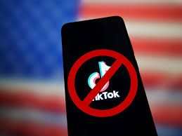
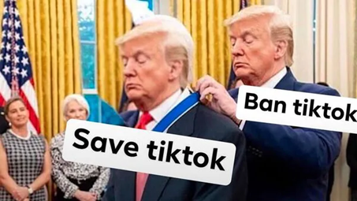

+++
title="Bodo morali Američani živeti brez TikToka?"
date=2025-01-22
description="Vrhovno sodišče že obravnava argumente proti prepovedi."

[extra]
author = "Jure Trtnik"

[taxonomies]
categories = ["Tehnologija"]
tags = ["TikTok", "Donald Trump", "Prepoved", "Vrhovno sodišče"]
+++

**Približuje se dan, ko bo celotna Amerika morda ostala brez TikToka, razen v primeru, če Vrhovno sodišče sprejme zadnji pravni poskus kitajskega lastnika, ki trdi, da bi bila takšna prepoved protiustavna. V primeru prepovedi, TikTok ne bo več dostopen za prenos preko trgovin z aplikacijami, ob enem pa obstoječi uporabniki ne bodo mogli aplikacije posodabljati, kar bo povzročilo njeno zastarelost. Edini način uporabe aplikacije bi bil s pomočjo VPN-jev, ki omogočajo dostop do storitev iz drugih držav. Obstaja pa možnost, da bi novoizvoljeni predsednik Donald Trump, ki začne s svojim mandatom en dan po začetku prepovedi, prosil sodišče za odlog, medtem, ko bi iskali politično rešitev.**

<!-- more -->

---

19\. januar je prelomni datum za Američane, saj se soočajo z morebitno prepovedjo TikToka. Do prepovedi naj bi prišlo zaradi tega, saj zakonodajalci in administracija Joeja Bidna opozarjajo, da platforma predstavlja grožnjo nacionalni varnosti, saj lahko z njeno pomočjo kitajska vlada pridobi dostop do podatkov ameriških uporabnikov. Ena izmed rešitev bi bila s strani kitajske matične družbe ByteDance, da proda ameriške operacije ameriški družbi, vendar pa to ni najbolj verjetno, saj bi s tem prodali tudi svoj algoritem, ki pa je ključen za uspeh platforme.

---

\
<small>Se bliža konec neskončnemu »scrollanju«? | FOTO: Costfoto—NurPhoto via Getty Images</small>

---

## Kaj bi se zgodilo s TikTokom po njegovi prepovedi?

Trenutno še ni jasno, kaj točno se bi zgodilo v primeru, da res pride do prepovedi uporabe aplikacije. Tisti, ki aplikacije trenutno še nimajo nameščene na svojih telefonih je tudi v prihodnje ne bi mogli, saj bo ta odstranjena iz vseh trgovin z aplikacijami. Za tisti, ki pa jo že imajo, pa sta verjetna dva scenarija. Uporabniki bi lahko še naprej imeli aplikacijo nameščeno na telefonu in bi jo lahko še naprej uporabljati, vendar pa je ne bi mogli posodabljati in bi tako s časom postala zastarela in nedelujoča. Drugi scenarij, ki pa je bolj verjeten -  aplikacija bi takoj prenehala delovati, uporabniki pa bi dobili obvestilo o nedelovanju aplikacije znotraj njihove države.

---

## Morda pa le ni vse tako črno

Na TikToku že krožijo videi, ki uporabnike učijo, kako ga lahko kljub njegovi prepovedi še vedno uporabljajo. Ena izmed rešitev je VPN – virtualno zasebno omrežje, s katerim lahko nastavimo našo lokacijo. Uporabniki bi nastavili, da se nahajajo izven Amerike, v neki državi, kjer TikTok ni prepovedan in tako lahko še naprej uživali v njegovi uporabi. Obstajajo pa tudi alternative kot so **Xiaohongshu**, **Lemon8**, **Clapper**, **Instagram Reels**, **YouTube Shorts** in še mnogi drugi. Xiaohongshu je bila v preteklem tednu največkrat naložena aplikacija s strani Američanov.

---

## Ali lahko Donald Trump naredi TikTok »great again«?

Trump je že v svojem prejšnjem mandatu leta 2020 želel prepovedati uporabo TikToka, vendar pa se sedaj bori za njegov obstoj. Zmaga Trumpa na letošnjih volitvah bi družbeno omrežje lahko rešilo, saj se je decembra  že osebno srečal z izvršnim direktorjem TikToka in tako dal upanje uporabnikom. Vrhovno sodišče bo 10. januarja obravnavalo argumente za njegovo ohranitev in tako bo njihova odločitev znana v prihodnjih dneh. Trenutno še ni jasno, kaj bi lahko Trump storil v primeru, da bo zakon potrjen in aplikacija ne bo več delovala, najverjetneje bo potreben nov zakon, ki bi razveljavil prejšnjega.

\
<small>Tudi Trumpova mnenja imajo rok trajanja. | FOTO: Instagram/menshumor</small>

---

## Kaj se lahko naučimo iz drugih držav?

Več držav v preteklosti pa so že prepovedale uporabo TikToka. Med bolj znanimi so Indija, ki ga je prepovedala leta 2020, Iran, Nepal, Afganistan in Somalija. V Nepalu je bila aplikacija prepovedana zaradi vsebine, ki je vzpodbujala družbene napetosti, vendar pa se je po določenem času vrnila z novimi dogovori z o novih regulacijah vsebine. Indijska trajna prepoved TikToka ostaja izjema in čeprav je ta prizadela številne ustvarjalce vsebin, ki so se zanašali na platformo za preživetje, ta ni sprožila večjega protesta. Pa lahko to pričakujemo tudi v Ameriki?

---

## Viri

- [BBC News](https://www.bbc.com/news/articles/clyng762q4eo)
- [BBC Technology](https://www.bbc.com/news/technology-53476117)
- [CBS News](https://www.cbsnews.com/news/tiktok-ban-app-phone/)
- [AP News](https://apnews.com/article/tiktok-alternative-social-media-platforms-ban-49af1bfd2a1543a09b327544c380f217)
- [Washington Post](https://www.washingtonpost.com/technology/2025/01/18/tiktok-ban-russia-india-nepal/)

---
