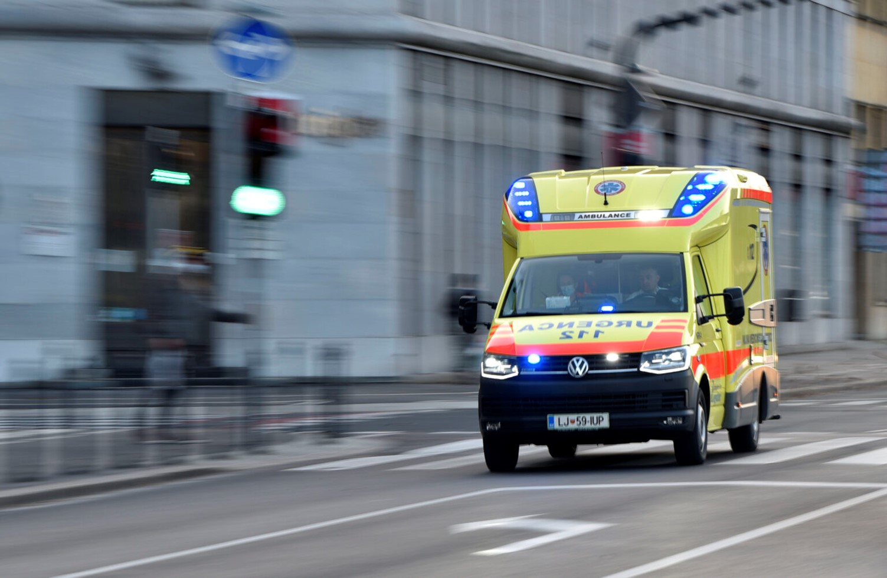
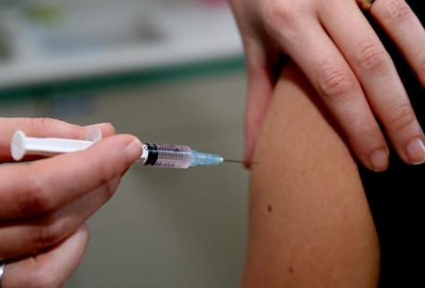

+++
title="Bolnišnice polne, preventiva v rokah posameznika"
date=2025-01-22
description="Prezasedene urgence, naraščajoče število obolelih in nizka precepljenost sprožajo zaskrbljenost zdravstvenih strokovnjakov."

[extra]
author = "Dunja Panič"

[taxonomies]
categories = ["Zdravje"]
tags = ["Gripa", "Cepljenje", "Slovenija", "Preventiva"]
+++

**Sezonska gripa, ki vsako leto v državah EU in Evropskega gospodarskega prostora (EGP) povzroči približno 50 milijonov simptomatskih primerov, se je močno razširila po Evropi. Zaradi porasta respiratornih okužb, večinoma gripe, slovenske bolnišnice v teh dneh omejujejo obiske, da bi zajezile širjenje okužb. Ob ponovnem odprtju šol se je tveganje za širjenje bolezni še povečalo.**

<!-- more -->

---

## Evropa pod udarom, slovenske bolnišnice na robu zmogljivosti

Sezonska gripa, ki prizadene do 200.000 Slovencev letno, je letos zaradi zapletov povzročila povečano število hospitalizacij po Evropi. V Sloveniji prevladuje influenca tipa A, medtem ko se v Španiji soočajo s prevlado influence tipa B. Slovenske bolnišnice so prezasedene, pacienti pogosto čakajo na hodnikih, obiski pa so omejeni. V Murski Soboti so odprli dodaten urgentni oddelek za obvladovanje pritiska. Po podatkih Evropskega centra za preprečevanje in obvladovanje bolezni (ECDC) je gripa splošno razširjena v vsaj 17 državah, med katerimi so najbolj prizadete Francija, Španija, Madžarska, Romunija, Danska, Latvija, Bolgarija, Avstrija, Italija in Nemčija.

---

\
<small>Gripa in prehlad sta najpogostejši nalezljivi bolezni, ki ju povzročajo virusi.︱FOTO: Žiga Živulović jr./BOBO</small>

---

## Kako prepoznati gripo, jo preprečiti in zakaj je pomembna previdnost

Gripa, ena najpogostejših sezonskih nalezljivih bolezni, jo povzročata virusa A in B, ki se prenašata z zrakom ali preko onesnaženih površin. Čeprav jo pogosto primerjamo s prehladom, so njeni simptomi hujši in lahko povzročijo resne zaplete, zlasti pri ranljivih skupinah, kot so otroci, nosečnice, starostniki in kronični bolniki. Simptomi, kot so vročina, mrzlica, glavobol in kašelj, se običajno pojavijo nenadoma po inkubacijski dobi enega do štirih dni. Bolniki so nalezljivi že en dan pred pojavom simptomov in do sedem dni po tem. Večina ljudi si opomore doma z počitkom in tekočino, medtem ko protivirusna zdravila, kot je oseltamivir, ob pravočasni uporabi lahko skrajšajo trajanje bolezni. 

---

## Cepljenje proti gripi

Cepljenje proti gripi je brezplačno za vse z urejenim zdravstvenim zavarovanjem in ga je mogoče opraviti pri osebnem zdravniku, v zdravstvenih domovih ali ambulantah NIJZ, ki se nahajajo v večjih mestih po Sloveniji. Cepljenje poteka od začetka oktobra, saj sezona gripe doseže vrhunec med decembrom in februarjem. Nacionalna koordinatorica za cepljenje dr. Marta Grgič Vitek iz NIJZ poudarja, da je cepljenje proti gripi še vedno smiselno, saj vrh obolevanja letos pričakujemo konec januarja in v začetku februarja. Po cepljenju telo potrebuje približno dva tedna, da razvije zaščito, zato strokovnjaki priporočajo, da se cepite čim prej, še preden gripa doseže svoj vrh. Cepljenje ne le ščiti posameznika pred težkim potekom bolezni, temveč tudi zmanjšuje širjenje gripe med bolj ranljive skupine, kot so dojenčki in starejši.

Na [tej povezavi](https://nijz.si/nalezljive-bolezni/ambulante/) lahko preverite, delovni čas ambulanta v vašem kraju.

\
<small>Cepljenje proti gripi ostaja ključni ukrep za zaščito pred hudim potekom bolezni.︱FOTO: Ljubo Vukelič</small>

---

## Miti in resnice o cepljenju proti gripi

*"Zaradi cepiva lahko zboliš za gripo."* Cepivo proti gripi je narejeno iz neaktiviranega virusa, zato ne more povzročiti bolezni.

*"Gripa je le malce večji prehlad."* Gripa lahko povzroči resne zaplete, vključno z visoko vročino in celo smrtjo.

*"Brez znakov gripe bolezni ne moreš širiti."* Približno 20–30 % okuženih z virusom gripe nima simptomov, a še vedno lahko prenaša virus.

*"Cepljenje proti gripi ni potrebno vsako leto."* Zaradi mutacij virusa je letno cepljenje nujno za zaščito.

---

## Slovenija na dnu lestvice precepljenosti proti gripi

Precepljenost proti gripi v Evropi močno niha med državami, pri čemer Slovenija s 5,6 % cepljenih v lanski sezoni (2023/24) spada med najslabše. Svetovna zdravstvena organizacija za starejše priporoča 75-odstotno precepljenost, a Slovenija dosega le 17,6 %. Države, kot so Nizozemska, Velika Britanija in Irska, se približujejo tem ciljem, medtem ko je v UKC Ljubljana precepljenost zdravstvenih delavcev le 14-odstotna. Po pandemiji covida-19 je precepljenost proti gripi opazno upadla v večini evropskih držav.

---

{{ youtube(id="oZ2j_zuXu7U") }}
<small>Poziv k zaščiti pred gripo. | Video: NIJZ</small>

---

Gripa je resna sezonska bolezen, ki lahko povzroči zaplete pri ranljivih skupinah. Poleg cepljenja so ključni preventivni ukrepi, kot so higiena rok, izogibanje stikom z okuženimi ter krepitev imunskega sistema z zdravo prehrano in življenjskim slogom. Odločitev za cepljenje pa je osebna in temelji na posameznikovih potrebah in informacijah.

## Viri

- [Cepljenje.info](https://www.cepljenje.info/novice-in-clanki/brezplacno-cepljenje-proti-gripi)
- [NIJZ - Cepljenje proti gripi](https://nijz.si/nalezljive-bolezni/cepljenje/cepljenje-proti-gripi-v-sezoni-2024-25/)
- [Cilizadelo.si](http://www.cilizadelo.si/miti-in-resnice-o-cepljenju-proti-gripi.html)
- [ZD Ljubljana](https://www.zd-lj.si/zdlj/images/stories/microsoft_word_-_pogosta_vpra.pdf)
- [Slovenske novice](https://www.slovenskenovice.si/novice/slovenija/cepiva-za-gripo-v-sloveniji-poglejte-za-koga-je-brezplacno/)
- [Vizita.si](https://vizita.si/infekcijske_bolezni/gripa.html)
- [Delo - Gripa na pohodu](https://www.delo.si/novice/slovenija/gripa-na-pohodu-v-evropi-v-postelji-tudi-vsak-dan-vec-slovencev)
- [NIJZ - Ambulante](https://nijz.si/nalezljive-bolezni/ambulante/)
- [NIJZ - Zaščita in cepljenja](https://nijz.si/nalezljive-bolezni/cepljenje/zascita-in-cepljenja-v-sezoni-okuzb-dihal-2024-2025/)

---
