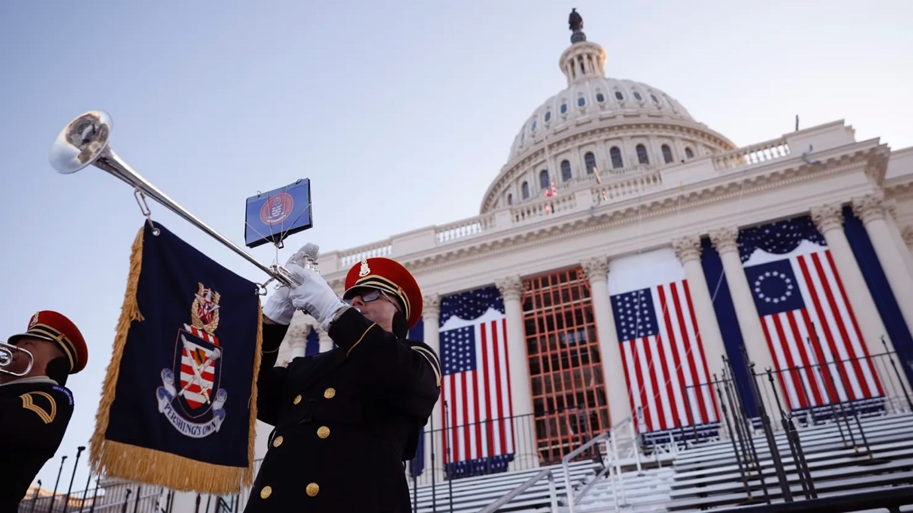
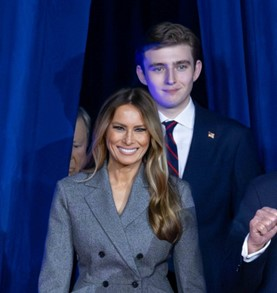

+++
title="Drugi mandat zasenčil kazenske obtožbe"
date=2025-01-21

[extra]
author = "Maša Klopčič"

[taxonomies]
categories = ["Politika"]
tags = ["Donald Trump", "Inavguracija"]
+++

**Donald Trump bo naslednji teden zaprisegel kot 47. predsednik Združenih držav Amerike. Melania Trump, žena Donalda Trumpa, je potrdila, da se vrača v Belo hišo, med slovenskimi obiskovalci inavguracije pa bodo tudi nekateri poslanci iz opozicijske Slovenske demokratske stranke. Donald Trump bo prvi ameriški predsednik, ki bo položaj prevzel s kazensko obsodbo v svoji uradni evidenci.**

<!-- more -->

---

\
<small>Član ameriške vojske Herald Trumpets sodeluje na vaji za inavguracijo na zahodni fronti ameriškega Kapitola, 12. januarja 2025, v Washingtonu, DC. (Foto: Getty Images)</small>

---

## Priprave na inavguracijo potekajo nemoteno

Donald Trump bo naslednji teden zaprisegel kot 47. predsednik Združenih držav Amerike. Njegova štiridnevna inavguracija bo vključevala ognjemet, tri VIP dogodke na njegovem igrišču za golf blizu Washingtona, D.C. Slavnostni shod političnega gibanja MAGA (Make America Great Again) bo potekal večer pred prisego. Čeprav je njegov odbor zbral rekordnih 170 milijonov dolarjev, bodo organizirali razmeroma malo dogodkov. Večina se bo razlikovala od običajnih standardov in bodo potekali ločeno od uradne prisege ter govora, ki ju pokriva kongresni odbor.

---

## Melania se vrača v Belo hišo

Melania Trump, žena Donalda Trumpa, je potrdila, da se vrača v Belo hišo, a bo tudi med drugim moževim mandatom čas preživljala v New Yorku in na Floridi. V intervjuju za Fox News je pojasnila, da je že izbrala nekaj pohištva za svoje prostore, pri čemer ji priprave tokrat olajšujejo izkušnje iz prvega mandata. Poudarila je, da so njene prioritete biti mati, prva dama in žena. Skupaj s sinom Barronom, ki trenutno živi v Trump Towerju na Manhattnu zaradi študija, bosta Belo hišo obiskovala občasno:

> "Vedno spoštujem Barronov 'da' ali 'ne', kaj rad počne, kje bi rad bil."

Ena njenih prvih uradnih odločitev je bila, da ne bo organizirala tradicionalnega srečanja z odhajajočo prvo damo Jill Biden.

\
<small>Melania Trump s sinom Barronom na eni od uradnih proslav. (Foto: Profimedia)</small>

---

## Med udeleženci inavguracije bodo tudi Slovenci

Med slovenskimi obiskovalci Bele hiše ob inavguraciji novega ameriškega predsednika 20. januarja bodo tudi nekateri poslanci, med njimi Žan Mahnič in Andrej Poglajen iz opozicijske Slovenske demokratske stranke (SDS). Kot so pojasnili v SDS-u, sta poslanca prejela vabilo kongresnika slovenskega rodu Paula Gosarja in podmladka republikancev v New Yorku. Med povabljenci bo tudi slovenski veleposlanik v Washingtonu, Iztok Mirošič, so potrdili v kabinetu predsednika vlade. Več o tem lahko izveste v [video prispevku](https://www.24ur.com/novice/slovenija/slovenska-zasedba-na-trumpovi-inavguraciji-veleposlanik-in-poslanca-sds.html).

---

## Prvi predsednik, ki bo položaj prevzel s kazensko obsodbo

Donald Trump bo prvi ameriški predsednik, ki bo položaj prevzel s kazensko obsodbo v svoji uradni evidenci. Obsojen je bil zaradi poskusa razveljavitve izida volitev leta 2020, čeprav trdi, da je nedolžen. Posebni tožilec Jack Smith je zapisal, da so dokazi "zadostni za obsodbo," vendar je primere zaključil skladno s pravili, ki preprečujejo pregon sedanjega predsednika. Trump je obtožbe označil za politično motivirane. Video iz sodišča si lahko ogledate [tukaj](https://edition.cnn.com/2025/01/10/politics/trump-sentencing-embarrassment-analysis/index.html).

---

## Trumpova izvolitev leta 2016 prinesla mešane občutke

Trumpova inavguracija je leta 2016 v nakupovalno središče National Mall privabila množice njegovih podpornikov. Ti so želeli biti priča zgodovinskemu trenutku, ko je nepremičninski magnat in televizijski zvezdnik prevzel položaj predsednika po eni najbolj kontroverznih kampanj v zgodovini ZDA. V svojem govoru je obljubil:

> "Danes je bil dan, ko so ljudje spet postali vladarji tega naroda."

Njegova prisega je potekala v času globoke razdeljenosti v državi. Takrat je Trump začel mandat z rekordno nizko stopnjo odobravanja z obljubami o razveljavitvi politike Baracka Obame in gradnji zidu na meji z Mehiko.


{
  "images": [
    {
      "src": "slika3.png",
      "title": "",
      "description": "Takratni novoizvoljeni predsednik Donald Trump se je s soprogo in prvo damo Melanio Trump ter njunim sinom Barronom sprehodil po aveniji Pennsylvania na inavguracijski paradi. (Foto: Getty Images)"
    },
    {
      "src": "slika4.png",
      "title": "",
      "description": "Inavguracijska zaprisega predsednika Donalda Trumpa pred množico privržencev. (Foto: Getty Images)"
    },
    {
      "src": "slika5.png",
      "title": "",      
      "description": "Podporniki predsednika Trumpa so vzklikali pred nakupovalnim središčem National Mall. (Foto: Getty Images)"
    },
    {
      "src": "slika6.png",
      "title": "",      
      "description": "Ljudje so na Pohodu žensk protestirali proti Trumpovi administraciji. (Foto: Getty Images)"
    }
  ]
}

---

Vzdušje so ob inavguraciji spremljali tudi množični protesti. Policija je zaradi vandalizma in blokad ulic aretirala 217 ljudi, šest policistov pa je utrpelo lažje poškodbe. Vrhunec nasprotovanj Trumpovi administraciji je sledil naslednji dan na Pohodu žensk, kjer se je za enakost in pravice zbralo okoli 200.000 ljudi. Trumpova prva inavguracija je tako postala simbol močnih družbenih delitev in nasprotij, ki so zaznamovala začetek njegovega predsedniškega mandata.

---

## Viri

- [Trump plans limited inauguration festivities despite massive fundraising haul](https://www.cnbc.com/2025/01/13/trump-inauguration-schedule-maga-rally-fireworks-show.html)
- [Trump endures embarrassment of criminal sentencing just 10 days before taking office](https://edition.cnn.com/2025/01/10/politics/trump-sentencing-embarrassment-analysis/index.html)
- [Na inavguraciji Trumpa poleg slovenskega veleposlanika tudi poslanca Mahnič in Poglajen](https://www.rtvslo.si/slovenija/na-inavguraciji-trumpa-poleg-slovenskega-veleposlanika-tudi-poslanca-mahnic-in-poglajen/732751)
- [Slovenska zasedba na Trumpovi inavguraciji: veleposlanik in poslanca SDS](https://www.24ur.com/novice/slovenija/slovenska-zasedba-na-trumpovi-inavguraciji-veleposlanik-in-poslanca-sds.html)
- [Trump would have been convicted if not elected, DoJ report says](https://www.bbc.com/news/articles/cpqld79pxeqo)
- [Trump bi bil obsojen, če ne bi zmagal na volitvah](https://www.24ur.com/novice/tujina/trump-bi-bil-obsojen-ce-ne-bi-zmagal-na-volitvah.html)
- [Melania Trump potrdila, da se vrača v Belo hišo](https://www.24ur.com/popin/tuja-scena/melania-trump-potrdila-da-se-vraca-v-belo-hiso.html)
- [Trump inauguration: President vows to end 'American carnage'](https://www.bbc.com/news/world-us-canada-38688507)
