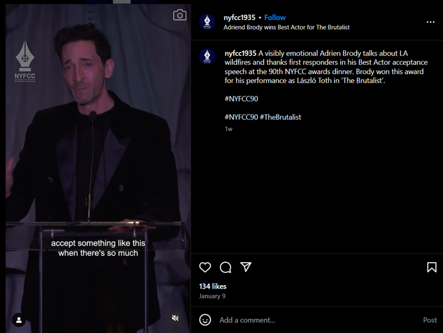

+++
title="Je oskar še pomemben, ko izgubiš dom?"
date=2025-01-22
description="Uničujoči požari v Kaliforniji so prizadeli tisoče ljudi, med njimi tudi filmske in televizijske ustvarjalce"

[extra]
author = "Eva Plešec"

[taxonomies]
categories = ["Zabavna industrija"]
tags = ["Kalifornija", "Požari", "Oskarji", "Grammyji"]
+++

**Že od prvih dni novega leta se gasilci borijo s požari, ki divjajo po zvezdniškem Los Angelesu. Številne produkcije, premiere in podelitve nagrad so že prestavljene, le glasbeni grammyji zaenkrat potekajo po prvotnem načrtu. Ob tem pa se postavlja vprašanje, kako zares smiselne so podelitve v takšnih trenutkih.**

<!-- more -->

---

\
<small>*Požari so v nekaj dneh uničili več kot 12 000 zgradb. (Foto: Hollywood Reporter)*</small>

---

## Brez doma ostali številni znani (in manj znani)

Mediji trenutno veliko poročajo o uničenih domovih zvezdnikov, kot so Mandy Moore, Paris Hilton, Milo Ventimiglia - [tudi o 125 milijonov dolarjev vredni graščini](https://www.rtvslo.si/zabava-in-slog/popkultura/v-pozaru-v-los-angelesu-pogorela-tudi-125-milijonov-dolarjev-vredna-grascina-iz-nasledstva/733102), od katere so ostali le tramovi in bazen. Predsednik filmske organizacije FilmLA, **Paul Audley**, pa opozarja tudi na ostale zgodbe:

> *»Ta tragedija je neposredno prizadela mnoge, ki sodelujejo v zabavni industriji.«*

Na prizadetih območjih Kalifornije tako ne domujejo le (znani) igralci, temveč tudi snemalci, lučkarji, make-up artisti in drugi, ki delujejo za kulisami zabavne industrije. Po uničujočih požarih se je večina razpršila po domovih sorodnikov, prijateljev ali si je poiskala nova začasna prenočišča. To pa bo vsaj kratkoročno [vplivalo tudi na nadaljnjo produkcijo](https://www.hollywoodreporter.com/business/business-news/film-tv-production-wildfires-la-1236111283/).

{{ youtube(id="5UHSfJHc6H8") }}
<small>*Posnetki iz Altadene, Malibuja in Pacific Palisades prikazujejo do tal porušene stavbe. (Video: Guardian)*</small>

---

## Oskarji prestavljeni, Grammyji z dobrodelno noto

Trenutne okoliščine so vplivale tudi na podelitev nagrad, ki zaznamujejo začetek leta v zabavni industriji. Zaradi požarov so [že dvakrat prestavili razglasitev nominacij za oskarje](https://www.24ur.com/popin/film_tv/ponovno-prestavili-razglasitev-nominirancev-za-oskarje.html), datum podelitve, 2. marec, zaenkrat še ni dokončno potrjen. So pa že odpovedali tradicionalno kosilo nominirancev in praznovanje vseh tistih, ki se potegujejo za kipce. Odpovedane so tudi številne premiere in produkcije. Le glasbeni grammyji bodo zaenkrat potekali po prvotnem načrtu, 2. februarja. Letos bodo [med prireditvijo zbirali dobrodelna sredstva](https://www.24ur.com/popin/glasba/podelitev-grammyjev-kot-nacrtovano-zbirali-bodo-sredstva-za-zrtve-pozarov.html):

> *»Podprli bomo žrtve požarov in počastili pogum gasilcev, ki tvegajo svoja življenja, da bi zaščitili naša,« so sporočili organizatorji.*

\
<small>*Organizatorji grammyjev so skupaj z neprofitno organizacijo MusiCares že donirali milijon evrov pomoči glasbenikom, ki so v požarih izgubili imetje. (Foto: MusiCares)*</small>

---

## Šov se mora nadaljevati

Vedno glasnejši pa so pozivi k odpovedi podelitev nagrad, ki so trenutno marsikomu drugotnega pomena. Igralec **Adrien Brody** je nedavno nagrado New York Film Critics Circle [sprejel s solznimi očmi](https://www.instagram.com/reel/DEnTFYeOzj0/):

> *»Težko je sprejeti nekaj takega, ko pa toliko ljudi trpi.«*

Tudi nekdanja predsednica družbe CBS Films, **Terry Press**, [opozarja na nesmiselnost situacije](https://www.nytimes.com/2025/01/14/business/la-wildfires-hollywood-film-production.html):

> *»Bomo torej v enem trenutku govorili, kako pretreseni smo zaradi naših bližnjih, v naslednjem pa pojasnjevali, da je našo obleko dizajniral Gucci?«*

\
<small>*Adrien Brody, igralec filma Brutalist, je bil ob zahvalnem govoru vidno pretresen nad nedavnimi dogodki. (Posnetek zaslona: New York Film Critics Circle.)*</small>

Po drugi strani pa pri [Washington Post](https://www.washingtonpost.com/entertainment/movies/2025/01/13/oscars-grammys-awards-season-la-fires/) ugotavljajo, da bi odpovedi dogodkov dodatno prizadele tamkajšnje delavce:

> *»Če odvzamete podelitve nagrad, brez dela ostanejo maskerji, vozniki, frizerji, asistenti v produkciji, osvetljevalci, kurirji in varnostniki. Kako se bodo znašli delavci, pri katerih je vse odvisno od dveh najbolj obremenjenih mesecev v letu?«*

Čas bo torej pokazal, kakšno smer in hitrost okrevanja bo ubral svet Hollywooda. Kdo ve, morda bodo prav ti požari postali zgodba filma na enem od naslednjih oskarjev. Upajmo, da s čim lažjim epilogom.

---

## Viri

- [RTV Slovenija](https://www.rtvslo.si/zabava-in-slog/popkultura/v-pozaru-v-los-angelesu-pogorela-tudi-125-milijonov-dolarjev-vredna-grascina-iz-nasledstva/733102)
- [Hollywood Reporter](https://www.hollywoodreporter.com/business/business-news/film-tv-production-wildfires-la-1236111283/)
- [24ur](https://www.24ur.com/popin/film_tv/ponovno-prestavili-razglasitev-nominirancev-za-oskarje.html)
- [24ur](https://www.24ur.com/popin/glasba/podelitev-grammyjev-kot-nacrtovano-zbirali-bodo-sredstva-za-zrtve-pozarov.html)
- [New York Times](https://www.nytimes.com/2025/01/14/business/la-wildfires-hollywood-film-production.html)
- [Washington Post](https://www.washingtonpost.com/entertainment/movies/2025/01/13/oscars-grammys-awards-season-la-fires/)

---
