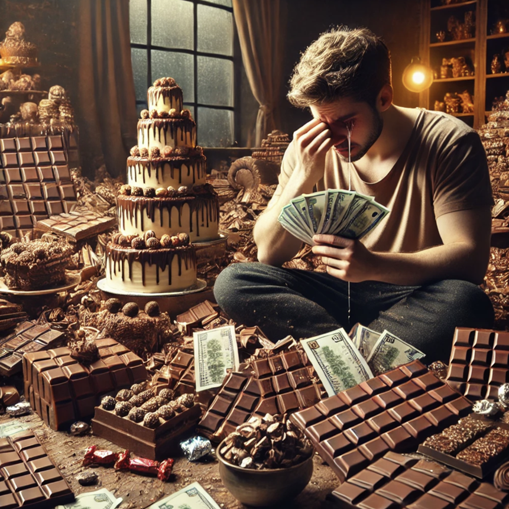

+++
title="Ko čokolada postane luksuz"
date=2025-01-13

[extra]
author = "Marko Matko Ficko"

[taxonomies]
categories = ["Kultura", "Hrana"]
tags = ["čokolada", "cenovna rast", "Dubajska čokolada"]
+++

**Čokolada ni le sladica, ampak simbol prazničnega veselja in tradicije, ki jo čutimo na vsakem koraku – od zavitih čokoladnih božičkov do prefinjenih gurmanskih poslastic. Kljub temu pa čokolada letos nosi grenko-sladek priokus, saj so njene cene po Evropi in drugod strmo narasle, zaradi česar je marsikomu praznična nakupovalna košarica težja za denarnico. Vendar pa, kljub visokim cenam, čokolada ostaja nepogrešljiv del praznikov, saj na globalni ravni opažamo celo rast povpraševanja, ki ga dodatno spodbuja novi praznični megahit tega leta.**

<!-- more -->

---

### Praznični posladki dražji kot kdaj koli prej

Cene čokolade so tik pred prazniki občutno poskočile. V Nemčiji so čokoladne figure božička letos dražje tudi za 50 odstotkov. Niso pa se zvišale samo cene božičnih čokoladnih slaščic, ampak tudi cene običajne temne in mlečne, ter otroške čokolade. Podražitev čokolade pa se ne občuti samo na nemškem trgu, ampak je prisotna tudi na policah slovenskih trgovin, kjer se na primer za 250-gramsko čokolado Milke, za katero se je cena dolgo časa gibala okrog treh evrov, odšteje danes najmanj 5 evrov.

  
<small>*Cene čokolade so te praznike zelo visoke | FOTO: ChatGPT*</small>

---

### Stanje v deželah rjavega zlata

Razlog za podražitve je slabša letina kakava zaradi suše, močnega dežja, bolezni rastlin ter nezakonitega izkopavanja zlata na nasadih kakava. To vključuje tudi države, ki veljajo za največje pridelovalke kakava, kot sta Slonokoščena obala in Gana. Cena kakava, ki jo določa Mednarodna organizacija za kakav (ICCO), je aprila dosegla rekord več kot 10.000 evrov na tono in še zmeraj ostaja visoka. Kljub podražitvam čokoladnih izdelkov pa v Nemčiji opažajo rast povpraševanja po čokoladi, kjer je poraba na prebivalca narasla iz dobrih 9 kilogramov leta 2018 na skoraj 9,9 kilograma leta 2023.

---

### Ste že slišali za Dubajsko čokolado?

Pri visokih cenah in povpraševanju po čokoladi pa se lahko pohvali letošnja praznična senzacija – Dubajska čokolada. Eksotična čokoladna slaščica, narejena iz prestižnih sestavin, kot so afriški kakav, iranske pistacije, žafran in jedilno zlato, je iz lokalne specialitete prerasla v globalni fenomen. Cena, ki pogosto presega 100 evrov za kilogram, ne odvrača navdušenih kupcev, tudi v Sloveniji, kjer so zaloge hitro razprodane. Njena eksotičnost, prefinjen okus in dovršena estetika jo uvrščajo v zadnjem času med najpriljubljenejše praznične posladke na svetu.

[Oglejte si več o Dubajski čokoladi.](https://www.24ur.com/video/iz-sveta-dubajska-cokolada_63338072.html)

---

Kljub izzivom v pridelavi in cenovni dostopnosti čokolade, ta ostaja univerzalna poslastica, ki nas povezuje ne glede na geografske ali kulturne meje. Slovenija, kot čokoladno navdušena država, pa ponuja še en zanimiv pogled na ta priljubljen posladek – Muzej čokolade, kjer lahko obiskovalci skozi zgodovino, tradicijo in inovacije še bolj cenijo njen sladki čar. Obisk muzeja je le še en opomnik, da čokolada ni le izdelek, temveč tudi zgodba, ki povezuje ljudi po vsem svetu.

---

### Viri:

- [24ur - Dubajska čokolada](https://www.24ur.com/novice/slovenija/dubajska-cokolada-novi-fenomen-slascicarskega-sveta.html)
- [24ur - Muzej čokolade](https://www.24ur.com/novice/slovenija/muzej-cokolade.html)
- [24ur - Dubajska čokolada - video](https://www.24ur.com/video/iz-sveta-dubajska-cokolada_63338072.html)
- [24ur - Podražitve čokolade](https://www.24ur.com/novice/gospodarstvo/cene-cokolade-poskocile-cokoladni-bozicki-drazji-tudi-za-50-odstotkov.html)
- [Maribor Info - Luksuzna čokolada](https://mariborinfo.com/novica/slovenija/bo-cokolada-postala-luksuz-taksne-so-cene-milke-v-slovenskih-trgovinah-ali-ni-bila)
- [RTV Slovenija - Podražitve čokolade](https://www.rtvslo.si/enostavno/zanimivosti/cokolada-se-je-podrazila/729772)
