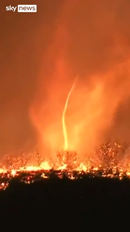
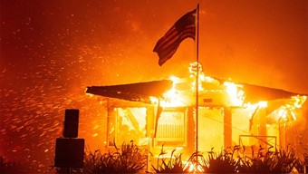
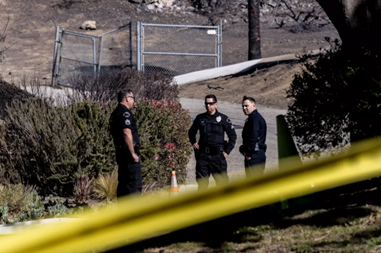

+++
title="Los Angeles v plamenih"
date=2025-01-27
description="Sodba nad mestom angelov"
[extra]
author = "Tilen Caf"

[taxonomies]
categories = ["Naravne nesreče"]
tags = ["Los Angeles", "požari", "evakuacija"]
+++

**Los Angeles se sooča z uničujočimi požari, katerih izbruh pripisujejo več dejavnikom, od dolgotrajne suše in vetrov do človeške malomarnosti. Ognjena apokalipsa je doslej terjala najmanj 24 življenj, uničila ogromno objektov in pregnala tisoče ljudi iz svojih domov. Uvedena je bila tudi policijska ura, ki na prizadetih območjih, preprečuje plenjenje in omogoča učinkovito delo reševalnih ekip.**

<!-- more -->

---

## Izvor peklenskega ognja

Vzrok ni samo v vetru, katera hitrost je dosegla 144 km/h, kar je primerljivo z močjo orkana, kriva naj bi bila tudi dolgotrajna suša, katera povečuje verjetnost, da že najmanjša iskra povzroči požar. Klimatologi situacijo opisujejo kot zelo nenavadno, da v tem delu leta ni padavin. Kaj je direkten izvor požara še pa vedno ostaja uganka. Sumi so, da jih je povzročil ogenj na prvi dan novega leta, ki so ga gasilci slabo pogasili in je kasneje znova izbruhnil. Sumi, pa so še tudi drugje, prijeli so pa že tudi osumljenca. Preiskovalci so pozorni tudi na električne kable, s katerih so v preteklosti že preskakovale iskre. 

  
<small>Ognjeni tornado divja po Los Angelesu (skynews)</small>

{{ youtube(id="ULiREXeQbBA") }}
<small>Moški ujet v goreči hiši (skynews)</small>

---

## Pepel in ruševine: Mesto v objemu uničenja

Ogenj je v večmilijonskem Los Angelesu doslej zahteval najmanj 24 življenj, še 23 ljudi je pogrešanih. Uničenih ali poškodovanih je bilo okoli 12.000 objektov. Svoje domove je moralo zapustiti več kot 180.000 ljudi. Reševalne ekipe s psi ob tem že več dni preiskujejo požgane ruševine, šerif okrožja Los Angeles je dejal, da pričakuje še več smrtnih žrtev. Na območju Los Angelesa na zahodni obali ZDA trenutno divjajo štirje požari, pri čemer je le eden izmed njih pod nadzorom. Najhujši še vedno divja in je doslej požgal več kot 9000 hektarjev zemljišč, vključno s stanovanjskimi objekti in infrastrukturo. 

  
<small>Požar zahteval najmanj 24 življenj (Reuters)</small>

---

## Proti plenjenju uvedli policijsko uro

V nekaterih predelih Los Angelesa, ki jih pestijo uničujoči požari, so oblasti zaradi nevarnosti in plenjenja uvedle policijsko uro. Šerif je poudaril, da je gibanje na teh območjih strogo prepovedano. Odhajajoči predsednik Joe Biden je medtem razdejane predele primerjal z vojnim območjem ter opozoril na širjenje dezinformacij o požarih. Policijska ura, ki velja od 18. do 6. ure, je bila uvedena v soseskah Pacific Palisades in Altadena, kjer so oblasti odredile evakuacijo. Šerif je tudi opozoril, da bodo osebe, ki kršijo prepoved, aretirane, saj ukrep pomaga zaščititi zapuščeno premoženje pred plenjenjem in omogoča učinkovitejše delovanje policije.

  
<small>Policisti losangeleške policije po požarih javnosti in medijem ne dovolijo vstopa na preiskovano območje (Los Angeles Times)</small>

---

## Klic Trumpa v pomoč mestu pepela

Kalifornijski guverner in več uradnikov v Los Angelesu je povabilo Donalda Trumpa, da obišče območja, prizadeta v požarih, da bi pospešil obnovo. Guverner je na omrežju X delil pismo, v katerem je Trumpa pozval, naj se osebno prepriča o škodi. Trump je ga je pred tem kritiziral in mu očital soodgovornost za požare zaradi ukrepov za varčevanje z vodo in pozval k njegovemu odstopu. Trumpa so tudi pisno pozvali naj si pride ogledati škodo, saj se je v preteklosti izkazalo, da je njegov obisk pospešil razdelitev zvezne moči.

  
<small>Donald Trump povabljen, da obišče prizadeta območja (Aljazeera)</small>

---

## Viri

- [24ur - Izredne razmere v Los Angelesu](https://www.24ur.com/novice/tujina/v-los-angelesu-izredne-razmere-evakuirati-se-mora-vec-kot-30000-ljudi.html)
- [Dnevnik - Uničujoči požari v Kaliforniji](https://www.dnevnik.si/nedeljski/aktualno/kako-si-lahko-razlozimo-tako-unicujoce-pozare-v-kaliforniji-2711234)
- [Delo - Zgodovinski požar v Los Angelesu](https://www.delo.si/novice/svet/za-zgodovinski-pozar-sumijo-slabo-pogasen-novoletni-ogenj)
- [RTV Slovenija - Požari v Los Angelesu](https://www.rtvslo.si/svet/s-in-j-amerika/unicujoci-pozari-v-los-angelesu-so-zahtevali-ze-16-zivljenj-se-13-ljudi-pogresajo/733078)
- [RTV Slovenija - Novi požari v Los Angelesu](https://www.rtvslo.si/svet/s-in-j-amerika/na-obmocju-los-angelesa-izbruhnil-nov-pozar-gasilci-se-pripravljajo-na-mocne-vetrove/733278)
- [Delo - Divjanje požarov v Los Angelesu](https://www.delo.si/novice/svet/v-los-angelesu-divja-se-pet-pozarov-umrlo-je-najmanj-deset-ljudi)
- [Sky News - Ognjeni tornado v Los Angelesu](https://news.sky.com/video/fire-tornado-spotted-in-los-angeles-pacific-palisades-blaze-13287014)
- [YouTube - Požari v Los Angelesu](https://www.youtube.com/watch?v=ULiREXeQbBA)
- [Los Angeles Times - Preiskava požarov in obtožbe za plenjenje](https://www.latimes.com/california/story/2025-01-13/prosecutors-looting-arson-charges-los-angeles-fires)