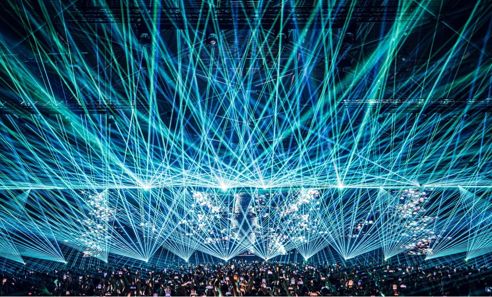

+++
title="Martin Garrix ponovno na vrhu: DJ Mag Top 100 za leto 2024"
date=2025-01-14

[extra]
author = "Tim Cof"

[taxonomies]
categories = ["Glasba", "Elektronska glasba"]
tags = ["Martin Garrix", "DJ Mag", "EDM", "Top 100"]
+++

**Vsako leto milijoni ljubiteljev elektronske glasbe nestrpno čakajo na objavo [DJ Mag Top 100](https://djmag.com/top100djs) – prestižne lestvice, ki od leta 1991 s pomočjo največje javne ankete v glasbeni industriji razkriva največje zvezde elektronske plesne glasbe (EDM). Leto 2024 ni bilo izjema, saj je na prvo mesto znova stopil nizozemski čudežni deček [Martin Garrix](https://martingarrix.com/). Ta zmaga ni le priznanje njegovemu talentu in glasbenemu vplivu, temveč tudi dokaz, da Garrix ostaja nepremagljiv simbol inovacij in strasti v EDM svetu.**

<!-- more -->

---

### Martin Garrix: Vzpon ne pojenja

[Martin Garrix](https://martingarrix.com/), nizozemski fenomen, je postal sinonim za elektronsko plesno glasbo, odkar je leta 2013 izdal svetovno uspešnico *"Animals"*. Danes, po več kot desetletju na sceni, je Garrix še vedno na vrhu kot eden najmlajših in najvplivnejših DJ-jev vseh časov.

Njegova šesta zmaga na [DJ Mag Top 100](https://djmag.com/top100djs) je več kot le simbol njegove vztrajnosti – je dokaz njegovega nenehnega razvoja in sposobnosti povezovanja z oboževalci. Garrix je v letu 2024 osvajal oder za odrom, pri tem pa preizkušal nove zvoke in sodelovanja, ki so razširila meje EDM žanra. S svojim zadnjim albumom je združil plesno glasbo z elementi popa in hip-hopa.

---

### Elementi superzvezde

Poleg glasbenega talenta je Garrix znan po tem, da osebno skrbi za detajle svojih nastopov, od setov do vizualnih učinkov in elementov. Njegove predstave na festivalih, kot sta [Tomorrowland](https://www.youtube.com/watch?v=GdMtN5Ifm-I) in [Ultra Music Festival](https://www.youtube.com/watch?v=-OSs746YI90), so pravi umetniški presežki, kjer glasba, svetloba in pirotehnika ustvarijo nepozabno izkušnjo.

  
<small>*Martin Garrix in njegovi laserski učinki iz dogodka IDEM v Amsterdamu.* ([Vir](https://wololosound.com/cronicas/martin-garrix-idem/))</small>

---

### Martin Garrix in oboževalci: Ključen del uspeha

Očitno je, da je Garrixov uspeh okrepljen z njegovo zvesto bazo oboževalcev. Gre za skupnost, ki jo globoko ceni, kar pogosto pokaže z javnim priznanjem njihove vloge pri njegovem vzponu. Na skoraj vsakem nastopu si vzame čas, da pozdravi oboževalce, podpiše spominke in jih preseneti kljub polnemu urniku. V izjavi za dokumentarno serijo *Martin Garrix Show* je tako dejal:

> *"Videti nasmehe na obrazih svojih oboževalcev med nastopi pomeni vse."*

  
<small>*Martin Garrix in njegovi oboževalci pred nastopom v San Franciscu.* ([Vir](https://www.instagram.com/martingarrix/))</small>

---

### Skromen kljub uspehu

Kljub izjemnemu uspehu in globalni slavi Martin Garrix ostaja prizemljen in iskren glede svojih občutkov. Med podelitvijo nagrad [DJ Mag Top 100](https://djmag.com/top100djs) za leto 2024 je priznal:

> *"Moja največja skrb, ko sem se prvič uvrstil na lestvico in jo osvojil, je bila, da lahko gre od tam le še navzdol, zato je res nekaj posebnega, da smo spet na prvem mestu."*

  
<small>*Martin Garrix po razglasitvi zmagovalca DJ MAG 2024.* ([Vir](https://www.instagram.com/martingarrix/))</small>

---

### Top 10: Največje zvezde EDM sveta leta 2024

1. **Martin Garrix**  
2. **David Guetta** – Francoski genij elektronske glasbe ohranja svojo moč z vplivom na komercialno sceno in nepozabnimi sodelovanji.  
3. **Dimitri Vegas & Like Mike** – Belgijska brata navdušujeta občinstvo z velikimi odrskimi spektakli in plesnimi himnami.  
4. **Alok** – Brazilski DJ še naprej dominira z unikatnim slogom deep house glasbe in globalnimi hiti.  
5. **Timmy Trumpet** – Z živo trobento in energičnimi nastopi dviguje standarde v plesni glasbi.  
6. **Armin van Buuren** – Ikona trance glasbe, ki že desetletja ohranja zvestobo žanru in množicam po vsem svetu.  
7. **Afrojack** – Mojster big room house glasbe, ki združuje močne bas linije z melodičnimi elementi.  
8. **FISHER** – House senzacija, ki je letos osvojil srca oboževalcev z novim slogom in eksplozivnimi seti.  
9. **Vintage Culture** – Brazilski talent, ki združuje melodično house glasbo z globokimi čustvi.  
10. **Peggy Gou** – Karizmatična korejska DJ-ka, ki navdušuje z retro zvoki in slogovno prepoznavnostjo.

---

### Garrix in prihodnost DJ Magazina

Martin Garrix, ob svoji zadnji zmagi na [DJ Mag Top 100](https://djmag.com/top100djs), napoveduje novo pobudo v sodelovanju z DJ Mag za podporo mladim talentom. Serija delavnic bo omogočila začetnikom učenje od najboljših, vključno z Garrixom, in dodatno povezala globalno skupnost EDM. 

Ta korak poudarja Garrixovo zavezanost k razvoju elektronske glasbe in DJ Magovo vlogo kot vodilne platforme, ki ne le prepoznava uspeh, ampak tudi aktivno oblikuje prihodnost industrije.

---

### Viri

- [DJ Mag Top 100](https://djmag.com/top100djs)
- [Martin Garrix Official Website](https://martingarrix.com/)
- [Tomorrowland Performance](https://www.youtube.com/watch?v=GdMtN5Ifm-I)
- [Ultra Music Festival Performance](https://www.youtube.com/watch?v=-OSs746YI90)
- [EDM Nomad - Martin Garrix Best DJ 2024](https://edmnomad.com/martin-garrix-best-dj-2024-dj-mag-top-100/)
- [EDM Identity - Martin Garrix 2024](https://edmidentity.com/2024/10/19/martin-garrix-top-100-djs-2024/)
