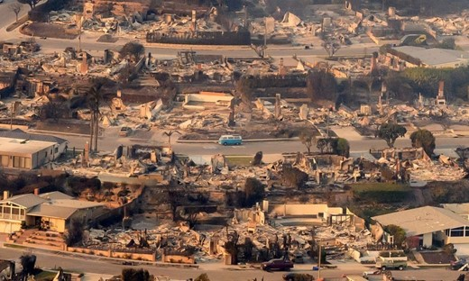
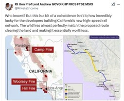

+++
title="Požari, ki širijo zarote"
date=2025-01-15
description="Naravna nesreča, nepremičninski interesi in urbana prenova ali uničenje dokazov: Kaj se dogaja v Los Angelesu?"

[extra]
author = "Amanda Vogrin"

[taxonomies]
categories = ["Svet"]
tags = ["Los Angeles", "požari", "teorije zarote"]
+++

**Požari, ki so se začeli 7. januarja v Kaliforniji, so povzročili opustošenje in sprožili številna vprašanja o njihovem izvoru. Fotografije nedotaknjenih dreves sredi pogorišč pa so podžgale teorije o skrivnih tehnologijah in načrtnih uničenjih. Hkrati se pojavljajo špekulacije, da so požari povezani z načrtovanimi urbanističnimi projekti, vključno z visokohitrostno železnico. Razvija se vedno več tako imenovanih teorij zarot, tudi takšne, da je to le preusmeritev pozornosti od kaznivih dejanj Diddyja.**

<!-- more -->

---

## Požari in skrivnostno nepoškodovana drevesa

Mednarodno pozornost so pritegnile fotografije posledic požarov v Los Angelesu, kjer so hiše popolnoma uničene, medtem ko drevesa v bližini ostajajo nedotaknjena. Ti nenavadni prizori so sprožili plaz teorij na družbenih medijih. Nekateri trdijo, da ogenj ni mogel preskočiti dreves in da so bile stavbe namerno napadene z napredno tehnologijo, vključno s skrivnim orožjem ali sistemi za nadzor vremena. Strokovnjaki takšne teorije zavračajo in pojasnjujejo, da so stavbe zaradi svojih materialov bolj gorljive, medtem ko lahko drevesa zaradi visoke vsebnosti vlage v nekaterih primerih ostanejo nepoškodovana. Kljub strokovnim pojasnilom pridobivajo teorije o načrtnih uničenjih vse večjo pozornost.

  
<small>Fotografija nedotaknjenih dreves med uničenimi stavbami v Los Angelesu (Profimedia)</small>

---

## Nepremičninski interesi in urbana prenova

Slavni hollywoodski igralec Mel Gibson, katerega dom je v teh požarih pogorel, je izrazil dvom, da gre za naravno nesrečo. Dejal je: "Ko vidiš takšne stvari, se vprašaš: je to namerno? Kakšen je cilj? Ali želijo prazen mestni center?" ter namignil, da bi lahko bil cilj teh dejanj izpraznitev mesta, kar bi omogočilo nove urbanistične projekte. Ena izmed priljubljenih teorij zarote trdi, da so požari povezani s konceptom “15-minutnih mest”, kjer naj bi bile osnovne storitve, kot so delo, nakupovanje, izobraževanje in zdravstvo, dosegljive v 15 minutah hoje ali kolesarjenja. Po mnenju zagovornikov teh teorij požari uničujejo družinske hiše, da bi sprostili prostor za gradnjo stolpnic in stanovanj ter gosto urbanizacijo.

---

## Načrtovanje železnice in uničenje dokazov

Poleg drugih teorij se je pojavila še ena, ki trdi, da so požari povezani z načrtovanim železniškim omrežjem visoke hitrosti v Kaliforniji. Po tej teoriji požari pomagajo "očistiti" območje, ki ga razvijalci želijo izkoristiti za gradnjo železnice med Los Angelesom in San Franciscom. Uporabniki družbenih medijev so delili zemljevide požarov, ki naj bi se natančno ujemali s predlagano traso vlakov. Ena divja teorija je povezala požare z ameriškim reperjem Seanom "Diddyjem" Combsom, domnevajoč da so požari namerno podtaknjeni, da bi uničili dokaze, povezane z [obtožbami o zlorabah in neprimernem vedenju, ki so se pojavile v zvezi z Diddyjevimi zabavami](https://www.themirror.com/entertainment/celebrity-news/legal-response-carolyn--1005-700005). Njegova razkošna hiša, čepraj blizu poti požara, ni utrpela poškodb, medtem ko so druge znane osebnosti v njegovi bližini izgubile svoje domove.

  
<small>Povezava med požari in načrtovano železniško traso (Daily Mail)</small>

---

## Za nekatere teorija, za druge tragedija

Medtem ko so ti dogodki za nekatere le predmet teorij, pa za mnoge predstavljajo resnično tragedijo. Trenutno v Los Angelesu še velja opozorilo o “posebno nevarni situaciji“ in tamkajšnji prebivalci so pozvani, naj bodo v pripravljenosti na evakuacijo. V enem tednu so požari uničili 12.000 posesti in terjali najmanj 24 življenj. Tisoči se soočajo z nepredstavljivo izgubo, zato je ključno ponuditi pomoč in podporo prizadetim skupnostim.

---

## Viri

- [Metropolitan - Los Angeles požari in teorije zarot](https://www.metropolitan.si/novice/svet/los-angeles-pozari-mel-gibson-teorija-zarote/)
- [24ur - Teorije zarote: zakaj poleg hiš niso pogorela tudi drevesa](https://www.24ur.com/novice/tujina/teorije-zarote-zakaj-poleg-his-niso-pogorela-tudi-drevesa.html)
- [Daily Mail - LA wildfires and conspiracy theories](https://www.dailymail.co.uk/news/article-14277681/LA-wildfire-conspiracy-theories-flooding-internet-PDiddy.html)
- [Economic Times - California wildfires and Diddy](https://economictimes.indiatimes.com/news/international/global-trends/la-wildfires-to-cover-up-seandiddys-crime-california-blaze-sparks-surge-of-wild-conspiracytheories/articleshow/117233327.cms?from=mdr)
- [CBS News - California fires updates](https://www.cbsnews.com/live-updates/california-fires-winds-updates/)

