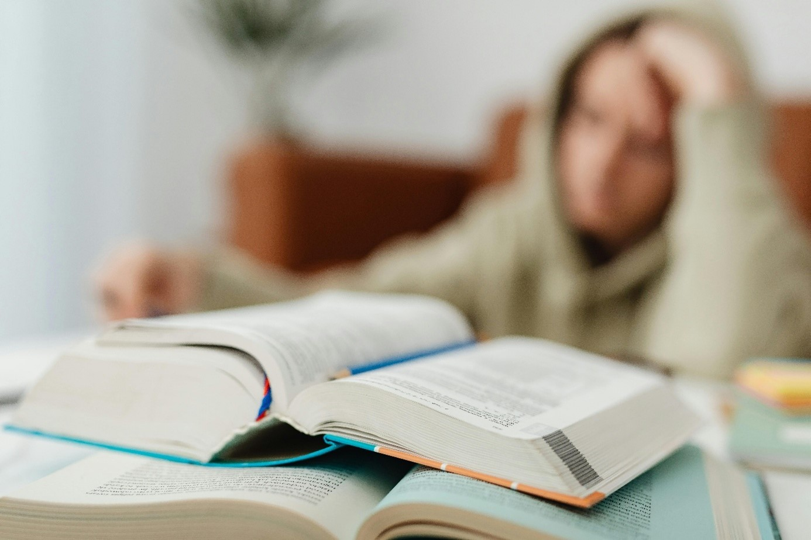
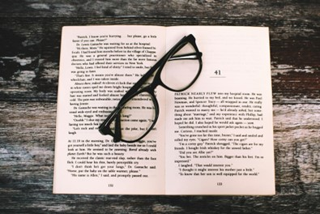
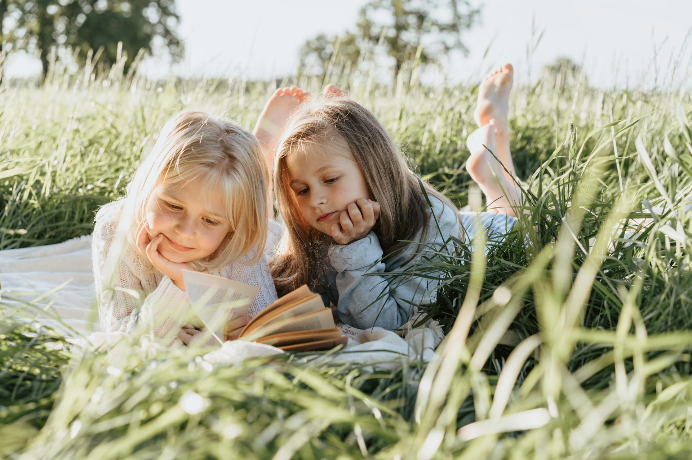

+++
title="Se še spomnite svoje zadnje prebrane knjige?"
date=2025-01-13

[extra]
author = "Eva Plešec"

[taxonomies]
categories = ["Kultura"]
tags = ["branje", "knjige", "mladi"]
+++

### Zmanjkalo je časa, volje in interesa za branje knjig

**Upad branja knjig v Sloveniji je pokazala tudi letošnja raziskava o bralni pismenosti, založništvu in nakupovanju knjig. Trend manj prebranih strani pa se nadaljuje tudi drugod po svetu, tudi pri perspektivnih študentih na prestižnih ameriških univerzah. Vseeno pa lahko najdemo tudi drugačne premike, recimo na Poljskem, kjer se prav mladi navdušujejo nad branjem.**

<!-- more -->

  
<small>*Kdaj ste nazadnje prebrali celotno knjigo? (Foto: Pexels)*</small>

Morda spadate v tistih 42 odstotkov Slovencev, ki v zadnjem letu niso prebrali niti ene knjige, nepovezane s službenimi ali šolskimi obveznostmi. Največ razlogov, [zakaj tega Slovenci redno ne počnejo](https://www.rtvslo.si/kultura/knjige/upad-bralne-pismenosti-je-povezan-s-spremembami-vrednot-v-druzbi/728701), je v pomanjkanju časa, volje in interesa. Strokovnjak za založništvo, **Miha Kovač**, je mnenja, da je upad bralne pismenosti povezan s spremembami vrednot v družbi.

> *"Tudi šolski sistem je naravnan tako, da je vse predstavljeno lahkotno, igrivo in zabavno, življenje pa je sestavljeno tudi iz reči, za katere je potreben intelektualni napor, ki ga vadimo ravno skozi branje."*

Da knjigo vzamemo v roke, začnemo in nadaljujemo z branjem vse do zadnje strani, pa morajo biti okoliščine temu primerne, oziroma si jih moramo ustvariti sami.

---

### Študentje književnosti, ki ne zmorejo brati knjig?

Ravno bodoči intelektualci, študenti na elitnih ameriških univerzah se soočajo z bralnimi izzivi. Kot priznava **Nicholas Dames**, profesor na univerzi Columbia v New Yorku na področju književnosti in humanistike, se [tamkajšnji študentje počutijo preobremenjeni](https://www.theatlantic.com/magazine/archive/2024/11/the-elite-college-students-who-cant-read-books/679945/) in nepripravljeni na branje obveznega čtiva (tj. par knjig na semester).

Sogovorniki razloge za to pripisujejo spremenjenim učnim načrtom osnovnih in srednjih šol – te v zadnjih letih dajejo prednost krajšim odlomkom in povzetkom, saj je tako pač lažje preveriti razumevanje snovi. Drugi očiten razlog pa je (pre)zabavna sodobna tehnologija. Kot dodaja psiholog na University of Virginia, **Daniel Willingham**:

> *"Nekako je zdaj že postalo neobičajno, da bi se lahko dolgočasili."*

  
<small>*Profesorji na Univerzi Columbia so se razmeram in študentom prilagodili ter skrajšali seznam bralnega gradiva. (Foto: Pexels)*</small>

---

### Vendarle ni vse črno (belo)

Zanimiv trend se namreč odvija na Poljskem - v zadnjem desetletju so zaprli skoraj tretjino knjigarn, kljub temu pa število bralcev narašča, še posebej mladih. [Rezultati raziskave](https://tvpworld.com/81767170/-bookstores-in-decline-but-more-poles-are-reading-survey-shows) so pokazali, da se je delež bralcev, ki so v letu 2023 prebrali vsaj eno knjigo, povečal za 9 % glede na leto prej. Direktor poljskega inštituta za knjigo, **Grzegorz Jankowicz**, ob tem poudarja:

> *"Nove tehnologije spreminjajo naše navade, nekaterim olajšajo dostop do informacij in raznih dobrin, vendar knjiga ne spada med navadne, običajne dobrine."*

Poljski bralci si knjige največkrat izposojajo iz knjižnic, jih dobijo od prijateljev ali jih prejmejo kot darila.

  
<small>*Kljub 1000 zaprtim knjigarnam od leta 2010, se delež bralcev na Poljskem veča. (Foto: Pexels)*</small>

---

### Kako naj otrok namesto mobilnega telefona raje vzame knjigo?

Začne se z mladimi. Vsaj tako pravi **Marit Borkenhagen**, skrbnica norveških projektov za dvig bralne pismenosti med otroki in mladimi. [Pri tem spodbujajo aktivnosti za različne starosti](https://www.rtvslo.si/kultura/knjige/upad-bralne-pismenosti-je-povezan-s-spremembami-vrednot-v-druzbi/728701), kot je skupno branje knjig staršev in otrok, branje skozi igro pri nižjih razredih in 15-minutno branje za srednješolce.

V projektu sodeluje več partnerjev, od vrtcev, šol, knjižnic pa vse do občine. Organizirajo pa tudi knjižne igre in vrsto literarnih festivalov za mlade, ki že kažejo dobre rezultate. Počasi, a vztrajno, se torej daleč pride (tudi skozi liste knjige).

  
<small>*Kdaj boste pa vi prebrali naslednjo knjigo? (Foto: Pexels)*</small>

---

### Viri

- [RTV Slovenija](https://www.rtvslo.si/kultura/knjige/upad-bralne-pismenosti-je-povezan-s-spremembami-vrednot-v-druzbi/728701)
- [The Atlantic](https://www.theatlantic.com/magazine/archive/2024/11/the-elite-college-students-who-cant-read-books/679945/)
- [TVP World](https://tvpworld.com/81767170/-bookstores-in-decline-but-more-poles-are-reading-survey-shows)
