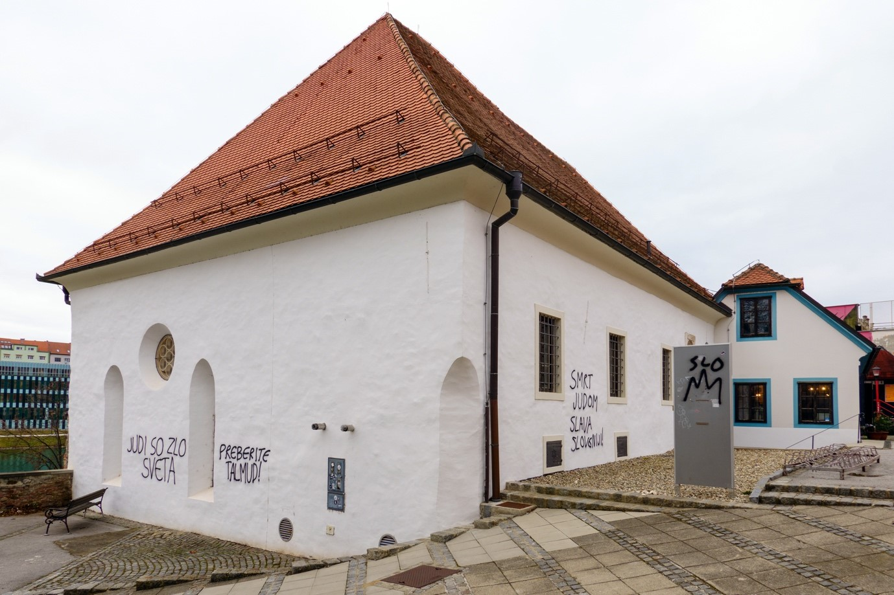
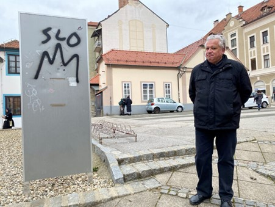
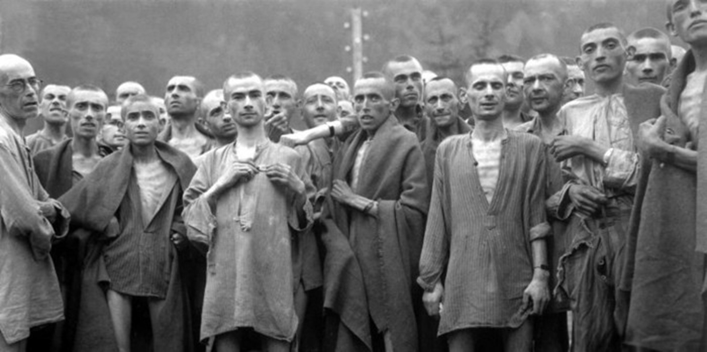

+++
title="Antisemitski grafiti oskrunili mariborsko sinagogo"
date=2025-01-15
description="Incident sovraštva znova opozarja na nujnost ohranjanja strpnosti in zaščite kulturne dediščine."
[extra]
author = "Andreja Bratuša"

[taxonomies]
categories = ["Družba"]
tags = ["Mariborska sinagoga", "antisemitizem", "kulturna dediščina"]
+++

**Mariborska sinagoga, simbol judovske kulturne dediščine in spomenik državnega pomena, je znova postala tarča vandalizma, saj so njene zidove popisali z antisemitskimi sporočili. Incident je sprožil ogorčenje in pozive k ukrepanju, saj to ni prvi primer sovražnega dejanja, usmerjenega proti tej pomembni ustanovi. Direktor najmanjše javne kulturne ustanove v Sloveniji Boris Hajdinjak je izpostavil pomen sožitja in sprejemanja različnosti. Ob tem je dodal, da so resnično močne države tiste, ki vključujejo vse svoje prebivalce. Policija je že začela preiskavo, ker gre za sum kaznivih dejanj spodbujanja sovraštva ter poškodovanja kulturne dediščine.**

<!-- more -->

  
<small>Vandali so pografitirali Mariborsko Sinagogo (24ur)</small>

---

## Simbol kulturne dediščine v nevarnosti

Sinagoga Maribor, ki je ustanovljena kot pomemben center judovske kulture, nosi izjemen zgodovinski pomen za slovensko in širšo evropsko dediščino. Leta 2015 je bila razglašena za kulturni spomenik državnega pomena, kar poudarja njeno simbolno vrednost. Kljub temu se je že pred 16 leti soočila z vandalizmom, kar odpira resna vprašanja o nestrpnosti in sovražnosti v družbi. Trenutni incident, v katerem so nastali antisemitski grafiti, je povzročil za približno 1500 evrov škode. Ta dogodek znova opozarja na nujnost učinkovitejšega varovanja kulturnih spomenikov in ozaveščanja javnosti o njihovi vrednosti.

---

## Zavračanje sovraštva in poziv k strpnosti v družbi

"Vsi zaposleni v Sinagogi Maribor smo Slovenci, zato ne moremo grafitov na naši zgradbi ocenjevati kot Judje. Kot Slovenci najostreje zavračamo vsebino grafitov," je poudaril direktor mariborske sinagoge Boris Hajdinjak in izpostavil pomen sožitja in sprejemanja različnosti. Ob tem je dodal, da so resnično močne države tiste, ki vključujejo vse svoje prebivalce, tudi najmanjše manjšine, saj s tem gradijo temelje za boljšo prihodnost. "Verjamem, da se s tem mnenjem strinja večina prebivalcev Republike Slovenije," je zapisal in pozval k večji družbeni odgovornosti ter ozaveščanju o pomembnosti strpnosti.

[Preberite celoten zapis na družbenem profilu](https://www.si21.com/Svet/Dan_spomina_na_zrtve_holokavsta_v_Muzeju_novejse_zgodovine_Slovenije/)

  
<small>Sovražno dejanje na svojem družbenem profilu komentiral direktor mariborske sinagoge Boris Hajdinjak (24ur)</small>

---

## Kazenski ukrepi proti nespoštovanju

Policija je že sprožila kazenski postopek zaradi suma kaznivih dejanj spodbujanja sovraštva ter poškodovanja kulturne dediščine, pri čemer za storilce tovrstnih dejanj zakon predvideva zaporno kazen do pet let. "Sovraštvo v naši družbi nima mesta," pravi ministrica za kulturo Asta Vrečko. Trdi, da so zgoraj navedeni napisi nagnusen izraz diskriminacije, poniževanja in zaskrbljujoče ogledalo vse večje nestrpnosti v družbi. Hajdinjak je poudaril tudi, da je ključnega pomena, da kot družba okrepimo prizadevanja za spodbujanje strpnosti, medsebojnega spoštovanja in razumevanja manjšin, saj le tako lahko preprečimo podobne incidente v prihodnje.

---

## Spomin na kruto preteklost ob prihajajoči 80. obletnici

  
<small>Približujemu se dnevu, ko se bomo spominjali žRtev holokavsta (SI21)</small>

Zagovornik načela enakosti Miha Lobnik je opomnil, da bomo 27. januarja, ob dnevu spomina na žrtve holokavsta, obeležili 80. obletnico osvoboditve največjega koncentracijskega taborišča Auschwitz, kar je priložnost za razmislek o kruti preteklosti, kaj se lahko zgodi, kadar je diskriminacija dovoljena. Pri tem izpostavlja, da je pomembno ohranjanje vključujoče in strpne družbe, ki spoštuje človekove pravice ter zavrača sovraštvo in neenakopravnost.


{
  "images": [
    {
      "src": "slika4.jpg",
      "title": "",
      "description": ""
    },
    {
      "src": "slika5.jpg",
      "title": "",
      "description": ""
    },
    {
      "src": "slika6.jpg",
      "title": "",
      "description": ""
    }
  ]
}


---

## Viri

- [RTV Slovenija - Neznanci z grafiti oskrunili mariborsko sinagogo](https://www.rtvslo.si/crna-kronika/neznanci-z-grafiti-oskrunili-mariborsko-sinagogo/733158)
- [N1info - Mariborsko sinagogo popisali z antisemitskimi grafiti](https://n1info.si/novice/slovenija/mariborsko-sinagogo-neznanci-popisali-z-antisemitskimi-grafiti/)
- [Delo - Sovražni grafiti na mariborski sinagogi](https://www.druzina.si/clanek/sovrazni-grafiti-na-mariborski-sinagogi)
- [24ur - Vandali z antisemitskimi napisi pografitirali mariborsko sinagogo](https://www.24ur.com/novice/slovenija/vandali-pografitirali-mariborsko-sinagogo.html)

## Viri fotografij

- [SI21 - Dan spomina na žrtve holokavsta](https://www.si21.com/Svet/Dan_spomina_na_zrtve_holokavsta_v_Muzeju_novejse_zgodovine_Slovenije/)

