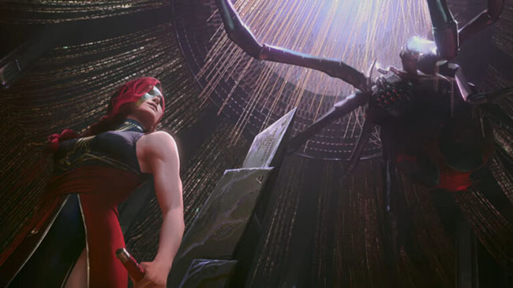

+++
title = "Arcane: Zgodba, vredna četrt milijarde dolarjev, zaključena"
date = 2025-01-25
description="Kakšna je prihodnost Netflixove animirane serije, ki je obnorela svet in prejela štiri emmy nagrade?"

[extra]
author = "Aja Cugmas"

[taxonomies]
categories = ["Animacija", "Kultura in zabava"]
tags = ["Arcane", "Netflix", "Fortiche", "League of Legends"]
+++

**Po izjemnem uspehu prve sezone Netflixove serije Arcane, ki jo je francoski animacijski studio Fortiche za javnost objavil pred več kot tremi leti, je tekom novembra 2024 izšla še druga sezona. Zgodba, ki opisuje dogajanje med dvema regijama, navdihnjenima z igro League of Legends, se po samo dveh sezonah zaključuje, soustvarjalca serije Christian Linke in Alex Yee pa obljubljata povsem novo serijo v franšizi. Arcane je prejel veliko pohval, uspeh te animirane serije pa izkazujejo tudi mnoge nagrade, med katere spadajo kar štirje emmyji.**

<!-- more -->

---

\
<small>Uspešnica studia Fortiche – Arcane | Vir: Riot Games</small>  

---

## Zgodba Piltoverja in Zauna je zaključena

Mineva že četrto leto, odkar je prva sezona Netflixove serije Arcane doživela izjemen uspeh. Animirano serijo, ki jo je francoski animacijski studio Fortiche ustvaril v sodelovanju s podjetjem Riot in jo na Netflixu predstavil javnosti konec leta 2021, je novembra 2024 dopolnila druga sezona, s katero pa se zgodba zaključuje. Ustvarjalci so svoj navdih za serijo črpali iz računalniške igre League of Legends, ki jo je pred več kot petnajstimi leti izdalo podjetje Riot Games. Zgodba sledi sporom dveh nasprotujočih si fiktivnih mest Piltover in Zaun, glavni liki pa so zasnovani po likih iz računalniške igre League of Legends.

\
<small>Utrinek iz zadnje sezone serije, ki je bil zaradi svoje lezbične narave izbrisan v določenih državah. | Vir: Esports.gg</small>

---

## Eden izmed Netflixovih najdražjih projektov

Med 9. in 23. novembrom 2024 so vse oboževalce serije vsako soboto pričakale tri nove epizode, vsaka od katerih traja med 40 in 50 minut. Skupaj devet epizod druge sezone je animacijski studio Fortiche ustvarjal več kot tri leta, pisanje zapomnljive zadnje linije za tako uspešno serijo pa je enemu izmed soustvarjalcev Alexu Yeeju predstavljalo vrtoglavice.

> »Porabil sem res veliko časa za zadnjo vrstico oddaje, dobesedno je trajalo okoli 27 ur. Večino časa sem samo sedel in se ubadal z vprašanjem, kako končati takšno oddajo,« je za *GamesRadar+* dejal Yee, ki je čutil neizmeren pritisk, da na visok način zaključi tako uspešno serijo.

\
<small>Soustvarjalec serije Alex Yee na uradni premieri prve sezone v Los Angelesu. | Vir: Awards Daily</small>  

Zahtevna produkcija Netflixove uspešnice, ki jo je na neki točki animiralo kar 450 umetnikov iz Francije in Združenih držav Amerike, pa je podjetje Riot stala več kot 250 milijonov dolarjev. Prva sezona serije Arcane je za svoj uspeh prejela kar štiri emmyje, med njimi tudi nagrado za izjemen animacijski program, in s tem dvignila lestvico tega, kaj lahko pomeni dobra filmska adaptacija videoigre.

  
<small>Serija je med drugim prejela tudi prestižno nagrado emmy za izjemen animacijski program. | Vir: TheGamer</small>

---

## Obljubljena nova franšiza

Po nepričakovanem koncu serije, ki je gledalce pustil odprtih ust, je Fortiche na srečo oznanil, da se bo franšiza televizijske serije nadaljevala z novimi zgodbami iz drugih regij sveta League of Legends. S serijo Arcane so gledalci lahko podrobno spoznali dve regiji – Piltover in Zaun, za novo franšizno serijo pa je francoski studio napovedal druge regije, v katerih bi se lahko odvijale bodoče zgodbe, med katere spadajo Noxus, Ionia in Demacia. Soustvarjalca serije Christian Linke in Alex Yee pa sta kmalu zatem opozorila, da prihodnje serije še naj ne bi bile v fazi produkcije in da za njih nimajo niti scenarijev.

<blockquote class="twitter-tweet" data-media-max-width="560">
A message from <a href="https://twitter.com/hashtag/Arcane?src=hash&amp;ref_src=twsrc%5Etfw">#Arcane</a> show co-creator <a href="https://twitter.com/praeco?ref_src=twsrc%5Etfw">@praeco</a> on bringing the story to a close. <a href="https://t.co/TlEhH1EWmY">pic.twitter.com/TlEhH1EWmY</a>
&mdash; Arcane (@arcaneshow) <a href="https://twitter.com/arcaneshow/status/1800545290241667414?ref_src=twsrc%5Etfw">June 11, 2024</a></blockquote> 

---

## Selitev v Noxus

  
<small>Del novega videa »Welcome to Noxus«, ki ga je animiral Fortiche. | Vir: Anime Corner</small>

7.\. januarja pa je vse oboževalce presenetil nenapovedan video, ki oznanja prihod že petnajste sezone igre League of Legends. V petminutnem videu je predstavljena regija, ki jo je obljubljala produkcijska ekipa – Noxus, animiral pa ga je nihče drug kot animacijski studio Fortiche. Zgodba v videu se navezuje na nadaljevanje serije Arcane in predstavlja nekatere izmed likov, ki so se pojavljali že v tej uspešni seriji. To pušča odprtih mnogo vprašanj, med njimi tudi ali sta soustvarjalca serije Arcane o prihodnosti franšize zavajala in lahko oboževalci v kratkem pričakujejo novo franšizno serijo.

{{ youtube(id="I76wvt0aEE4") }}

---

### Viri
- [Gamerant](https://gamerant.com/arcane-success-new-league-of-legends-players-underwhelming/)  
- [Netflix Tudum](https://www.netflix.com/tudum/features/arcane-season-two-behind-the-scenes)  
- [Collider](https://collider.com/arcane-season-2-final-line-alex-yee-explained/)  
- [Variety](https://variety.com/2024/biz/news/riot-games-arcane-hollywood-netflix-most-expensive-animated-series-ever-1236196655/)  
- [Screenrant](https://screenrant.com/arcane-noxus-show-league-of-legends-trailer-op-ed/)  
- [TechRadar](https://www.techradar.com/streaming/netflix/arcane-creators-say-itll-be-a-long-time-before-the-next-league-of-legends-adaptation-lands-on-netflix-were-not-in-production-on-those-yet)  
- [DualShockers](https://www.dualshockers.com/riot-games-cinematic-video-welcome-to-noxus-arcane/)  
