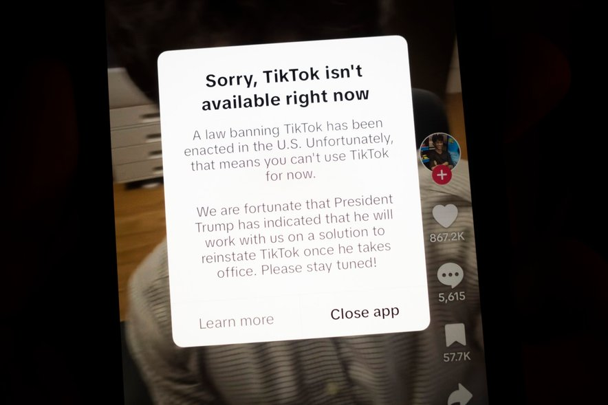

+++
title = "Digitalna vojna: TikTok pod udarom ameriških oblasti"
date = 2025-01-26
description="Tehnološki velikan pred izzivi ameriške politike"

[extra]
author = "Sara Tratnjek"

[taxonomies]
categories = ["Tehnologija"]
tags = ["TikTok", "Geopolitika", "Donald Trump", "Digitalna varnost"]
+++

**TikTok, ki je osvojil milijone uporabnikov po svetu, se je v ZDA znašel sredi geopolitičnega spopada. Zaradi domnevnih nacionalno varnostnih groženj je postal tarča ameriške politike, kar je povzročilo nemalo negotovosti glede njegove prihodnosti. Ali gre res za varnostna vprašanja ali za politične interese, je tema, ki buri duhove med uporabniki in analitiki.**

<!-- more -->

---

\
<small>Obvestilo uporabnikom, da aplikacija več ne deluje │ Foto: 24ur.com</small>  

---

## Začetek prepovedi in razlogi zanjo

Novoizvoljeni ameriški predsednik Donald Trump je že leta 2020 napovedal prepoved TikToka v ZDA. Razlogi za to odločitev so bili predvsem nacionalno varnostni pomisleki, saj naj bi aplikacija zbirala občutljive podatke uporabnikov in jih delila s kitajsko vlado. Trumpova administracija je trdila, da bi lahko to ogrozilo ameriško varnost. TikTok je sicer večkrat zanikal obtožbe, vendar to ni preprečilo začetka postopkov za prepoved delovanja aplikacije.

---

## Trumpov odlog in pogajanja

Kljub grožnjam s prepovedjo se je TikTok uspel izogniti takojšnjemu zaprtju. Trumpova administracija je napovedala odlog prepovedi, da bi omogočila pogajanja o morebitni prodaji ameriškega dela podjetja. Podjetja Oracle, Walmart in druga so izrazila zanimanje za sodelovanje s TikTokom, vendar konkretnega dogovora ni bilo doseženega. Ta odlog je bil ključen za ohranjanje TikTokove prisotnosti v ZDA, čeprav je prihodnost aplikacije ostala negotova.

---

## Reakcije uporabnikov in strokovnjakov

TikTokova morebitna prepoved je sprožila burne reakcije med uporabniki in strokovnjaki. Uporabniki so bili zaskrbljeni, da bodo izgubili platformo, ki je postala del njihovega vsakdanjega življenja. Strokovnjaki so opozarjali, da bi takšna prepoved lahko imela dolgoročne posledice za svobodo izražanja in digitalno ekonomijo. Prav tako so izrazili skrb, da bi lahko ukrep odprl vrata za nadaljnje omejevanje tehnoloških podjetij iz tujih držav.

Medtem ko TikTok ponovno deluje v ZDA, je vprašanje njegove prihodnosti še vedno odprto. Ameriška politika je pokazala, kako lahko tehnološke platforme postanejo orožje v globalnih političnih igrah. Ne glede na končni razplet pa ostaja jasno, da so uporabniki tisti, ki nosijo posledice teh odločitev. Ta primer nas opominja, kako pomembno je ohranjanje ravnotežja med varnostjo, svobodo izražanja in pravico do digitalne povezanosti.

---

## Viri

- [RTVSLO: TikTok v ZDA znova deluje, potem ko je Trump napovedal odlog prepovedi](https://www.rtvslo.si/svet/s-in-j-amerika/tiktok-v-zda-znova-deluje-potem-ko-je-trump-napovedal-odlog-prepovedi/733833)  
- [24ur: Prepoved delovanja za TikTok](https://www.24ur.com/novice/tujina/prepoved-delovanja-za-tiktok.html)  
- [Delo: TikTok prenehal delovati v ZDA](https://www.delo.si/novice/znanoteh/tiktok-prenehal-delovati-v-zda)  
