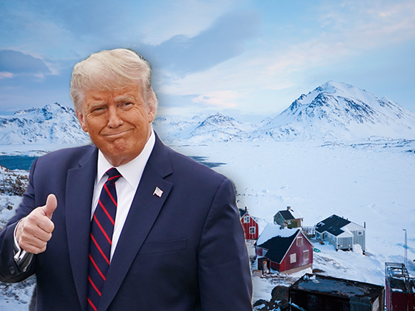
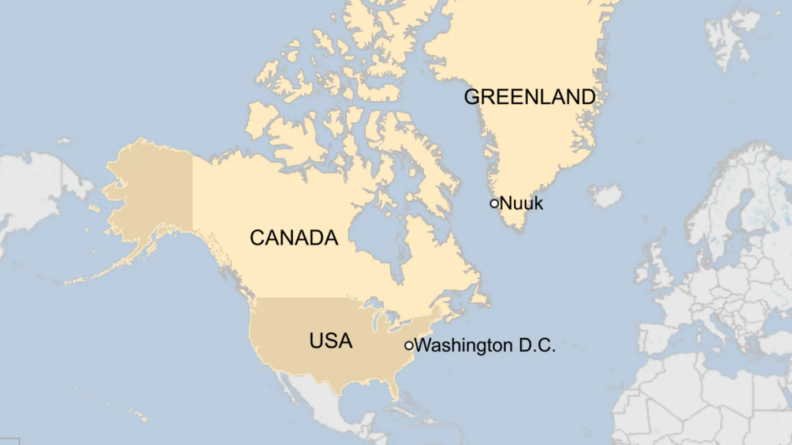
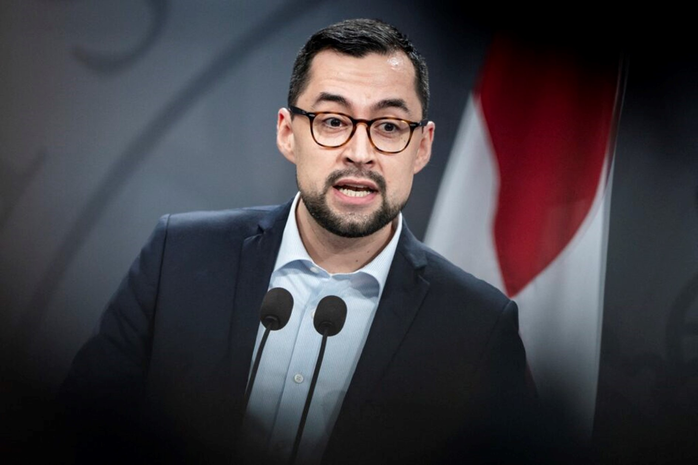

+++
title="Grenlandija na Trumpovem nakupovalnem seznamu"
date=2025-01-21

[extra]
author = "Timotej Pliberšek"

[taxonomies]
categories = ["Politika"]
tags = ["Donald Trump", "Grenlandija"]
+++

**47\. ameriški predsednik Donald Trump je s koncem prejšnjega leta razburil javnost, ko je razkril svoje načrte za širitev ameriškega ozemlja, med temi tudi nakup Grenlandije. Za njen doseg je pripravljen uporabiti tako gospodarske kot vojaške ukrepe. Otok je za Američane posebej pomemben zaradi svoje lege, bogatih naravnih virov in spremljanje ruskih vojaških aktivnosti. Trump kot glavni razlog navaja nacionalno varnost ZDA ter njeno globalno svobodo. Prebivalci Grenlandije nakupu nasprotujejo, sami pa si prizadevajo za popolno nacionalno avtonomijo.**

<!-- more -->

---
\
<small>Trump bi rad kupil Grenlandijo. | (Foto: [Breitbart](https://www.breitbart.com/politics/2024/12/23/pinkerton-trump-wants-to-make-greenland-great-again/))</small>

---

## Pripravljen je uporabiti tudi orožje

Novoizvoljeni ameriški predsednik **Donald Trump** je pred zaključkom prejšnjega leta presenetil javnost z zanimanjem za ameriško lastništvo Grenlandije. Ta je izrazil svoj interes za njen nakup že med svojim prvim mandatom leta 2019, vendar so mu danske oblasti hitro sporočile, da je največji otok na svetu del kraljevine in ni na prodaj. Trump je dodatno razburil javnost z grožnjo, da je za Grenlandijo sedaj pripravljen uporabiti vojaške ali gospodarske ukrepe, med temi carine proti Danski.

{{ youtube(id="GzBAw1Y3X-8") }}
<small>Frederiksenova pojasnjuje, da je Grenlandija za Grenlandce in samo oni se lahko odločijo kam bodo spadali. | Video: [New York Post](https://www.youtube.com/watch?v=GzBAw1Y3X-8)</small>

Trump je na svoje interese komentiral:

> "Za namene nacionalne varnosti in svobode po vsem svetu ZDA menim, da sta lastništvo in nadzor Grenlandije absolutna nuja."

Danska premierka **Mette Frederiksen** ga je opomnila, da otok ni na prodaj, o njegovi prihodnosti pa odločajo tamkajšnji prebivalci.

---

## Zakaj ravno Grenlandija?

Grenlandija je strateško pomembna zaradi svoje lege med Evropo in Severno Ameriko ter bogatih naravnih virov, kot so nafta, zemeljski plin in redke zemeljske kovine. Ta vsebuje 25 od 34 pomembnih surovin, ki jih potrebuje EU, vključno z litijem in grafitom. Kljub temu je razvoj otoka počasnejši, gospodarstvo pa močno odvisno od ribolova in danskih subvencij, ki pokrivajo polovico proračuna.

<small>Grenlandija lahko ponudi ZDA številne lastniške prednosti. | (Foto: [BBC](https://www.bbc.com/news/articles/c791xy4pllqo))</small>

Grenlandija ima ključno vlogo pri spremljanju ruskih vojaških aktivnosti, hkrati pa je Američanom pomembna za opozarjanje na balistične rakete. Ameriška vojska že ima tam stalno bazo Pituffik, zgrajeno v skladu z dogovorom iz leta 1951 med Dansko in ZDA, ki omogoča gradnjo vojaških objektov na otoku.

---

## Nočemo biti Američani. Želimo biti Grenlandci

Grenlandski premier **Mute B. Egede** je odločno zavrnil špekulacije, da bi ZDA lahko poskušale pridobiti Grenlandijo, potem ko je Donald Trump sprožil govorice o uporabi sile. Verjame, da Grenlandija stremi k neodvisnosti, sam pa je dejal:

> "Združuje nas več, toda želja, da bi bili gospodar v lastni hiši, bi morala biti razumljiva vsem na svetu."

Egede je prav tako izpostavil, da si Grenlandci želijo biti samostojni v mednarodnih odnosih, ne pa biti odvisni od danskega veleposlaništva. Poudaril je njihovo dolgotrajno željo po gradnji lastne države, ki bi bila v skladu z njihovimi ambicijami.

<small>Egede nasprotuje Trumpovim idejam. | (Foto: [PROFIMEDIA](https://n1info.si/novice/svet/po-trumpovih-groznjah-se-je-oglasil-grenlandski-premier-iscemo-priloznosti/))</small>

---

## Kako sedaj naprej?

Kljub dvigu napetosti je Grenlandija odprta na poslovanje z ZDA in razvoj dobrih odnosov. Egede je komentiral, da je bilo sicer dansko avtonomno ozemlje že doslej odprto za sodelovanje na področju rudarstva, bo pa tudi v prihodnje. Po zadnjih poročanjih ameriških medijev so Trumpovi zavezniki v predstavniškem domu kongresa že začeli iskati podporo za predlog zakona, s katerim bi se lahko izvedel nakup Grenlandije. V primeru sprejetja predloga zakona bi Trump lahko po uradnem prevzemu položaja 20. januarja že začel pogajanja z Dansko.

---

## Viri

- [RTV Slovenija](https://www.rtvslo.si/svet/zda-2024/trump-ne-izkljucuje-vojaske-sile-za-prevzem-nadzora-nad-grenlandijo-in-panamskim-prekopom/732648)
- [The Conversation](https://theconversation.com/4-reasons-why-the-us-might-want-to-buy-greenland-if-it-were-for-sale-which-it-isnt-246955)
- [24ur](https://www.24ur.com/novice/tujina/nocemo-biti-americani-zelimo-biti-grenlandci.html)
- [N1](https://n1info.si/novice/svet/po-trumpovih-groznjah-se-je-oglasil-grenlandski-premier-iscemo-priloznosti/)

---
