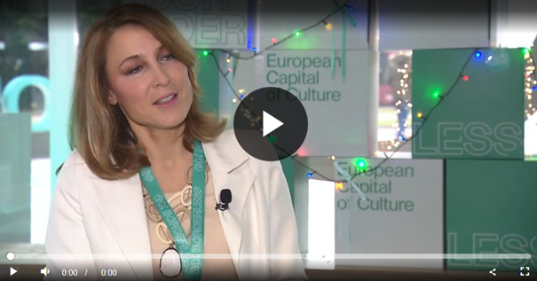
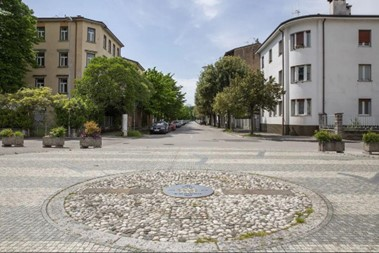
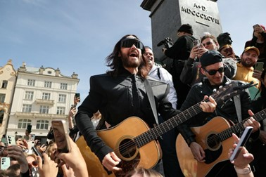

+++
title="Jared Leto prihaja v Gorico: GO! 2025 bo zasijal z zvezdniškim spektaklom"
date=2025-01-22

[extra]
author = "Neli Šijanec"

[taxonomies]
categories = ["Kultura"]
tags = ["GO! 2025", "Nova Gorica", "Jared Leto", "Trg Evrope"]
+++

*Prva čezmejna evropska prestolnica kulture, kjer Nova Gorica in Gorica združujeta moči v edinstvenem projektu, ki povezuje umetnost, zgodovino in skupno dediščino dveh držav.*

**Prvič v zgodovini bosta evropsko prestolnico kulture sestavljali dve mesti iz dveh držav – Nova Gorica in Gorica. Leta 2025 bosta mestoma v sodelovanju z različnimi kulturnimi organizacijami in umetniki ustvarili edinstven kulturni prostor, ki bo poudaril skupno zgodovino ter kulturno dediščino čezmejnega območja. Osrednji dogodki bodo obiskovalcem ponudili širok spekter kulturnih izkušenj, s poudarkom na povezovanju mest in vključevanju lokalnih umetnikov ter svetovno priznanih izvajalcev.**

<!-- more -->

---

\
<small>[Evropska prestolnica kulture GO! 2025 združuje Nova Gorico in Gorico v enoten prostor umetnosti in kulture, s številnimi dogodki ob reki Soči, ki vključujejo športne, glasbene, umetniške in kulinarične vsebine.](https://www.24ur.com/popin/domaca-scena/nova-gorica-in-gorica-letos-epicenter-kulturnega-dogajanja-sirse-regije.html) | Vir: 24ur</small>

## Skupna zgodovina in bogata kulturna dediščina regije

Evropska prestolnica kulture GO! 2025 bo združila mesti Nova Gorica in Gorica v enoten kulturni prostor, ki bo v letu 2025 postal središče umetniškega dogajanja na evropski ravni. Namen projekta je spodbuditi sodelovanje med različnimi kulturnimi organizacijami, umetniki ter skupnostmi obeh mest. Program bo zasnovan tako, da bo poudarjal skupno zgodovino Nove Gorice in Gorice ter s tem okrepil kulturno identiteto čezmejnega prostora, ki že stoletja deli bogato skupno zgodovino. Poudarek bo na prepletanju tradicionalnih in sodobnih umetniških praks, ki bodo obiskovalcem ponudile celovit vpogled v raznolikost kulturnih izrazov regije. Direktorica Zavoda GO! 2025, Maja Lorbek je ob tem izjavila:

> »To bo edinstvena priložnost za krepitev vezi med obema mestoma in prikaz kulturnega bogastva, ki ga delimo.«

---

<iframe src="https://www.google.com/maps/embed?pb=!4v1737476549793!6m8!1m7!1s0ZXNnZ8-0xqZt0vMIq1NeA!2m2!1d45.95530366053605!2d13.63507772160043!3f268.37018!4f0!5f0.7820865974627469" width="100%" height="450" style="border:0;" loading="lazy" referrerpolicy="no-referrer-when-downgrade"></iframe> 
<small>Street view osrednje lokacije | Vir: Google</small>

---

## Nova osrednja lokacija – prenovljen Trg Evrope

Osrednja lokacija dogajanja bo prenovljen Trg Evrope ob novogoriški železniški postaji, ki bo simboliziral povezovanje obeh mest ter odprte meje, ki odražajo temeljne vrednote evropske prestolnice kulture. Uradna otvoritev prenovljenega trga bo potekala **8. februarja 2025**. Prenovitev trga prinaša sodoben arhitekturni pristop, ki spoštuje zgodovinski kontekst prostora, hkrati pa omogoča odprt in dostopen prostor za raznolike kulturne dogodke, od koncertov do umetniških instalacij. 

---

\
<small>Sodobna prenova Trga Evrope bo ustvarila dinamičen prostor za različne kulturne dogodke. | Foto: Katarina Brešan</small>

---

## Vrhunski nastopi svetovnih zvezd

Ob tej priložnosti bodo Novo Gorico in njeno bližnjo okolico obiskale zvezde svetovnega formata. Maja Lorbek izpostavlja: 

> »nastopilo bo vsega skupaj okoli 2000 udeležencev otvoritve. Tukaj bomo videli vse najboljše, kar ponudi širša regija, torej Furlanija-Julijska krajina, in pa tudi Slovenija vse do Ptuja.«

Med glavne zvezde, ki bodo nastopile na dogodkih GO! 2025 spada tudi znani glasbenik in igralec **Jared Leto**. Njegov nastop bo eden izmed vrhuncev kulturnega dogajanja, saj bo s svojo karizmo in umetniškim izrazom pritegnil obiskovalce iz celotne regije ter širše. 

\
<small>Na čelu zasedbe Thirty Seconds to Mars je oskarjevec Jared Leto. | Foto: EPA</small>

---

## Raznolik kulturni program za vse generacije

Dogajanje v sklopu GO! 2025 bo s svojo pestro vsebino in globalno prisotnostjo obiskovalcem omogočilo nepozabno kulturno izkušnjo. 

Seznam dogodkov je na voljo na [uradni spletni strani GO! 2025](https://www.go2025.eu/sl).

Poudarek bo na raznolikosti programov, ki vključujejo koncerte, gledališke predstave, umetniške instalacije in interaktivne delavnice za vse generacije. Lokalni umetniki bodo s svojimi projekti poskrbeli za avtentičnost, medtem ko bodo svetovno priznani izvajalci, kot so **Sting**, **Robbie Williams**, **Alanis Morissette** in **Jared Leto**, dogajanje dodatno obogatili in pritegnili obiskovalce iz vseh koncev sveta. 

---

## Trajnostna preobrazba čezmejnega prostora

Zaključek GO! 2025 ne bo le priložnost za umetniško in kulturno izražanje, temveč tudi za trajnostno preobrazbo čezmejnega prostora. Z ureditvijo Trga Evrope in drugimi infrastrukturnimi izboljšavami bodo Nova Gorica in Gorica okrepili svojo vlogo kot kulturna vozlišča, ki ne le povezujeta ljudi, ampak tudi spodbujata razvoj trajnostnih praks v kulturi in turizmu. 

Projekt GO! 2025 vključuje številne pobude za zmanjšanje okoljskega odtisa, kot so zelene površine, uporaba obnovljivih virov energije ter podpora trajnostnim načinom prevoza, kot so kolesarjenje in javni prevoz. S tem bo evropska prestolnica kulture ne le praznovanje umetnosti, ampak tudi odgovorna in napredna platforma za prihodnost, ki bo služila kot zgled drugim mestom po Evropi, kako združiti kulturno dediščino z modernimi in trajnostnimi pristopi.

---

## Viri

- [RTV Slovenija](https://www.rtvslo.si/kultura/go-2025/abc-o-epk-kaj-prinasa-prenovljeni-trg-evrope/733324)  
- [24ur](https://www.24ur.com/popin/domaca-scena/nova-gorica-in-gorica-letos-epicenter-kulturnega-dogajanja-sirse-regije.html)  
- [Uradna spletna stran GO! 2025](https://www.go2025.eu/sl)  
- [Si21](https://www.si21.com/Svet/go-2025-nova-gorica---gorica/)  
- [Euro-Go](https://euro-go.eu/sl/programmi-e-progetti/capitale-europea-della-cultura-2025/)  

---
