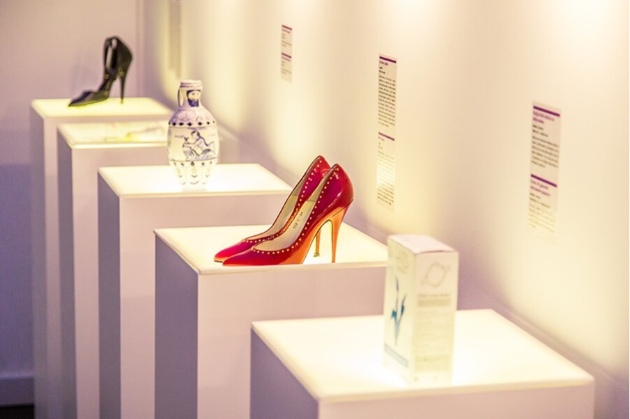
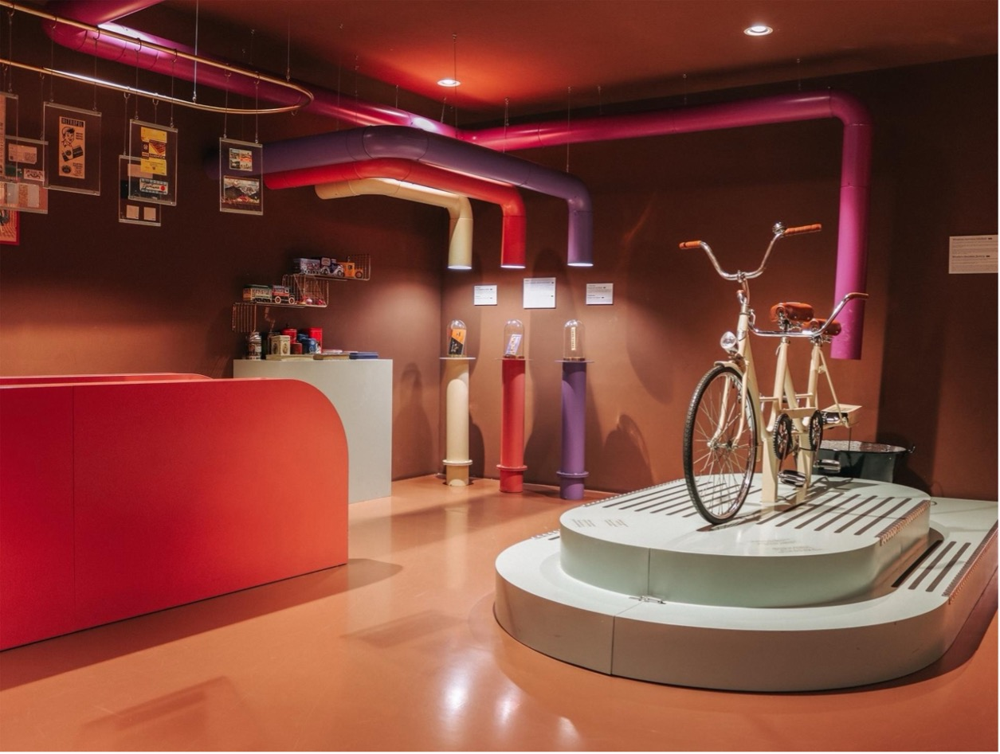
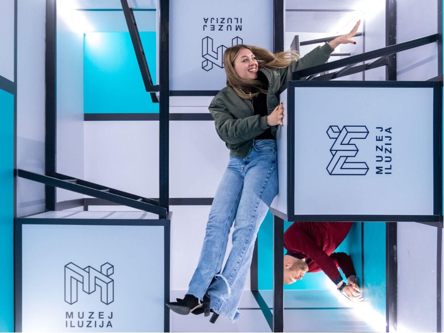
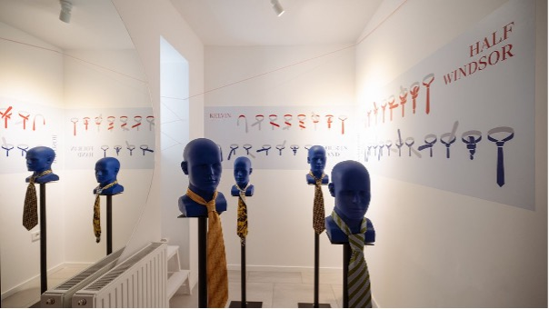
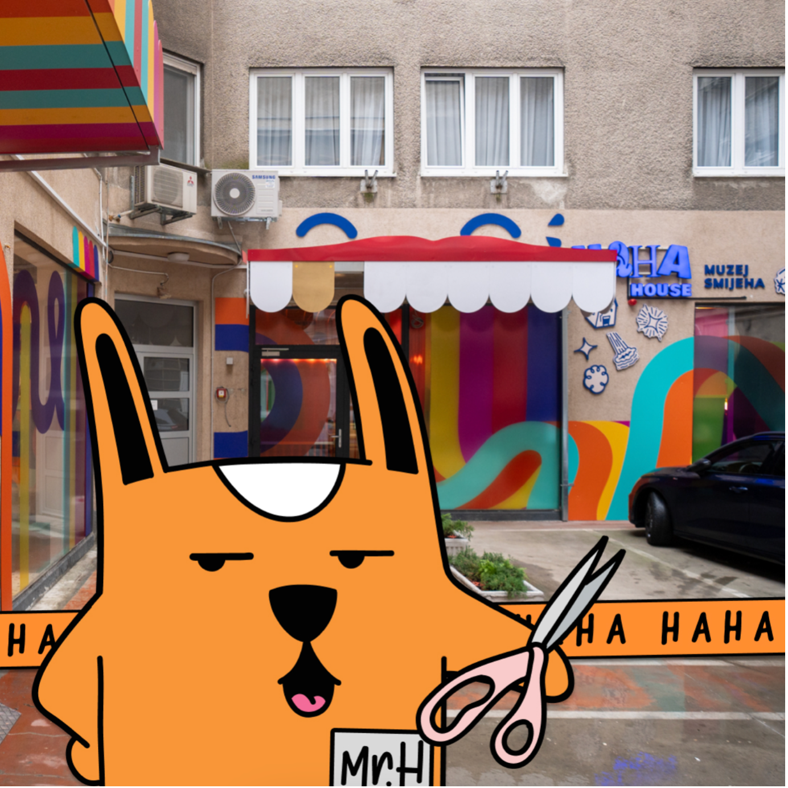
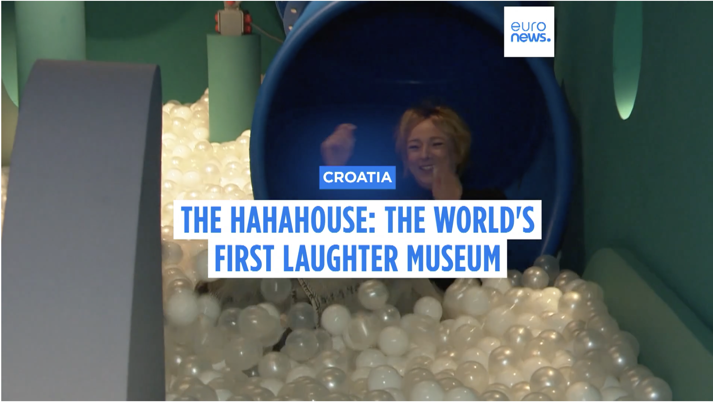

+++
title="Nenavadni muzeji Zagreba, ki privabljajo turiste"
date=2025-01-22
description="Uspešne zgodbe odštekanih muzejev prestolnice sosedov"

[extra]
author = "Jasna Bahovec"

[taxonomies]
categories = ["Potovanja"]
tags = ["Zagreb", "Muzeji", "Turizem"]
+++

**Zagreb je mesto, za katerega kljub nepreverjenim podatkom, pogosto pravijo, da ima največje število muzejev na prebivalca na svetu. Ne glede na to, ali ta trditev drži ali ne, pa se Zagreb ponaša z enimi izmed najbolj nenavadnih muzejev. Od Muzeja prekinjenih ljubezni, ki je postal svetovna ikona, do prvega muzeja smeha HaHaHouse, so zagrebški muzeji postali ena največjih turističnih atrakcij mesta. Dodatno pozornost v zadnjih letih pa so pridobili še zaradi prenove večine javnih muzejev, poškodovanih v potresu leta 2020.**

<!-- more -->

---

\
<small>Nenavadni predmeti, ki govorijo zgodbe o propadlih razmerjih.︱FOTO: Paul Prescott</small>

---

## Muzej prekinjenih ljubezni: od propadlega razmerja do globalne ikone

Najbolj prepoznaven je nedvomno [**Muzej prekinjenih ljubezni**](https://brokenships.com/). Razpadla zveza ustanoviteljev - umetnikov Olinke Vištice in Dražena Grubišića, oziroma njuni skupni predmeti, so bili povod za idejo o potujoči razstavi zgodb in predmetov propadlih razmerij. Leta 2010 je razstava svojo stalno mesto našla v Zagrebu. Muzej, ki ga pogosto uvrščajo med najbolj nenavadne in edinstvene muzeje v Evropi in po svetu, je s svojo izvirnostjo in univerzalno tematiko postal globalna ikona. Njegov uspeh je spodbudil nastanek drugih inovativnih muzejev, lani pa so odprli tudi podružnico v Chiang Maiu na Tajskem.

---

\
<small>V Muzeju čokolade Zagreb se lahko preizkusite v mletju kakavovih zrn.︱FOTO: Muzej čokolade Zagreb</small>

## Ena izmed 10 % najboljših turističnih aktivnosti je obisk Muzeja čokolade

[**Muzej čokolade Zagreb**](https://muzejcokolade.hr/ulaznice/) se je leta 2024 uvrstil med najboljše 10 % turističnih aktivnosti na svetu in prejel nagrado Traveller’s Choice, ki jo podeljuje TripAdvisor. Nagrada je rezultat ocen obiskovalcev, ki jih je muzej navdušil z edinstveno kombinacijo zabave, izobraževanja in sladkih doživetij. Obiskovalci lahko spoznajo zgodovino čokolade, poskusijo devet vrst čokolade iz degustacijske škatle in se celo preizkusijo v mletju kakavovih zrn. Muzej vključuje tudi trgovino, kjer lahko kupite čokoladne praline lokalnih in mednarodnih proizvajalcev.

---

\
<small>Soba iluzije preizkuša vašo logiko.︱FOTO: Muzej iluzij Zagreb</small>

## Prvi Muzej iluzij v verigi

**Muzeji iluzij** so postali svetovna atrakcija, ki v svoje prostore pritegnejo več kot 15 milijonov obiskovalcev letno. Ta največja in najhitreje rastoča veriga zasebnih muzejev na svetu, ki šteje že več kot 50 lokacij po vsem svetu, je svoje prvo lokacijo odprla prav v Zagrebu. [**Muzej iluzij Zagreb**](https://muzejiluzija.com/naslovna/) je vizualna, senzorična in izobraževalna izkušnja, zasnovana tako, da spremeni vaš pogled na svet skozi znanost, ki stoji za optičnimi iluzijami.

---

\
<small>Kravate so najprej nosili hrvaški vojaki.︱FOTO: Cravaticum</small>

## Ko vojni šal postane modni dodatek

Le redko kdo ve, da kravata izhaja iz Hrvaške. Prav to je bil povod, da od lani lahko v Zagrebu obiščemo [**Muzej Cravaticum**](https://cravaticum.com/english/), posvečen samo kravatam. Kravata, ki je svoje ime dobila po šalih hrvaških vojakov v francoski vojski, je danes prepoznaven svetovni simbol. Obiskovalci lahko v muzeju odkrijejo, kako se je kravata razvijala skozi čas, od vojnih obdobij do sodobnih različic. Muzej ponuja vpogled v kar 177.147 načinov zavezovanja kravate – vsak z lastnim pomenom in stilom.

---

\
<small>HaHaHouse je odprtje razglasil tudi preko svojega Instagram profila.︱FOTO: hahahousezagreb, Instagram</small>

## »Naj se smeh iz Zagreba širi po celem svetu«

Najnovejši zagrebški muzej, [**HaHaHouse**](https://www.haha.house/), se je odprl 10. januarja, na mednarodni dan smeha. Gre za prvi muzej na svetu, ki združuje humor, umetnost in tehnologijo, da obiskovalce vseh starosti spravi v smeh. Igrive instalacije in interaktivni prikazi obiskovalce spodbujajo k sodelovanju in zabavi. Ustanoviteljica muzeja Andrea Golubić, [je ob otvoritvi povedala](https://www.euronews.com/culture/2025/01/12/museum-of-laughter-opens-in-zagreb-on-international-laughter-day):

> »Naj se smeh iz Zagreba širi po celem svetu. Odprti bomo vsak dan od 9.00 do 21.00, nasmejali ljudi in dali vse od sebe, da bo več radosti, sreče in smeha na ulicah Zagreba.«

Upajo, da bodo z muzejem lahko pomagali pri duševnem zdravju ljudi, saj nudijo priložnost za smeh, sprostitev in odmor od monotonega vsakdana.

\
<small>Prvi obiskovalci se že zabavajo v  muzeju smeha | Posnetek zaslona: euronews.com</small>

---

## Muzeji: prostor za ustvarjalnost in nekonvencionalne tematike

Seznam nenavadnih muzejev v Zagrebu se tu še ne konča. Med bolj zanimivimi so tudi [Muzej karikature](https://otoreisinger.com/), [Muzej naivne umetnosti](https://hmnu.hr/), [Muzej nedokončane umetnosti](https://www.museumofunfinishedart.com/) in [Muzej pivskega mačka](https://muzejmamurluka.com/). Mesto s svojo raznolikostjo muzejev dokazuje, da je pravi prostor za ustvarjalnost in inovativne tematike. Zdi se, da bo Zagreb v prihodnosti še naprej navdihoval s svojimi nenavadnimi koncepti in presenetil obiskovalce z novimi idejami, ki pritegnejo tako domačine kot turiste.

---

## Naslovi in odpiralni časi omenjenih muzejev

- [Muzej prekinjenih ljubezni](https://brokenships.com/) (Ćirilometodska 2): ponedeljek – nedelja: 09:00 - 21:00  
- [Muzej čokolade Zagreb](https://muzejcokolade.hr/ulaznice/): zaprto zaradi selitve (15.–31. januar 2025)  
- [Muzej iluzij Zagreb](https://muzejiluzija.com/naslovna/) (Ilica 72): ponedeljek – nedelja: 10:00 - 22:00  
- [Cravaticum](https://cravaticum.com/english/) (Tomićeva ulica 5): ponedeljek – nedelja: 10:00 - 20:00  
- [HaHaHouse](https://www.haha.house/) (Gajeva ulica 7/1): ponedeljek – nedelja: 09:00 - 21:00  
- [Muzej karikature](https://otoreisinger.com/) (Radićeva ulica 44): ponedeljek – nedelja: 10:00 - 19:00  
- [Muzej naivne umetnosti](https://hmnu.hr/) (Ćirilometodska 3): ponedeljek – petek: 09:00 - 17:00, sobota: 10.00 - 14.00  
- [Muzej nedokončane umetnosti](https://www.museumofunfinishedart.com/) (Eugena Kumičića 10): torek – četrtek: 16.00 - 19.00, petek – nedelja: 10:00 - 19:00  
- [Muzej pivskega mačka](https://muzejmamurluka.com/) (Vlaška ulica 55): ponedeljek – nedelja: 10:00 - 22:00  

---

## Viri

- [Delo](https://www.delo.si/magazin/potovanja/zagreb-mesto-kjer-dobis-muzejskega-macka)
- [Chiang Mai Citylife](https://www.chiangmaicitylife.com/citynow/social-life/live-events/the-opening-of-the-museum-of-broken-relationships/)
- [Croatia Week](https://www.croatiaweek.com/zagreb-museum-ranked-among-worlds-top-10-tourist-activities/#google_vignette)
- [Bizna Kenya](https://biznakenya.com/museum-of-illusions-nairobi/)
- [Euronews](https://www.euronews.com/culture/2024/07/25/this-treasure-house-of-ties-is-far-from-outdated-worlds-first-cravat-museum-opens-in-zagre)
- [Euronews](https://www.euronews.com/culture/2025/01/12/museum-of-laughter-opens-in-zagreb-on-international-laughter-day)
- [Siol.net](https://siol.net/trendi/potovanja/zanimiv-in-cudovit-svet-nenavadnih-muzejev-v-zagrebu-646690)

---
