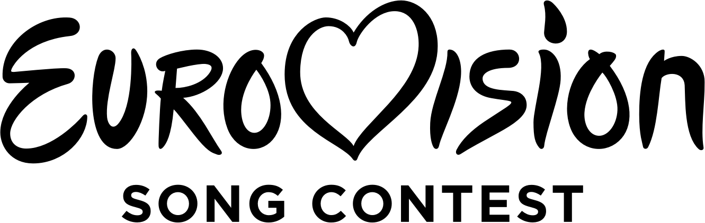
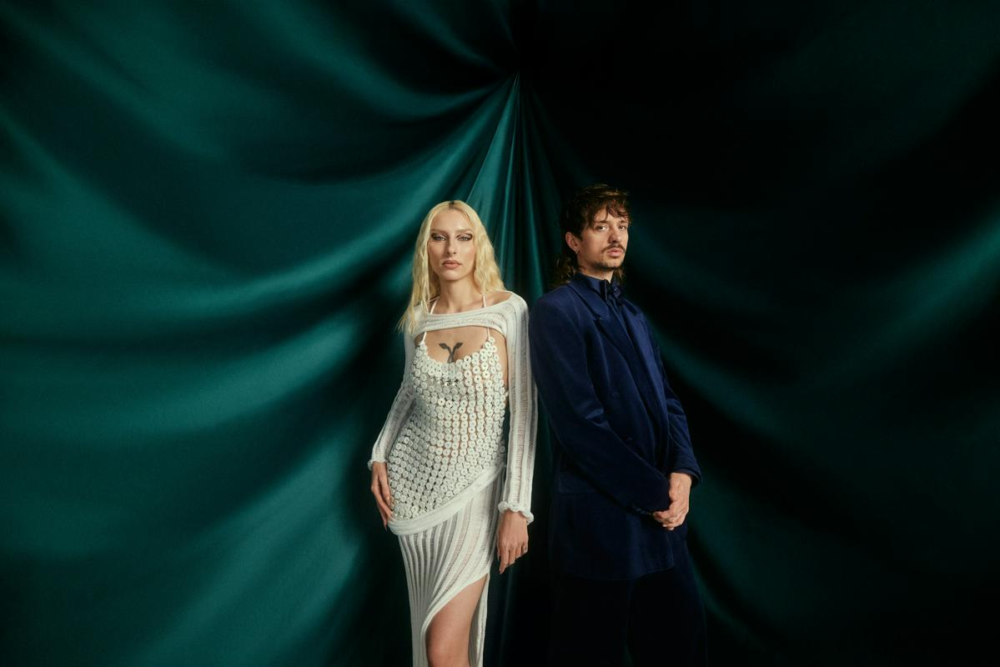
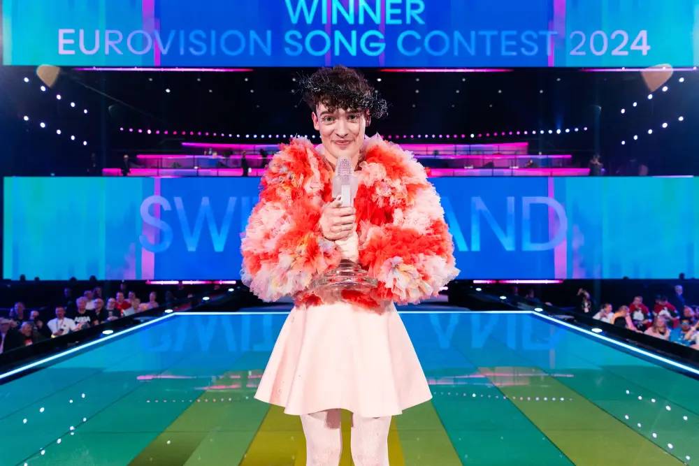
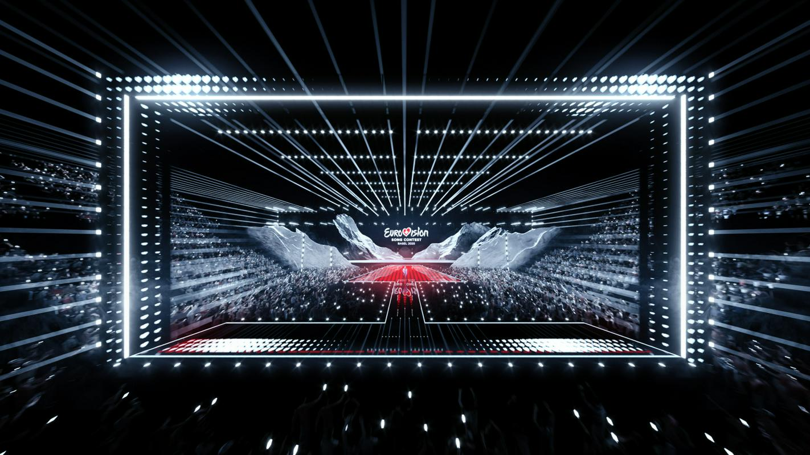

+++
title="Pričetek slovenske evrovizijske poti v Basel"
date=2025-01-24

[extra]
author = "Maja Turinek"

[taxonomies]
categories = ["Glasba"]
tags = ["Evrovizija", "Ema", "Basel", "Slovenija"]
+++

**Približuje se 69. tekmovanje za Pesem Evrovizije, ki bo v švicarskem mestu Basel, za kar gre zasluga lanskemu zmagovalcu Nemu. 1.2. bo napočil čas, da tudi Slovenija izbere kdo bo nasledil Raiven in zastopal naše barve. Po dveh letih se ponovno vrača Ema, kjer bodo o zmagovalcu odločale strokovne žirije in občinstvo.**

<!-- more -->

---

\
<small>Vir: Wikipedia</small>

---

## Ema se vrača

Zadnji dve leti Eme ni bilo, saj je strokovna žirija interno izbrala slovenskega evrovizijskega predstavnika. Lani nas je zastopala **Raiven** s skladbo [Veronika](https://www.youtube.com/watch?v=l86DxpRnz5M), leta 2023 pa **Joker Out** s skladbo [Carpe Diem](https://www.youtube.com/watch?v=3LXlPviGiWc), ki je postala uspešnica po celi Evropi. Letos bo izbor mogoče spremljati **1. februarja ob 20. uri na TV SLO 1**. Voditelja večera bosta Raiven in pevec skupine Mrfy, **Gregor Strasbergar – Štras**, ki je o svoji vlogi dejal:

> »Misel na vodenje Eme mi za zdaj še ne predstavlja velikega užitka, ampak bolj stres. Verjetno me bo pol države popljuvalo, ampak na srečo bodo bolj popljuvali našega novega predstavnika.«

\
<small>Letošnja voditelja Eme: pevka Raiven in pevec skupine Mrfy Gregor Strasbergar – Štras. | Vir: rtvslo.si</small>

---

## Dvanajst pesmi v boju za zmago

Predstavilo se bo 12 izvajalcev, ki bodo poskušali prepričati strokovno žirijo in občinstvo. V prvem krogu bo namreč pet strokovnih žirij določilo dva finalista, med katerima bo zmagovalca izbrala javnost s telefonskim glasovanjem. 


{
  "images": [
    {
      "src": "slika3.jpg",
      "title": "",
      "description": "ANNA: Čau (vir: rtvslo.si)"
    },
    {
      "src": "slika4.jpg",
      "title": "",
      "description": "Astrid & The Scandals: Touché (vir: rtvslo.si)"
    },
    {
      "src": "slika5.jpg",
      "title": "",      
      "description": "ZveN: Divja (vir: rtvslo.si)"
    },
    {
      "src": "slika6.jpg",
      "title": "",      
      "description": "Eva Pavli: Niti (vir: rtvslo.si)"
    },
    {
      "src": "slika7.jpg",
      "title": "",
      "description": "Jon Vitezič: Vse ti dam (vir: rtvslo.si)"
    },
    {
      "src": "slika8.jpg",
      "title": "",
      "description": "July Jones: New Religion (vir: rtvslo.si)"
    },
    {
      "src": "slika9.jpg",
      "title": "",      
      "description": "KiKi: O-ou! (vir: rtvslo.si)"
    },
    {
      "src": "slika10.jpg",
      "title": "",      
      "description": "Klemen: How Much Time Do We Have Left (vir: rtvslo.si)"
    },
    {
      "src": "slika11.jpg",
      "title": "",      
      "description": "PolarAce: Kind (vir: rtvslo.si)"
    },
    {
      "src": "slika12.jpg",
      "title": "",
      "description": "RAI: Frederick's Dead (vir: rtvslo.si)"
    },
    {
      "src": "slika13.jpg",
      "title": "",      
      "description": "Trine: Grace (vir: rtvslo.si)"
    },
    {
      "src": "slika14.jpg",
      "title": "",      
      "description": "Žan Videc: Pusti da gori (vir: rtvslo.si)"
    }
  ]
}


### Tekmovalci Eme 2025

- **ANNA**: *Čau*  
- **Astrid & The Scandals**: *Touché*  
- **ZveN**: *Divja*  
- **Eva Pavli**: *Niti*  
- **Jon Vitezič**: *Vse ti dam*  
- **July Jones**: *New Religion*  
- **KiKi**: *O-ou!*  
- **Klemen**: *How Much Time Do We Have Left*  
- **PolarAce**: *Kind*  
- **RAI**: *Frederick's Dead*  
- **Trine**: *Grace*  
- **Žan Videc**: *Pusti da gori*  

---

## Od televizijskega eksperimenta do globalnega fenomena

Pesem Evrovizije je tekmovanje za najboljšo pesem med evropskimi državam, ki se odvija vsako leto. Vse se je začelo s **prvim izborom 24. maja 1956**, kot televizijski eksperiment, na katerem je sodelovalo le sedem držav. Danes je tekmovanje zelo priljubljeno po celem svetu, na lanskem izboru je sodelovalo kar 37 držav. Čeprav je tekmovanje načeloma namenjeno evropskim državam, pa kot izjema od leta 2015 dalje sodeluje tudi Avstralija. Slovenija kot samostojna država tekmuje **od leta 1993**, ko nas je zastopal  1X Band s pesmijo [Tih deževen dan](https://www.youtube.com/watch?v=ZJKnD9k3soU). Naša najboljša uvrstitev na Evrovoziji je **7. mesto**, ki sta ga dosegli **Darja Švajer** leta 1995 in **[Nuša Derenda](https://www.youtube.com/watch?v=yzXmzCMOLQY)** leta 2001. Svojega predstavnika slovenci izberemo na nacionalnem izboru Ema, ki se pod tem imenom odvija od leta 1997. 

{{ youtube(id="qwnewjD7xg0") }}
<small>Darja Švajger s skladbo Prisluhni mi leta 1995 | Vir: Youtube</small>

---

## Lanska zmaga se je za las izmaknila našim sosedom

Tekmovanje za Pesem Evrovizije bi se letos skoraj odvijalo zelo bliu nas, na Hrvaškem, saj je lani njihov predstavnik [Baby Lasagna](https://www.youtube.com/watch?v=YIBjarAiAVc) zasedel drugo mesto. Za 44 točk ga je namreč prehitel švicarski predstavnik **Nemo s skladbo [The Code](https://www.youtube.com/watch?v=CO_qJf-nW0k)**, ki je poskrbel, da se tekmovanje po 36 letih vrača v Švico. Seveda pa tudi izbira novega prizorišča ni potekala brez težav, saj so se po izboru mesta Basel tamkajšnji prebivalci pritožili in tako so izvedli referendum, na katerem je 66,57 % volivcev podprlo financiranje dogodka. Tako se bo prvi predizbor odvil 13. maja, drugi predizbor 15. maja, veliki finale po bo na sporedu 17. maja. Na tekmovanju bo sodelovalo 38 držav, Ciper, Češka, Nizozemska Črna gora in Albanija so tudi že izbrali svoje predstavnike.

\
<small>Nemo s skladbo The Code- zmagovalec Evrovizije 2024 ︱vir: evrovizija.com</small>

---

## Letošnje tekmovanje v znamenju poslušanja in dialoga

Prav tako je že znan vizualni koncept letošnjega tekmovanja za katerega je letos zadolžen umetniški direktor **Artur Deyneuve**, ki je za vodilno temo izbral poslušanje in celoten koncept poimenoval Enotnost oblikuje ljubezen, ob čimer je dejal: "Če poslušamo drug drugega, najdemo ljubezen,". Za podobo odra je že osmič poskrbel scenograf švicarskih korenin **Florian Wieder**, ki je navdih črpal pri švicarskih gorah in jezkovni raznolikosti države. "Naš cilj je bil ustvariti revolucionaren koncept odra – celostno izkušnjo, ki je na Evroviziji še nismo videli," je povedal. 

\
<small>Izgled odra na Evroviziji 2025 po navdihnu švicarskih gora | vir: rtvslo.si</small>

---

## Izvajalce bomo lahko spoznali že pred Emo

Oddaja *Ema pred Emo* bo na sporedu 25. januarja ob 20. uri na TV SLO 1. Voditelja oddaje bosta **Bernarda Žarn** in **Jože Robežnik**, gledalci pa bodo lahko spoznali tekmovalce in prvič slišali njihove pesmi.

---

## Viri

- [Evrovizija - Zgodovina](https://eurovision.tv/history/origins-of-eurovision)  
- [Evrovizija 2024 - Malmo](https://eurovision.tv/event/malmo-2024)  
- [Evrovizija - Avstralija](https://eurovision.tv/country/australia)  
- [Evrovizija - Slovenija](https://eurovision.tv/country/slovenia)  
- [RTVSLO - Prvi vpogled v Ema pesmi](https://www.rtvslo.si/zabava-in-slog/glasba/ema/prvi-vpogled-v-emo-pesmi-o-minljivosti-avtenticnosti-divjosti-ljubezni-in-prijaznosti/733240)  
- [RTVSLO - Voditelja Eme 2025](https://www.rtvslo.si/zabava-in-slog/glasba/ema/emo-2025-bosta-povezovala-raiven-in-stras/732642)  
- [RTVSLO - Nastopajoči na Ema 2025](https://www.rtvslo.si/zabava-in-slog/glasba/ema/znani-so-nastopajoci-na-emi-2025/730468)  
- [Evrovizija - Eurovision 2024](https://eurovisionworld.com/eurovision/2024)  
- [Evrovizija - Referendum o Baslu](https://evrovizija.com/baselski-volivci-na-referendumu-odlocili-evrovizija-bo/)  
- [Evrovizija 2025 - Basel](https://evrovizija.com/basel-2025-od-38-sodelujocih-znanih-5-predstavnikov-in-2-pesmi/)  
- [RTVSLO - Koncept Evrovizije 2025](https://www.rtvslo.si/zabava-in-slog/glasba/ema/gore-dialog-in-jodlanje-koncept-prihajajoce-evrovizije-navdihuje-svicarska-tradicija/731265)  

---
