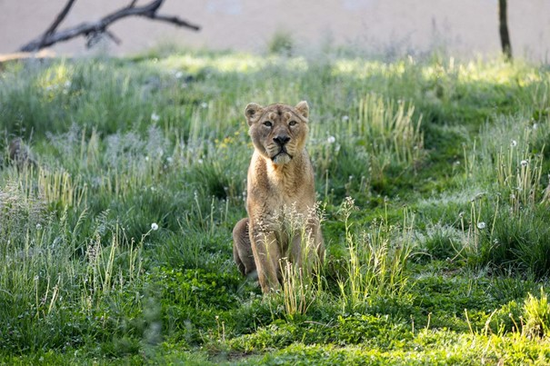
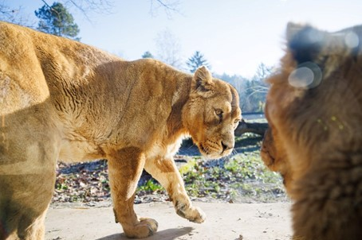

+++
title="ZOO Ljubljana v žalosti"
date=2025-01-19
description="Poslavljamo se od levinje Čaje"
[extra]
author = "Lara Drimel"

[taxonomies]
categories = ["Narava"]
tags = ["ZOO Ljubljana", "azijski levi", "Spomin na Čajo "]
+++

**Ljubljanski živalski vrt je sredi 19. januarja 2025 pretresla izguba ljubljene azijske levinje Čaje, ki je bila ena glavnih atrakcij živalskega vrta. Levinjo Čajo, znano po svoji živahni osebnosti in samozavesti, so morali v 17. letu evtanazirati zaradi nenadnega poslabšanja zdravstvenega stanja.**

<!-- more -->

---

  
<small>Čaja v vsej svoji veličastnosti. Foto: Petra Hrovatin</small>

## Iz Lodža do Ljubljane: Potovanje in življenje Čaje

Levinja Čaja je bila leta 2019 pripeljana v ljubljanski živalski vrt skupaj z levjim samcem Maksimusom iz živalskega vrta Lodž Zoo na Poljskem. Prvič sta se skupaj pokazala obiskovalcem na odprtju nove ograde ob 70-letnici živalskega vrta Ljubljana. Lani je umrl Maksimus, kar je pustilo precejšnjo praznino tako med osebjem živalskega vrta kot med Čajo. Da bi ji olajšali osamljenost, so iz madžarskega živalskega vrta pripeljali 15-letno levinjo Živano, ki je žalovala za izgubo svoje sestre. Po krajšem obdobju prilagajanja sta se Čaja in Živana močno povezali in postali nerazdružljivi.

  
<small>Čaja je zelo dolgo žalovala za Maksimusom. Foto: Luka Kotnik</small>

  
<small>Po daljšem obdobju spoznavanja sta bili Čaja in Živana nerazdružljivi. Foto: Petra Hrovatin, arhiv ZOO Ljubljana</small>

---

## Nenadna izguba in poslednje slovo

Žal pa se je Čajino zdravje nenadoma poslabšalo. Diagnostične preiskave so pokazale, da ima v trebušni votlini hitro rastoči tumor in razsevke, čeesar ni bilo možno operirati. Oskrbniki so se odločili za njeno evtanazijo, da preprečijo nadaljnje trpljenje. "Čajo si bomo zapomnili kot samozavestno levinjo, ki je uživala v sodelovanju z oskrbniki pri tehtanju, urjenju prostovoljnega odvzema krvi in dajanju zdravil," so v sporočilu za javnost zapisali v živalskem vrtu. Pogosto so jo videli ležati na hribu sredi svoje ograde in opazovati okolico, posebej so jo zanimale antilope v sosednji ogradi.

Koordinator Evropskega združenja živalskih vrtov in akvarijev (EAZA) je bil obveščen o smrti Čaje, organizacija pa bo zdaj proučila možnosti za nadaljevanje vzreje te ogrožene vrste v Ljubljani.

---

## Posebna podvrsta z edinstvenimi lastnostmi

Živana je trenutno edina azijska levinja, ki je ostala v ljubljanskem živalskem vrtu. Rodila se je v züriškem živalskem vrtu in nosi ime, ki v hindijščini pomeni "življenje". Živana je ena izmed 125 azijskih levov, ki sodelujejo v evropskih rejskih programih za ohranitev te ogrožene podvrste. Ti levi se od afriških levov razlikujejo tako po videzu kot po življenjskem slogu. Imajo manj izrazite grive, vendar so bolj poraščeni na konici repa in pod pazduho. Za razliko od svojih afriških sorodnikov, ki živijo v velikih krdelih, azijski levi tvorijo manjše skupine, ki jih pogosto sestavljajo samo samice in njihovi mladiči, samci pa običajno živijo ločeno.

[Več o azijskih levih lahko preberete tukaj](https://www.zoo.si/zival/41/azijski-lev/v-zivalskem-vrtu)

Spomin na Čajo bo nedvomno ostal živ, saj so jo cenili tako obiskovalci kot zaposleni, "bila krasna žival, iskrivega in vedrega značaja" so poudarili v ZOO Ljubljana. Njena zgodba ne poudarja le lepote azijskih levov, ampak tudi pomen vzrejnih programov. Živalski vrt Ljubljana pa se bo zdaj osredotočil na prihodnje korake za zaščito azijskih levov, obenem pa zagotovil najboljšo oskrbo levinji Živani, ki še vedno kraljuje v njihovi ogradi.

---

## Viri

- [RTV Slovenija - Čaja dobila prijateljico Živano](https://www.rtvslo.si/zabava-in-slog/zanimivosti/azijska-levinja-caja-v-zoo-ju-ljubljana-dobila-prijateljico-zivano/716795)
- [RTV Slovenija - Žalovanje za Čajo](https://www.rtvslo.si/zabava-in-slog/zanimivosti/v-zoo-ljubljana-zalujejo-za-cajo-bila-je-samozavestna-levinja-iskrivega-znacaja/734054)
- [ZOO Ljubljana](https://www.zoo.si/)
- [24ur - Poslovili so se od priljubljene levinje Čaje](https://www.24ur.com/novice/slovenija/zalostna-novica-iz-zoo-ljubljana-poslovili-so-se-od-priljubljene-levinje-caje.html)

