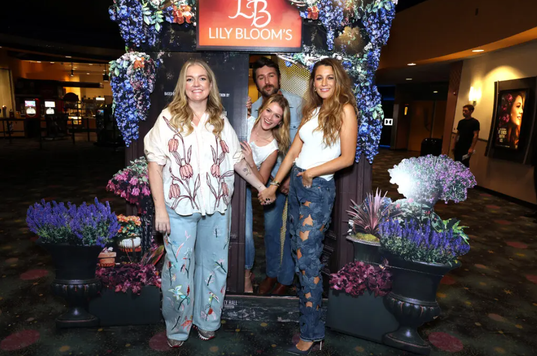
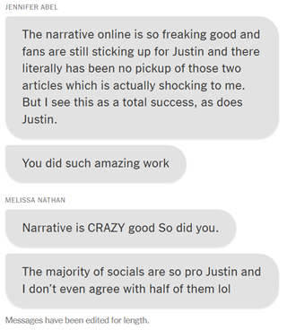
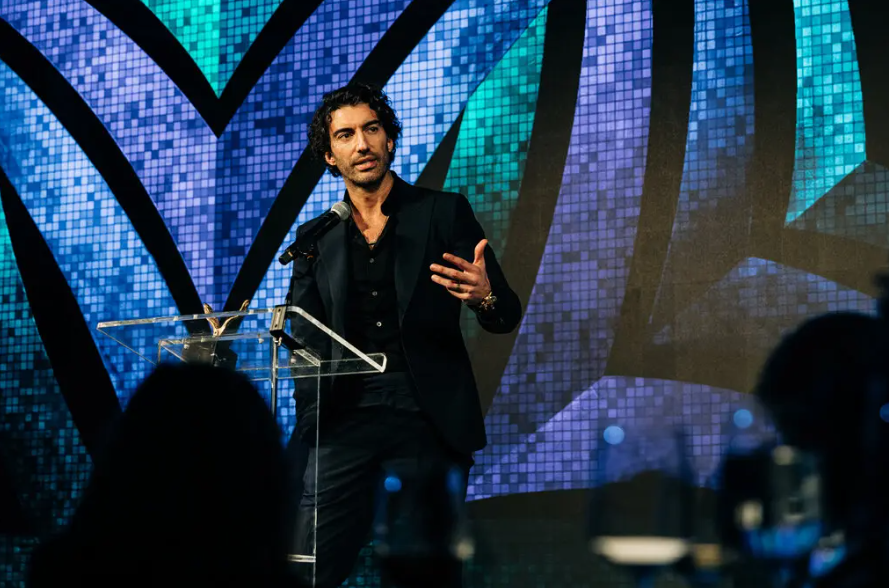

+++
title="Zakulisje zabavne industrije"
date=2025-01-15
description="Odnosi z javnostmi oblikujejo zgodbo: Blake Lively proti Justinu Baldoniju"
[extra]
author = "Elena Schmid"

[taxonomies]
categories = ["Film", "Zabavna industrija"]
tags = ["Blake Lively", "Justin Baldoni", "It Ends With Us", "odnosi z javnostmi"]
+++

**Snemanje in promocija filma *It Ends With Us* je povzročilo govorice o napetostih med igralko Blake Lively in soigralcem ter režiserjem Justinom Baldonijem. Prav tako je škodila ugledu igralke lika Lily Bloom. V decembru je Baldonija obtožila spolnega nadlegovanja in diskreditacijskih taktik s pomočjo kriznega PR-ja, kar so razkrili v [članku](https://www.nytimes.com/2024/12/21/business/media/blake-lively-justin-baldoni-it-ends-with-us.html) časopisa The New York Times. Posledično je Baldoni tožil časopis za obrekovanje in manipulacijo dokazov, v prihodnje pa načrtuje tudi tožbo proti soigralki Lively.**

<!-- more -->

---

### Padec popularnosti igralke zaradi lahkotnega tona o družinskem nasilju

Vse se je začelo s snemanjem filma *It Ends With Us*, v katerem nastopata znana igralka Blake Lively in Justin Baldoni, kateri je bil tudi v vlogi režiserja. Film, ki je bil posnet po romantični knjigi Colleen Hoover, obravnava družinsko nasilje. Govorice o napetosti med Baldonijem in Lively so se pričele že v času promocije filma, saj je Lively govorila z lahkotnim in šaljivim tonom med intervjuji o temi družinskega nasilja. Uporabniki družbenih medijev so opazili, da filmska ekipa ne sledi režiserju, kar naj bi dokazovalo razkol med Baldonijem in Lively. S filmom je igralka iz *Gossip Girl* promovirala lastno linijo izdelkov za lase in alkohol, kar so oboževalci kritizirali in označili kot sebično. [Mnenja](https://www.independent.co.uk/arts-entertainment/films/news/it-ends-with-us-blake-lively-justin-baldoni-interviews-b2597237.html) o igralki so na družbenih medijih postala zelo negativna.

  
<small>*Avtorica Colleen Hoover in člani igralske zasedbe Brandon Sklenar, Isabela Ferrer in gospa Lively promovirajo film It Ends With Us brez Baldonija. (The New York Times)*</small>

---

### Razkritje srhljivega zakulisja spora med igralcema filma *It Ends With Us*

V avgustu 2024 je izšel podatek, da je Baldoni zaposlil vodjo za krizni PR Melisso Nathan, ki je pomagala že Johnnyju Deppu. V decembru pa je [članek](https://www.nytimes.com/2024/12/21/business/media/blake-lively-justin-baldoni-it-ends-with-us.html) v The New York Times dodal popolnoma nov vpogled v spor med Baldonijem in Lively. Igralka lika Lily Bloom je vložila pritožbo proti soigralcu in režiserju filma *It Ends With Us* zaradi domnevnega spolnega nadlegovanja in ustvarjanja sovražnega delovnega okolja. Obtožbe vključujejo neželene poljube med snemanjem in neprimerne komentarje. Po njenih trditvah je Baldoni najel PR ekipo za diskreditacijo njenega ugleda. Lively je [izjavila](https://www.independent.co.uk/arts-entertainment/films/news/blake-lively-justin-baldoni-lawsuit-golden-globes-b2674167.html):

> *"Upam, da bom s svojim pravnim postopkom pomagala odgrniti zaveso nad temi zloveščimi povračilnimi taktikami."*

  
<small>*Sporočila med PR ekipo in Justinom Baldonijem, ki naj bi dokazovala zaroto proti Blake Lively. (The New York Times)*</small>

---

### Obtožbe manipulacij in favoriziranja hollywoodskih elit v višini 250 milijonov dolarjev

Konec decembra je Baldoni vložil tožbo zaradi obrekovanja v višini 250 milijonov dolarjev proti *The New York Timesu* zaradi poročanja časopisa o obtožbah Lively. Obtožil jih je uklonjenja željam "nedotakljivih" hollywoodskih elit Lively in njenega moža Ryana Reynoldsa. Objavljena sporočila naj bi bila specifično izbrana in spremenjena brez potrebnega konteksta za namerno zavajanje. Odvetnik obtoženca, Bryan Freedman, je izjavil o bodoči tožbi proti igralki iz *Gossip Girl* in dodal:

> *"Ta tožba bo temeljila na dokazih in bo razkrila vsak dokument, e-pošto in besedilna sporočila, ki pripovedujejo resnično zgodbo."*

Manj znan igralec je posledično po objavi članka izgubil nagrado Vital Voices za njegov feministični podkast Man Enough.

  
<small>*Justin Baldoni je decembra 2024 prejel nagrado za zaveznika žensk. (The New York Times)*</small>

---

### Pravni izid le senca omadeževanega ugleda

Primer poudarja vztrajne izzive v zabavni industriji, vključno z dinamiko moči, nadlegovanjem na delovnem mestu in vlogo odnosov z javnostmi pri oblikovanju pripovedi. Oba igralca se soočata z možnostjo, da bo njun ugled trajno spremenjen, ne glede na pravni izid. Zvočni posnetek, ki je pred kratkim ušel v javnost, naj bi poročal o premieri filma *It Ends With Us* in kako Lively ni želela Baldonija na premieri.

---

### Viri

- [Independent](https://www.independent.co.uk/arts-entertainment/films/news/it-ends-with-us-blake-lively-justin-baldoni-feud-b2593794.html)  
- [The New York Times](https://www.nytimes.com/2024/12/21/business/media/blake-lively-justin-baldoni-it-ends-with-us.html)  
- [Independent - Lawsuit](https://www.independent.co.uk/arts-entertainment/films/news/blake-lively-justin-baldoni-lawsuit-golden-globes-b2674167.html)  
- [Forbes](https://www.forbes.com/sites/maryroeloffs/2025/01/13/the-entire-justin-baldoni-vs-blake-lively-feud-explained-former-publicist-reportedly-subpoenaing-tech-companies/)  
- [The Music Essentials](https://themusicessentials.com/trending-pop-culture-news/justin-baldoni-counters-blake-livelys-allegations-with-new-evidence/)  
