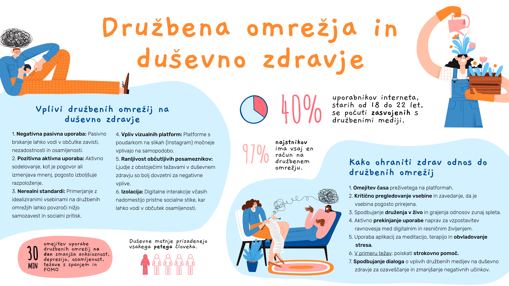
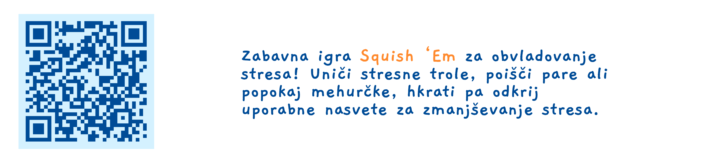

+++
title = "Družbena omrežja in duševno zdravje: med povezanostjo in osamljenostjo"
date = 2025-01-26
description="Kako digitalne platforme vplivajo na naše počutje in kaj lahko storimo za uravnoteženo uporabo."

[extra]
author = "Maja Kuhl"

[taxonomies]
categories = ["Duševno zdravje"]
tags = ["Družbena omrežja", "Digitalna odvisnost", "Samopodoba"]
+++

**Leto 2024 je bilo do sedaj najtoplejše leto, saj se je povprečna globalna temperatura dvignila za 1,6 °C in s tem prvič presegla predindustrijsko raven. Kljub svojim trudom za zmanjšanje onesnaževanja okolja, pa je Evropa še vedno četrta največja onesnaževalka na svetu. Strokovnjaki in poznavalci po vsem svetu opozarjajo, da je čas za ukrepanje zdaj, saj bo v nasprotnem primeru prepozno. Kljub temu pa novoizvoljeni ameriški predsednik obstoj globalnega segrevanja zanika in ga označuje za prevaro.**

<!-- more -->

---

\
<small>Foto: Zasvojenost z družbenimi omrežij | Vir: Freepik</small>  

V digitalni dobi, kjer so družbeni mediji postali neločljiv del našega vsakdanjega življenja, se vse bolj zavedamo njihovega vpliva na naše duševno zdravje. Digitalne platforme, ki so sprva obetale povezanost in skupnost, so se sčasoma izkazale tudi za možen vir negativnih posledic, zlasti na mlade. Raziskave, ki preučujejo povezavo med uporabo družbenih medijev in duševnim zdravjem, so razkrile zapleteno mrežo vplivov, ki vključujejo depresijo, anksioznost, zadovoljstvo z življenjem, samopodobo in občutke osamljenosti. 

## Vpliv družbenih medijev na naše počutje

Problematična uporaba družbenih medijev ni le stvar časa, ki ga preživimo na spletu. Gre predvsem za način, kako uporabljamo te platforme, saj je uporaba družbenih medijev sama po sebi nevtralna. Pasivno brskanje po objavah pogosto vodi v negativne občutke, kot so zavist, manjvrednost in izolacija. Nasprotno pa lahko aktivna komunikacija, izmenjava mnenj in ustvarjanje resničnih povezav z drugimi pozitivno vplivajo na naše počutje. Individualne razlike pri tem igrajo ključno vlogo pri tem, kako platforme vplivajo na uporabnike. Nekateri posamezniki so zaradi osebnostnih lastnosti ali obstoječih težav z duševnim zdravjem bolj občutljivi na negativne vplive. Na drugi strani tisti z močnimi socialnimi vezmi pogosto uspešno uravnavajo uporabo družbenih omrežij, ne da bi to škodovalo njihovemu počutju.

Pomemben dejavnik, ki vpliva na duševno zdravje, je tudi primerjanje z drugimi. Družbeni mediji pogosto prikazujejo idealizirane različice življenja, ki ne odražajo resničnosti, kar lahko povzroči občutke nezadostnosti in nižje samopodobe. Ta primerjava lahko sproži nerealna pričakovanja, povzroči socialni pritisk in poveča negotovost o lastni vrednosti. Uporabniki se pogosto znajdejo pod socialnim pritiskom, da dosežejo standarde, ki so nerealni ali neizvedljivi. Zavedanje, da je vsebina na družbenih omrežjih pogosto prirejena in selektivna, lahko pomaga ublažiti negativne učinke teh primerjav.  

*Spodaj je odlomek iz podkasta **Brstologija**, ki razpravlja o nerealnem prikazovanju življenja na družbenih omrežjih. Celotno epizodo podkasta "**Čustvene, vedenjske in duševne težave otrok in mladostnikov**" (Sanja Brezničar, epizoda #35) si lahko ogledate [tukaj](https://www.youtube.com/watch?v=ZQYh5Olvi7I).* 

{{ youtube(id="ZQYh5Olvi7I") }}

## Posebnosti platform in vloga osebnih značilnosti

Različne digitalne platforme lahko nekoliko drugače vplivajo na uporabnike. Zaradi značilnosti posameznih družbenih omrežij lahko pride do razlik v tem kako jih uporabniki doživljajo in s tem vplivajo na njihovo duševno zdravje. Na primer, vizualne platforme, kot je Instagram, kjer so slike pogosto močno obdelane, lahko močneje vplivajo na samopodobo kot platforme, kjer prevladujejo besedilne objave. Hitre spremembe v digitalnem okolju lahko močno vplivajo na duševno zdravje posameznikov, pri čemer so negativni učinki pogosto izrazitejši pri tistih, ki so že ranljivi ali imajo pretekle izkušnje z duševnimi težavami. Na to kako družbeni mediji učinkujejo na nas, vplivajo različni dejavniki. Naše osebnostne lastnosti, pretekle izkušnje, socialno okolje in genetska predispozicija igrajo pomembno vlogo pri tem, kako doživljamo vpliv digitalnega sveta. Na primer, raziskave kažejo, da so dekleta pogosto bolj občutljiva na negativne vplive družbenih omrežij kot fantje. Posamezniki, ki so že nagnjeni k duševnim težavam, so tako lahko bolj ranljivi za negativne učinke, medtem ko so tisti z močnimi socialnimi vezmi v resničnem svetu lahko bolj zaščiteni pred temi vplivi.

\
<small>Foto: Družbena omrežja in duševno zdravje | Vir: Maja Kuhl</small>  

## Pot k uravnoteženi uporabi in rešitve za duševno zdravje

Digitalne tehnologije pa ne prinašajo le izzivov, temveč tudi rešitve za izboljšanje duševnega zdravja. Pametni telefoni in aplikacije omogočajo zbiranje podatkov o razpoloženju ter sledenje simptomom, kar lahko pripomore k zgodnjemu odkrivanju težav. Aplikacije za meditacijo, terapijo in obvladovanje stresa lahko pomagajo posameznikom, da se soočijo z vsakodnevnimi izzivi. Takšne aplikacije so lahko koristne, še posebej, če se uporabljajo v kombinaciji s strokovno pomočjo. Pomembno pa je, da te tehnologije ne zamenjajo osebnega stika s strokovnjaki.

*[Kliknite to povezavo](https://mindyourmind.ca/apps/squishem_2023/pages/squish.html) ali  skenirajte qr kodo in preiskusite igro [Annoying Stress Trogs](https://mindyourmind.ca/apps/squishem_2023/index.html), zasnovano za sproščanje stresa. Igra vključuje tri izzive, kjer morate stisniti stvore, poiskati pare ali pokati mehurčke, medtem ko obvladujete stres in pridobite koristne nasvete.*

Ključnega pomena za zmanjšanje negativnih vplivov družbenih medijev je ozaveščanje o lastnih navadah in postavljanje meja. Omejevanje časa, preživetega na platformah, je ena od učinkovitih strategij, pa tudi aktivno prekinjanje uporabe naprav za vzpostavljanje boljšega ravnovesja med digitalnim in resničnim življenjem. Uporabnike je treba spodbuditi h kritičnemu pregledu vsebine, ki jo vidijo na spletu, zavedajoč se, da nerealistične predstavitve življenj lahko povzročijo neugodne socialne primerjave in negativno vplivajo na samopodobo.  Digitalne interakcije ne bi smele nadomestiti realnih socialnih stikov. Spodbujanje druženja v živo in gradnje offline odnosov je ključno za preprečevanje osamljenosti in izboljšanje duševnega zdravja. V primeru težav pa je nujno poiskati strokovno pomoč, saj lahko negativni učinki družbenih medijev vodijo do resnih posledic, kot so kronična depresija, anksioznost ali druge motnje. 

\
<small>Foto: Socialni stiki in dialog | Vir: Freepik</small> 

Pomembno je, da spodbujamo dialog o vplivu družbenih medijev na duševno zdravje, tako med strokovnjaki kot med uporabniki teh platform. Le s skupnim razumevanjem in odprto komunikacijo lahko začnemo graditi digitalno okolje, ki bo spodbujalo dobro počutje in zmanjšalo negativne učinke. Končni cilj mora biti ravnovesje med digitalnim in resničnim svetom. To pomeni ne le postavljanje meja uporabe družbenih omrežij, ampak tudi spodbujanje pristnih odnosov, razvijanje odpornosti na negativne vplive ter podpiranje tistih, ki so zaradi svojih izkušenj ali okoliščin bolj ranljivi. S prizadevanjem za bolj zdravo digitalno kulturo lahko ustvarimo svet, kjer tehnologija ne bo prevladovala nad nami, ampak bo delovala v našo korist – podpirala naše duševno zdravje in omogočala resnično povezanost.

## Viri

### Članki in raziskave
- Sadagheyani, H. E., & Tatari, F. (2021). Investigating the role of social media on mental health. *Mental health and social inclusion, 25*(1), 41-51. [Povezava do članka](https://www.emerald.com/insight/content/doi/10.1108/mhsi-06-2020-0039/full/pdf?title=investigating-the-role-of-social-media-on-mental-health)  
- Braghieri, L., Levy, R. E., & Makarin, A. (2022). Social media and mental health. *American Economic Review, 112*(11), 3660-3693. [Povezava do članka](https://pubs.aeaweb.org/doi/pdfplus/10.1257/aer.20211218)  
- Valkenburg, P. M., Meier, A., & Beyens, I. (2022). Social media use and its impact on adolescent mental health: An umbrella review of the evidence. *Current opinion in psychology, 44*, 58-68. [Povezava do članka](https://www.sciencedirect.com/science/article/pii/S2352250X21001500)  
- Huang, C. (2022). A meta-analysis of the problematic social media use and mental health. *International Journal of Social Psychiatry, 68*(1), 12-33. [Povezava do članka](https://journals.sagepub.com/doi/abs/10.1177/0020764020978434)  
- Boer, M., Stevens, G. W., Finkenauer, C., de Looze, M. E., & van den Eijnden, R. J. (2021). Social media use intensity, social media use problems, and mental health among adolescents: Investigating directionality and mediating processes. *Computers in Human Behavior, 116*, 106645. [Povezava do članka](https://www.sciencedirect.com/science/article/pii/S0747563220303927)  
- Torous, J., Bucci, S., Bell, I. H., Kessing, L. V., Faurholt‐Jepsen, M., Whelan, P., ... & Firth, J. (2021). The growing field of digital psychiatry: current evidence and the future of apps, social media, chatbots, and virtual reality. *World Psychiatry, 20*(3), 318-335. [Povezava do članka](https://onlinelibrary.wiley.com/doi/full/10.1002/wps.20883)  

### Igra
- [Squish 'Em – igra za zmanjšanje stresa](https://mindyourmind.ca/games-tools/stress-wellness/squish-em/)  

### Statistika in infografike
- [Teens, Screens, and Mental Health – WHO](https://www.who.int/europe/news-room/25-09-2024-teens--screens-and-mental-health)  
- [Social Media Addiction and Mental Health: The Growing Concern for Youth Well-Being – Stanford Law](https://law.stanford.edu/2024/05/20/social-media-addiction-and-mental-health-the-growing-concern-for-youth-well-being/)  
- [Social Media Addiction by Age – Statista](https://www.statista.com/statistics/1081292/social-media-addiction-by-age-usa/)  
- [Social Media and Mental Health Statistics – Etactics](https://etactics.com/blog/social-media-and-mental-health-statistics)  
- [Search results: Social Media and Mental Health – Statista](https://www.statista.com/search/?q=social+media+and+mental+health&Search=&p=1)  
- [Resolucija: Nacionalni inštitut za javno zdravje (NIJZ)](https://nijz.si/wp-content/uploads/2022/12/zadnja_mira_resolucija_10_feb_2020_slo_1.pdf)  
