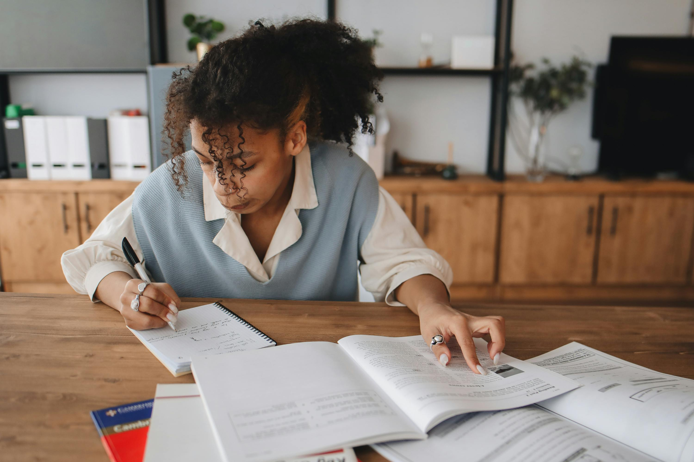
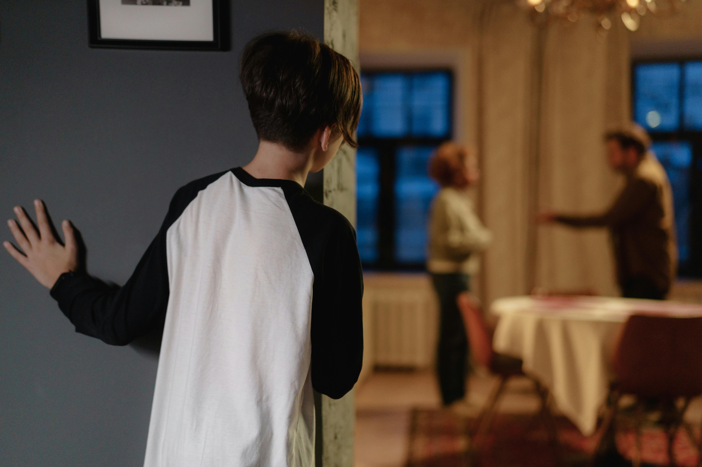

+++
title = "Duševno zdravje otrok in najstnikov"
date = 2025-01-26
description="Izzivi in rešitve za mlade v sodobnem svetu"

[extra]
author = "Lara Drimel, Sara Tratnjek"

[taxonomies]
categories = ["Duševno zdravje"]
tags = ["Psihološka podpora", "Otroci in mladostniki", "Pritisk družbenih omrežij"]
+++

**V današnjem okolju, kjer so otroci in najstniki vsakodnevno izpostavljeni različnim izzivom, postaja skrb za njihovo duševno zdravje vse pomembnejša. Duševne težave med mladimi so vse pogostejše, saj se soočajo s stresom zaradi šolskih obveznosti, vplivi družbenih omrežij, pritiski v družini in številnimi drugimi dejavniki. Ta članek raziskuje vzroke za duševne težave pri otrocih in najstnikih, vpliv teh težav na njihovo življenje ter možne strategije za pomoč mladim pri obvladovanju težav z duševnim zdravjem.**

<!-- more -->

---

## Izzivi in poti k izboljšanju

Adolescenca je ključna faza v življenju, v kateri se otroci spreminjajo tako fizično kot čustveno. To obdobje prinaša številne izzive, ki lahko vplivajo na duševno zdravje. Po vsem svetu je ocenjenih, da eden od sedmih ljudi, starih med 10 in 19 let, doživi duševno motnjo, kar predstavlja 15 % svetovne obremenitve bolezni v tej starostni skupini. Med najpogostejšimi težavami so depresija, anksioznost in vedenjske motnje, ki spadajo med glavne vzroke za bolezni in invalidnost v adolescenci. Žal pa te težave pogosto ostajajo neprepoznane in ne obravnavane, kar ima lahko dolgotrajne posledice za mladostnike, ki trpijo zaradi njih.

## Vzroki za duševne težave pri otrocih in najstnikih

### Pritisk zaradi šolskih obveznosti

Otroci in najstniki se že od mlajših let soočajo s pritiski šolskega sistema. Stres zaradi izpitov, visokih pričakovanj in akademskih dosežkov lahko vpliva na njihovo duševno zdravje. Preobremenjenost z nalogami, pomanjkanje časa za prosti čas in zabavo ter občutek, da morajo biti vedno najboljši, so dejavniki, ki lahko vodijo do tesnobe in depresije.

### Vpliv družbenih omrežij

Družbena omrežja so postala pomemben del vsakdanjega življenja otrok in najstnikov. Na teh platformah se mladostniki pogosto primerjajo z drugimi, kar lahko privede do občutkov manjvrednosti. Vpliv popolnih življenjskih slik na Instagramu, TikToku in drugih platformah je lahko zelo škodljiv za samopodobo mladih, kar povzroči stres, anksioznost in depresijo.

### Družinski in socialni pritiski

Družina je eden ključnih dejavnikov v razvoju otroka. Toda težave v družinskem okolju, kot so razveze, zlorabe, pomanjkanje podpore ali slabi odnosi s starši, lahko povzročijo občutke osamljenosti, žalosti in stresa. Poleg tega so nekateri otroci in najstniki izpostavljeni socialnim pritiskom v svojih prijateljskih krogih, kar lahko privede do težav z identiteto in duševnega zdravja.

### Vpliv medijev in oglaševanja

Mediji in oglaševanje otrokom pogosto ponujajo nerealne predstave o življenju, videzu in sreči. Otroci in najstniki se pogosto soočajo z občutkom, da morajo doseči določene standarde, ki jim jih predstavljajo televizija, reklame in spletni oglasi. To lahko vpliva na njihovo samopodobo in poveča tveganje za duševne težave, kot so tesnoba in depresija.

---

## Vpliv duševnih težav na življenje otrok in najstnikov

Duševne težave pri mladih lahko vplivajo na številne aspekte njihovega življenja. Pomembno je razumeti, da imajo lahko dolgotrajne posledice, če se ne obravnavajo pravočasno. Med ključnimi vplivi so:

- **Težave pri učenju in koncentraciji**: Otroci in najstniki, ki se soočajo z duševnimi težavami, imajo pogosto težave s koncentracijo in učenjem. To lahko vodi v slabše šolske rezultate in dodatno povečanje stresa.  
- **Socialna izolacija in težave v odnosih**: Mladostniki, ki trpijo zaradi duševnih motenj, se lahko umaknejo iz družbenega življenja in izogibajo stiku s prijatelji. To lahko vodi v osamljenost in poveča občutke depresije.  
- **Telesne težave**: Duševne motnje pri mladih pogosto vodijo do telesnih težav, kot so motnje hranjenja, nespečnost in utrujenost. Takšne težave lahko povzročijo dolgoročne zdravstvene zaplete.  

---

## Možne rešitve in pomoč za otroke in najstnike

Kljub vsem izzivom pa obstajajo učinkovite rešitve, ki lahko pomagajo otrokom in najstnikom obvladovati duševne težave. Pomembno je, da se mladim nudi ustrezna podpora in pomoč. Nekaj ključnih rešitev vključuje:

1. **Pogovor in odprta komunikacija**: Otroke in najstnike je treba spodbujati, da se pogovarjajo o svojih čustvih. Starši, učitelji in prijatelji morajo ustvariti okolje, kjer se lahko mladi počutijo varne in podprte pri izražanju svojih težav.
2. **Psihološka pomoč in svetovanje**: Za otroke in najstnike, ki se soočajo z duševnimi težavami, je pomembno, da poiščejo pomoč strokovnjaka. Psihologi, psihoterapevti in svetovalci so usposobljeni za pomoč mladim pri spopadanju z duševnimi težavami in jim ponujajo učinkovite tehnike za obvladovanje stresa in anksioznosti.
3. **Tehnike sproščanja in telesna aktivnost**: Zdrave navade, kot so šport, meditacija in sprostitvene vaje, so odličen način za zmanjšanje stresa in izboljšanje duševnega zdravja. Otroci in najstniki, ki se redno ukvarjajo s telesno aktivnostjo, so bolje pripravljeni na obvladovanje vsakodnevnih izzivov.
4. **Podpora in ozaveščanje v šolah**: Šole so odličen prostor za osveščanje o pomenu duševnega zdravja in za ponujanje podpore otrokom in najstnikom. Programi za spodbujanje duševnega zdravja v šolah lahko pomagajo mladim razumeti, kako obvladovati stres in kako poiskati pomoč.

Za obvladovanje duševnih težav otrok in najstnikov je ključnega pomena, da družba sprejme ukrepe, ki omogočajo lažji dostop do pomoči. Povečanje ozaveščenosti o duševnem zdravju, zagotavljanje dostopnih svetovalnih storitev in spodbujanje odprte komunikacije so nujni za izboljšanje duševnega zdravja mladih.

Duševno zdravje otrok in najstnikov je pomembno vprašanje, ki zahteva takojšnje ukrepanje. S podporo staršev, učiteljev, psihologov in širše skupnosti lahko mladim pomagamo premagati izzive, s katerimi se soočajo. Z ustreznim osveščanjem, iskanjem pomoči in učenjem zdravih načinov obvladovanja stresa lahko mladim zagotovimo bolj zdravo in srečno prihodnost.