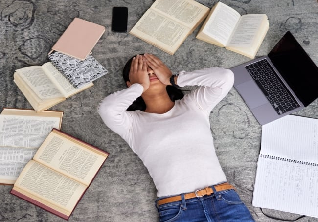
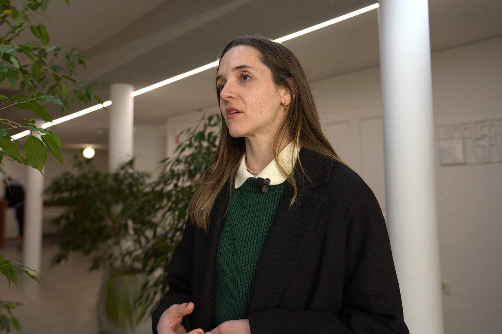
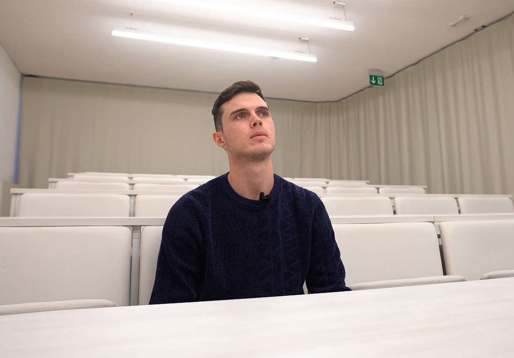
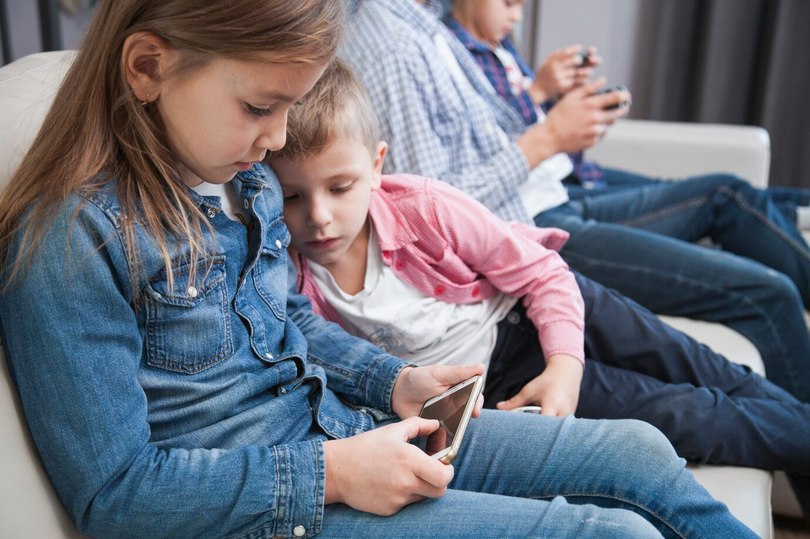
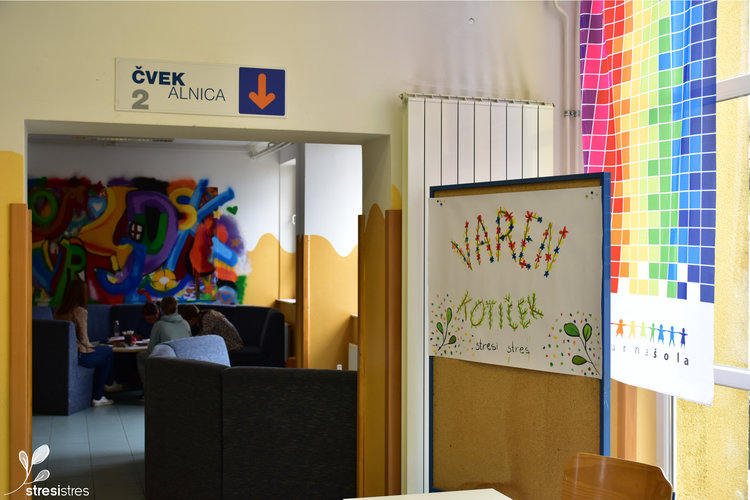
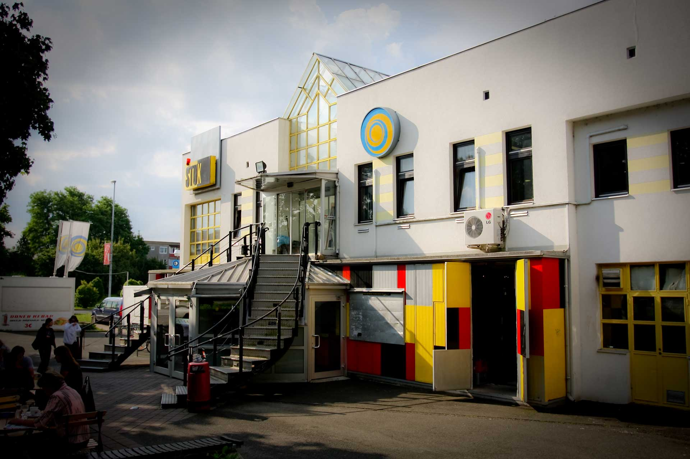
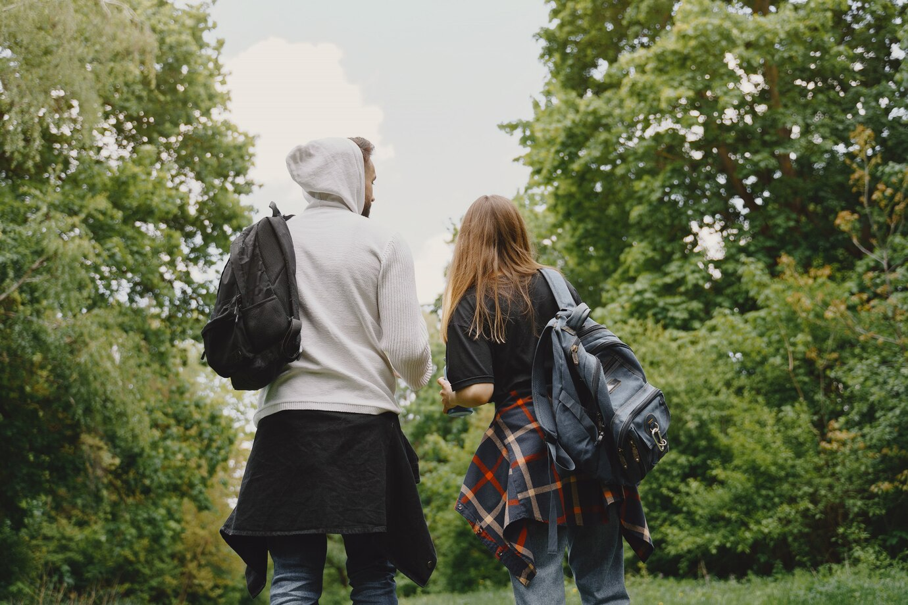

+++
title = "Duševno zdravje študentov: cena akademskega uspeha"
date = 2025-01-26
description="Ali sploh kdo misli na študente?"

[extra]
author = "Aja Cugmas, Tim Cof"

[taxonomies]
categories = ["Duševno zdravje"]
tags = ["Študenti", "Stres", "Psihološka pomoč"]
+++

**Kadar govorimo o zdravju, se pogosto osredotočamo na pomembnost telesnega zdravja, medtem ko o psihičnem počutju in duševnem zdravju še vedno govorimo premalo. Tako domače kot tuje raziskave dosledno kažejo, da so prav mladi na področju duševnega zdravja med najbolj prizadetimi. Najbolj izpostavljeni stresnemu okolju pa so študentje, katerim hiter tempo življenja in cel kup študijskih obveznosti še dodatno otežujejo vsakdan. Pojavlja se vprašanje: ali kdo sploh govori o duševnem zdravju študentov?**

<!-- more -->

---

\
<small>Akademski pritisk in časovne stiske imajo negativen vpliv na študente | Slika: People Images/iStock/Getty Images Plus</small>  

---

## Duševno zdravje kot stigma sodobnega sveta

O duševnem zdravju smo se pogovarjali s specializantko pediatrije, dr. med. Mašo Cugmas, ki meni, da je med mladimi še vedno primanjkuje odprtih pogovorov o duševnem zdravju. Kljub temu pa situacija ni povsem črno-bela, saj se tema o duševnem zdravju in psihičnih težavah postopoma normalizira, a stigma in z njo negativna konotacija duševnega (ne)zdravja ostajata. Ko posameznik doživlja duševno stisko, mu je pogosto težko poiskati pomoč in govoriti o svojih osebnih stiskah. Pri razbijanju stigme pa veliko težo nosijo tudi mediji, kjer se o duševnem zdravju v zadnjem času vse pogosteje razpravlja. O tej temi pa se vedno več pogovarjajo tudi študentje med seboj.

\
<small>Stigma o duševnem zdravju se zmanjšuje, a v celoti še ni izginila | Slika: Tim Cof</small>

---

## Stres ni rezerviran za izpitna obdobja

O svojem duševnem zdravju je spregovoril tudi magistrski študent Fakultete za elektrotehniko, računalništvo in informatiko. Njegovo duševno zdravje je v času študija pogosto nihalo, predvsem pa je bilo odvisno od dogajanja in obsega študijskih obveznosti. Najpogosteje se je med študijem znašel v stresnih situacijah, ki so mu študijsko delo dodatno oteževale. Za dobro počutje med študijem pa zasluge v največji meri pripisuje svojim prijateljem, ki so mu polepšali tudi najtežja obdobja. Stres zaradi študijskih obveznosti je za študente še posebej poudarjen v času opravljanja nujnih obveznosti, kot so časovni pritiski zaradi študijskih projektov ali pisanje izpitov ter kolokvijev. Seveda pa to ne spremeni dejstva, da je doživljanje stresa subjektivno in da se vsak posameznik vsakodnevno sooča z najrazličnejšimi stiskami. Sam se spopada s stresom tako, da se na obveznosti poskuša čim bolj pripraviti in si s tem dvigniti samozavest in zaupanje v svoje znanje.

\
<small>Pogovor s študentom Univerze v Mariboru | Slika: Tim Cof</small>

---

## Epidemija motenj pozornosti

Dr. Maša Cugmas kot najpogostejše duševne težave, s katerimi se soočajo mladostniki, navaja čustveno-vedenjske motnje. V to kategorijo spadajo tudi nekatere izmed bolj poznanih motenj, kot so anksioznost, depresija in panični napadi. Zaradi duševnih stisk pa se mladostniki dostikrat zatečejo k tveganim in kaznivim dejanjem, kot so nasilje, predprodaja in zloraba drog, dolgotrajno pa lahko tovrstno počutje vodi tudi v odvisnosti od substanc. Še posebej med dekleti so pogoste tudi prehranske motnje, med najbolj znani sodita anoreksija in bulimija. Med pogostejše motnje spadajo tudi motnje pozornosti in koncentracije, ki pa se v zadnjih letih pri mladostnikih pojavljajo v vedno večji meri. Točen vzrok za njihov pojav še ni poznan, na njihov razvoj pa vpliva več dejavnikov – najverjetneje gre za preplet genetike in načina vzgoje v zgodnjem otroštvu.

\
<small>Uporaba sodobnih tehnologij lahko škoduje zdravemu razvoju otroških možganov | Slika: Freepik</small>

---

## »Zanašamo se drug na drugega«

Največja ovira pri obravnavi in razumevanju duševnega zdravja je poiskati ustrezno pomoč in zanjo prositi. Otroci in mladostniki lahko ustrezno psihološko podporo na področju duševnega zdravja prejmejo tudi v okviru izobraževalnega sistema, saj obstaja veliko projektov, ki sodelujejo z osnovnimi in srednjimi šolami po vsej Sloveniji. Projekti, ki jih krije zdravstvena zavarovalnica, ne zajemajo le ozaveščanja o duševnem zdravju ampak tudi o pomembnosti zdravega življenjskega sloga.

\
<small>Ena izmed delavnic duševnega zdravja za osnovnošolce v okviru programa »Stresi stres« | Slika: MKC Maribor</small>

Premalo pa se o duševnem zdravju govori na fakultetah, kjer se študentje zaradi študijskih pritiskov soočajo z najtežjimi izzivi. Na dveh največjih univerzah v Sloveniji – Univerzi v Ljubljani in Univerzi v Mariboru, pa imajo glede skrbi za duševno zdravje študentov drugačne pristope. Na Univerzi v Ljubljani so na voljo tako imenovane psihosocialne delavnice, namenjene tako študentom kot zaposlenim, ki so namenjene ustreznemu soočanju z osebnimi stiskami. Tovrstnih delavnic pa ne izvaja Univerza v Mariboru, vendar je za študente v stiskah poskrbljeno s strani Študentske organizacije Univerze v Mariboru – ŠOUM. Organizacija, ki jo upravljajo mariborski študentje, ponuja brezplačna individualna psihološka svetovanja za vse študente v stiski. V okviru mladinskih centrov po Sloveniji obstaja več projektov, kjer se nudi brezplačna psihološka pomoč v obliki psihoterapije. Žal pa večina študentov, katerim bi tovrstna pomoč morda lahko koristila, za projekte in druge oblike pomoči v sklopu fakultete ne ve. Študentje mariborske univerze se, kar se tiče iskanja pomoči pri duševnih stiskah, počutijo zapostavljeno s strani izobraževalne ustanove – zanašajo se sami nase in drug na drugega.

\
<small>Mariborski študentje lahko pomoč poiščejo samo pri študentskih organizacijah | Slika: ŠOUM</small>

---

## Zaleže lahko tudi sprehod v naravi

Kljub vsakršnim izzivom, ki jim pridejo nasproti, pa študentje niso popolnoma brez pomoči. Prvi korak pri iskanju pomoči je pogovor, kjer je ključna medsebojna pomoč. Predvsem je pomembno to, da ima posameznik nekoga, s komer lahko govori o svojih težavah. Strokovnjaki poudarjajo, da si morajo mladostniki, ki se soočajo s stresom, v hitrem tempu življenja vzeti tudi čas zase. Kot najučinkovitejšo tehniko sproščanja je dr. Maša Cugmas izpostavila aktivnosti v naravi in ukvarjanje s športom, saj vsakršna fizična aktivnost pomaga pri sproščanju hormona sreče. S tem se strinja tudi študent Fakultete za elektrotehniko, računalništva in informatiko, ki je kot svojo glavno tehniko sproščanja navedel sprehode v naravi. Pri spopadanju s stresom in doživljanju duševnih stisk je ključno, da se zatečemo aktivnostim, ki nas sproščajo – bodisi so to hobiji ali pa druženje s prijatelji.

\
<small>Sprehod v naravi ima lahko sproščujoče učinke | Slika: Freepik</small>

*Če se ti ali tvoji bližnji spopadate z občutki obupa ali duševnimi stiskami, ne odlašajte. Pogovor lahko pomaga. Obrnite se na strokovnjake ali poiščite podporo pri prijateljih in družini. **Niste sami**.*

*Za pogovor s strokovnjaki lahko pokličete **Klic v duševni stiski** na številko **01 520 99 00**, **Zaupna telefona Samarijan in Sopotnik** na številko **116 123**, **Društvo SOS telefon za ženske in otroke žrtve nasilja** na številko **080 11 55** ali **TOM telefon za otroke in mladostnike** na številko **116 111**.*

{{ youtube(id="8wdTYWCaokU") }}