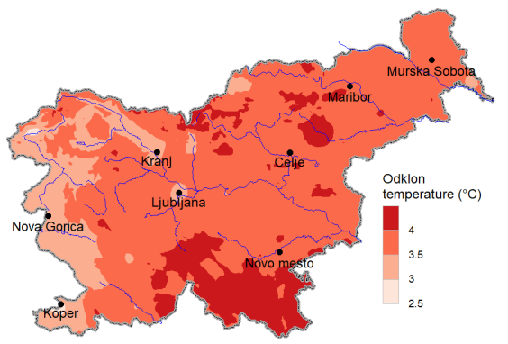
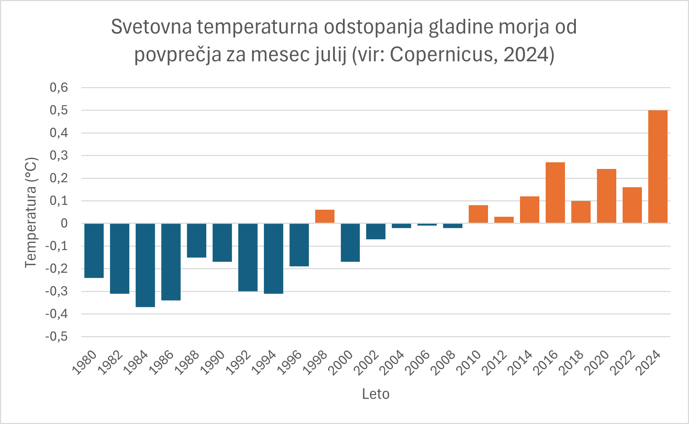
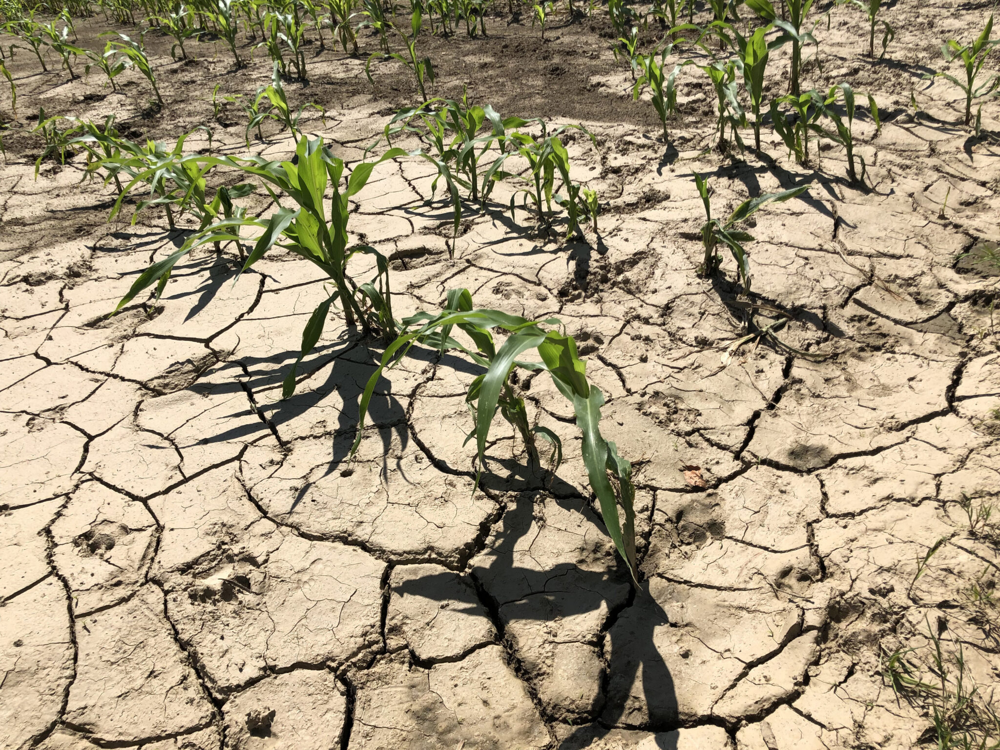
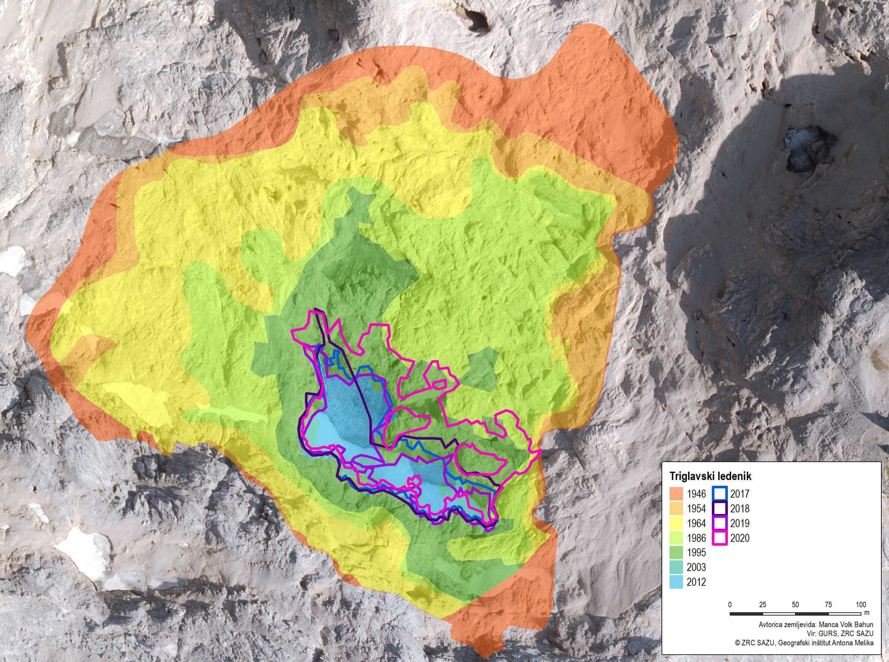
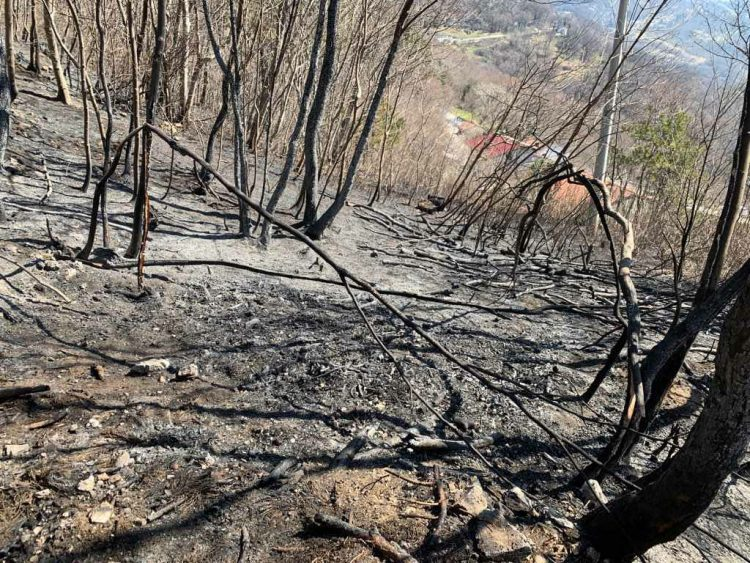

+++
title = "Letošnje poletje bo sodeč po napovedih eno najtoplejših v zgodovini"
date = 2025-01-26
description="Za povišanje temperatur je krivo taljenje arktičnih ledenikov"

[extra]
author = "Elena Schmid, Klarisa Hren"

[taxonomies]
categories = ["Okolje"]
tags = ["Podnebne spremembe", "Globalno segrevanje", "Ledeniki"]
+++

**Nova študija je razkrila, da taljenje ledenikov na območju Arktike, za katero je v največji meri odgovorno globalno segrevanje, povečuje dotok sveže hladne vode v severni Atlantik. Vzhodno od Grenlandije se namreč nahaja več kot 2 tisoč kilometrov širok odsek, skozi katerega se lahko staljeni led neposredno izliva vanj. Sodeč po poročanju revije Weather and Climate Dynamics, je to eden glavnih povzročiteljev vročinskih valov in sušnih obdobij v Evropi, katerih naj bi bilo po napovedih vedno več. ARSO izpostavlja, da bo razsežnost sprememb odvisna od izpustov toplogrednih plinov, ki povzročajo globalno segrevanje in posledično tudi taljenje ledenikov.**

<!-- more -->

---

\
<small>Povprečni odklon temperature zraka po Sloveniji v obdobju od leta 1991 do 2020. | Foto: ARSO</small> 

## Problem nastane ob mešanju sladke ledeniške s slano morsko vodo

Arktika zaradi naraščajočih temperatur v povprečju letno izgubi več sto kubičnih kilometrov morskega in ledeniškega ledu. Taljenje le-tega v severni Atlantik dodaja velike količine sladke vode, za katero so raziskovalci dokazali, da povzroča ekstremne vremenske razmere po Evropi. Sladka voda ima namreč v primerjavi z morsko nizko gostoto, zaradi česar ostaja na površju oceana – strokovno se ta pojav imenuja sladkovodna anomalija. Znanstvenica Marilena Oltmanns, ki deluje v Nacionalnem oceanografskem centru v Združenem kraljestvu, je dejala, da razloga za nastanek teh mehanizmov še ne poznajo ter da “sladka voda zavira izmenjavo toplote med globjim oceanom in zrakom” oz. deluje kot nekakšna pregrada. 

Raziskovalci so ugotovili, da se sladkovodne anomalije v jesenskem in zimskem času hitreje ohladijo kot okoliške vodne mase. To med drugim spodbuja nastanek nevihtnega vremena. Nastali vetrovi nato povzročijo spremembe tlaka, ki tvorijo vrtince za prihajajočo zimo. Oltmanns in njeni sodelavci so ob analizi zadnjih 40 poletij v Evropi ugotovili, da so najtoplejša poletja običajno sledila zimam, za katere so bile značilne večje sladkovodne anomalije. Zatrdila je, da bo glede na napovedi povečanja stopnje taljenja v Arktiki, južna Evropa brez dvoma postala toplejša, tamkajšnji zrak pa bolj suh. 

Po besedah Oltmannsove naj bi omenjena raziskava ponudila možnost predvidljivosti evropskega poletja za kar eno zimo vnaprej, za kar meni, da bi ponujalo pomembno pot za napovedovanje vremena v prihodnosti. Podnebna dinamičarka na Pensilvanski univerzi Melissa Gervais je uporabnost tovrstnih napovedi pospremila z besedami “Če sem kmetica in vem, da me čakata vročina in suša, bom morda spremenila pridelke, ki jih imam. Morda bi razmislila tudi o moji strategiji namakanja”. S tem je nakazala na praktične koristi, ki bi jih imele tovrstne napovedi za kmetovalce. 

\
<small>Vročina in sušna obdobja imajo velik vpliv na upad letine pridelkov, zaradi česar bo v prihodnosti pomembno upoštevati prilagajanje novim vremenskim razmeram. | Foto: Podjetnik kmet</small> 

## Ledeniki pod grožnjo taljenja

Led deluje kot zaščitni pokrov nad Zemljo in našimi oceani. Te bele površine odvečno toploto odbijajo nazaj v vesolje in ohranjajo planet hladnejši. A zaradi taljenja je do sedaj izginilo že 95 % najstarejšega in najdebelejšega ledu na Arktiki. Hitro taljenje ledenikov poteka že od zgodnjih 1900-ih let, za kar so v največji meri krive človeške dejavnosti. Od industrijske revolucije naprej se emisije ogljikovega dioksida in drugih toplogrednih plinov dvigujejo temperature po vsem svetu, vključno s severnim in južnim polom, kar povzroča taljenje ledenikov in njihovo odtekanje v morje. Znanstveniki predvidevajo, da bi lahko Arktika, v kolikor bodo emisije še naprej nenadzorovano naraščale, brez ledu ostala že čez 15 let. 


{
  "images": [
    {
      "src": "slika4.jpg",
      "title": "",
      "description": ""
    },
    {
      "src": "slika5.jpg",
      "title": "",
      "description": ""
    },
    {
      "src": "slika6.jpg",
      "title": "",      
      "description": ""
    }
  ]
}

<small>Izginjanje ledenika Blomstrandbreen skozi leta. Foto: Norveški polarni inštitut</small>

Dvigovanje morske gladine je ena izmed posledic taljenja ledenikov, ki vodi po povečanja obalne erozije in nevihtnih valov, medtem ko segrevanje zraka in temperature oceanov povzroča pogostejše in močnejše obalne nevihte kot so orkani in tajfuni. Grenlandska ledena plošča trenutno izginja štirikrat hitreje kot leta 2003 in že prispeva 20 % k trenutnemu dvigu morske gladine. Koliko in kako hitro se bodo te grenlandske in antarktične ledene plošče stopile v prihodnosti, bo v veliki meri odvisno od dvigovanje morske gladine. Zaskrbljujoče je, da bi se globalna gladina morja, če bi se stopil ves led na Grenlandiji, dvignila za šest metrov. 

## Slovenija pod vplivom rastočih temperatur

V Sloveniji se temperature višajo hitreje od svetovnega povprečja, kar je bilo najbolj očitno v zadnjih tridesetih letih. V mestih, kot je Ljubljana, so vročinski vali občutnejši kot na podeželju, kar se bo z višanjem temperatur, ki jih napoveduje ARSO, le še stopnjevalo. Trend naraščanja temperature zraka je nekoliko večji v vzhodni kot v zahodni polovici države. Nadzorno ga lahko opazimo s spremljanjem taljenjem slovenskega ledenika.

\
<small>Ponazoritev krčenja obsega ledenika na Triglavu skozi leta. | Foto: Arhiv GIAM ZRC SAZU</small> 

> “*Skrajen primer podnebnih sprememb na ledenikih je tudi Triglavski ledenik. V dobrih sto letih je ostala tisočinka njegove mase. Po svetu ledeniki v zadnjih tridesetih letih izgubijo pol metra ledu na leto. V zadnjih letih, leta 2018 in 2019, je to povprečje en meter.*” – Gregor Vertačnik o taljenju ledenikov (vir: Ars humana)

Topel zrak zadrži več vlage, kar z višanjem temperature pomeni, da bodo padavinski dogodki v bližnji prihodnosti postali intenzivnejši. Možnost zimskih poplav bo večja zaradi odtekanja večjih količin padavin. Projekcije za Slovenijo ne kažejo znatnih sprememb količine poletnih padavin, vendar se bo podaljšal čas med padavinskimi dogodki. Spremenila se je tudi snežna odeja, ki se bo s časom še naprej manjšala. Vsi našteti dogodki bodo vplivali na kakovost naših življenj. 

\
<small>Poleti 2024 so zaradi suše razglasili veliko požarno ogroženost po celotnem območju Slovenije. | Foto: BoBo</small> 

Po napovedih ARSO, bo najverjetneje najbolj zrasla temperatura pozimi, le nekoliko manj poleti in jeseni, najmanj pa spomladi. Deležni bomo večjemu številu vročih dni in daljših vročinskih valov. Z optimističnimi napovedi o količini izpustov, ARSO poroča, da bo temperatura do konca stoletja zrasla za približno 1,3 °C, po pesimističnemu scenariju pa šokantnih 4,1 °C.

## Mračen pogled v prihodnost

Dokler se bodo morski led in ledeniki topili ter oceani segrevali, bodo oceanski tokovi še naprej motili vremenske vzorce po vsem svetu. Že v sredini stoletja se naj bi v vzhodni Sloveniji zimske padavine povečale do 40 odstotkov. Zaradi taljenja ledenikov in toplotnega raztezanja morske vodo, bodo med posledicami tudi zvišanje gladine morja, ekstremni vremenski in podnebni dogodki kot so to poplave, suše, toča ter močan veter. Izgubljamo tudi naravne znamenitosti, ki so del naše kulture. Triglavski ledenik se je skrčil na 0,7 hektarjev iz svojih prvotnih meritev iz 19. stoletja, kadar je še znašal več kot 45 hektarjev. Najverjetneje smo zadnja generacija, ki lahko opazuje ostanke ledenika v živo.