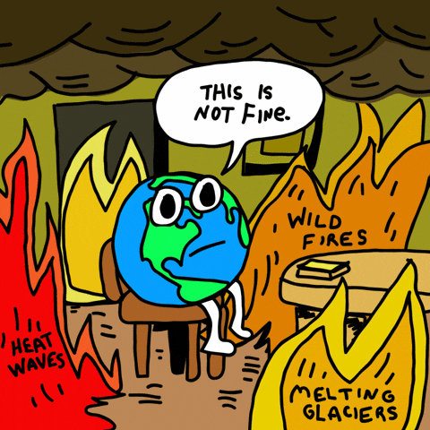
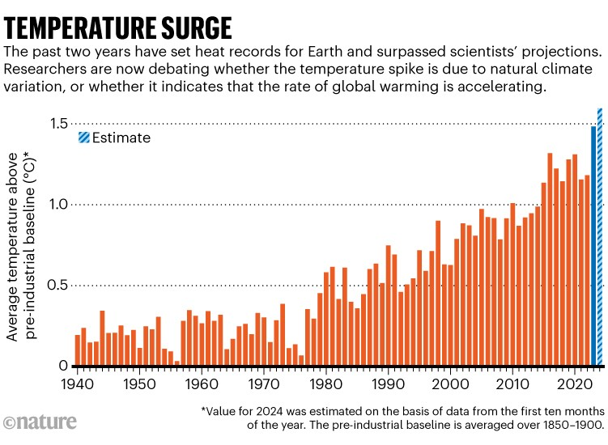
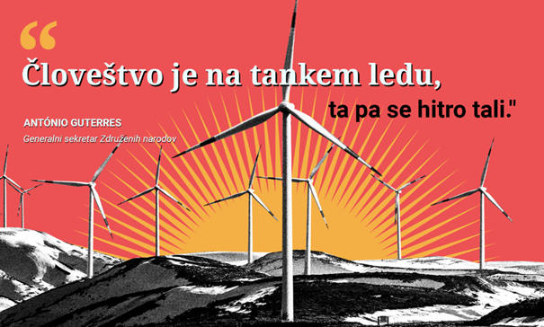
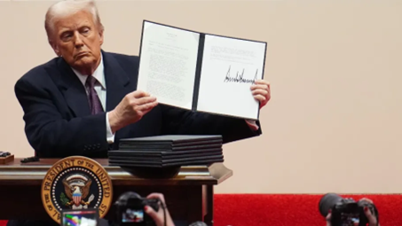

+++
title = "Naraščanju temperatur ni videti konca"
date = 2025-01-26
description="Najvišje izmerjene povprečne temperature – opozorilo narave"

[extra]
author = "Jure Trtnik"

[taxonomies]
categories = ["Podnebne spremembe"]
tags = ["Globalno segrevanje", "Pariški sporazum", "Onesnaževanje"]
+++

**Leto 2024 je bilo do sedaj najtoplejše leto, saj se je povprečna globalna temperatura dvignila za 1,6 °C in s tem prvič presegla predindustrijsko raven. Kljub svojim trudom za zmanjšanje onesnaževanja okolja, pa je Evropa še vedno četrta največja onesnaževalka na svetu. Strokovnjaki in poznavalci po vsem svetu opozarjajo, da je čas za ukrepanje zdaj, saj bo v nasprotnem primeru prepozno. Kljub temu pa novoizvoljeni ameriški predsednik obstoj globalnega segrevanja zanika in ga označuje za prevaro.**

<!-- more -->

---

Podnebne spremembe so eden največjih globalnih izzivov in imajo velik vpliv na naša življenja. Povzročajo ekstremne vremenske pojave, dvig morske gladine, ki povečuje nevarnost katastrofalnih pojavov, ogrožajo ekosisteme in še bi lahko naštevali. Čeprav so toplogredni plini nujni za naše življenje pa so vseeno industrija, kmetijstvo in krčenje gozdov pripeljali do rekordnih ravni emisij, kar pospešuje segrevanje našega planeta.

[Pariški sporazum](https://www.consilium.europa.eu/sl/policies/paris-agreement-climate/#what) in cilji trajnostnega razvoja Združenih narodov si prizadevajo omejiti dvig globalne temperature na manj kot 2°C v tem stoletju z zmanjšanjem emisij in prehodom na obnovljive vire energije. Poročila znanstvenikov pa opozarjajo, da je čas za ukrepanje nujen, saj so prelomne točke za nepovratne spremembe ekosistemov morda že presežene.

\

## Leto 2024 je prinesel rekordne temperature

[Toplogredni plini](https://www.europarl.europa.eu/topics/sl/article/20230316STO77629/podnebne-spremembe-toplogredni-plini-ki-povzrocajo-globalno-segrevanje) ter [uporaba fosilnih goriv](https://www.youtube.com/watch?v=57UbRXYh1Us). To sta dva glavna razloga za višanje temperatur. Letos je povprečna temperatura zraka znašala 15,10 °C, kar je 1,6 °C več kot v obdobju med 1850-1900. Te rekordne temperature so kot je bilo že prej povedano, povezane s povečano koncentracijo toplogrednih plinov, vključno z ogljikovim dioksidom – CO2 (422 ppm) in metanom (1897 ppb). Pomembno vlogo imajo tudi vodni hlapi, ki so povečali količino padavin in ekstremnih vremenskih dogodkov. Čeprav zaradi letošnjega dviga temperatur še nismo prekršili pariškega podnebnega sporazuma iz leta 2015, ki temelji na 20-letnem povprečju, znanstveniki opozarjajo, da je preseganje tega praga na dolgi rok zelo verjeten.

\
<small>Globalno segrevanje se pospešuje</small> 

## Kako Evropa pripomore k zmanjševanju?

Podnebne spremembe že vplivajo na Evropo z več sušami, poplavami, gozdnimi požari in zmanjšanjem biotske raznovrstnosti. Negativne posledice segrevanja so izrazite v vseh regijah, čeprav niso povsod enakomerno razporejene. Evropska unija pa vseeno igra ključno vlogo v globalnih podnebnih pogajanjih in si do leta 2050, prizadeva za podnebno nevtralnost.

Leta 2021 je ogljikov dioksid predstavljal skoraj 80% izpustov po vsej Evropi. Čeprav metan in fluorirani plini predstavljajo manjši delež, imajo lahko veliko večji vpliv na segrevanje. Glavni viri emisij v EU so energetski sektor, ki predstavlja 27,4% , promet z 23,8% in industrija z 20,3%. Promet pa je edini sektor, kjer so izpusti od leta 1990 narasli. Evropska unija je v obdobju med 1990-2023 zmanjšala izpuste toplogrednih plinov za 37%, vendar pa bo težko dosegla svoj cilj, da bi jih zmanjšala za 55% do leta 2030. Trenutno so emisije v prometu najvišje, saj avtomobili in kombiji prispevajo 15% vseh izpustov ogljikovega dioksida. 

\

## Strokovnjaki svarijo pred najhujšim

Leto 2024 je zaznamoval najhitrejši letni porast koncentracije ogljikovega dioksida v ozračju, na kar nakazujejo tudi podatki raziskovalne postaje na Havajih. Po mnenju britanskega urada za meteorologijo trenutne ravni ogljikovega dioksida niso združljive s ciljem omejitve globalnega segrevanja na 1,5 °C. Trenutne koncentracije so zdaj 50 % višje kot pred začetkom množične uporabe fosilnih goriv, posledično pa smo tako letos imeli najtoplejšo zimo doslej.

Profesor Rob Jackson z Univerze Stanford opozarja, da so ti podatki zelo zaskrbljujoči. Porast CO2 letos ni bil posledica le povečanja emisij iz fosilnih goriv, temveč tudi upada sposobnosti zemlje za absorpcijo ogljika zaradi podnebnih ekstremov, kot so požari in suše v Amazoniji. Čeprav se povečuje uporaba obnovljivih virov energije, pa globalno povpraševanje po energiji še vedno narašča, kar vodi v nadaljnje kurjenje fosilnih goriv.

Če se emisije ne zmanjšajo in fosilne elektrarne ne zaprejo, bi se lahko globalne temperature povzpele za več kot 2,5 °C, kar bi povzročilo dvig morske gladine, taljenje ledu in ekstremne vremenske razmere. Profesor Jackson še opozarja, da trenutna raven človeškega razvoja in potreb po energiji ne ustreza nujnim ukrepom za zaščito planeta.

{{ youtube(id="ZAQGoXIkTlw") }}

## Trumpov umik iz podnebnega sporazuma – udarec v boju proti globalnemu segrevanju

Zahod Združene države Amerike ponovno pestijo divji požari, tokrat v Los Angelesu, kjer je bilo evakuiranih 30.000 ljudi. Gasilci se trudijo, da bi ogenj obvladovali, vendar pa jim to za nameček otežuje še močan veter. Medtem pa jug države prizadeva redek zimski vihar, ki prinaša rekordne količine snega in je terjal že vsaj devet življenj. Ti ekstremni vremenski pojavi – požari na zahodu in snežne nevihte na jugu – pa so definitivno posledica podnebnih sprememb.

Kljub temu pa novo izvoljeni ameriški predsednik Donald Trump zanika obstoj globalnega segrevanja in ga označuje za prevaro. Ena od njegovih prvih potez je bila umik ZDA iz pariškega podnebnega sporazuma, kar ogroža globalna prizadevanja za omejitev dviga temperatur. Poleg tega pa je sprožil še nacionalno energetsko izredno stanje za razveljavitev okoljevarstvenih predpisov iz obdobja prejšnje administracije.

Znanstveni dokazi pa so jasni: »podnebne spremembe poganjajo te ekstremne vremenske razmere«. Kljub temu pa predsednik ignorira vsa opozorila, medtem ko država hkrati gori in zmrzuje. Vprašanje pa še vedno ostaja, ali bo človeštvo pravočasno ukrepalo ali bo zavrnitev resnice vodila v neizogiben konec. 

\
<small>Donald Trump je podpisal izvršni ukaz o umiku ZDA iz pariškega podnebnega sporazuma</small> 

Po novem poročilu Združenih narodov so uničujoči vplivi podnebnih sprememb, ki jih povzroča človek, že prisotni in se poslabšujejo, v nekaterih primerih pa so lahko nepovratni. Skoraj polovica človeštva trenutno živi v območju nevarnosti, mnogi ekosistemi pa so že dosegli točko, od koder ni vrnitve.

Vremenski ekstremi kot so suše in požari so že močno vplivali na človeška življenja in naravne ekosisteme. Ugotovitve poudarjajo, da so ti vplivi bolj razširjeni in hitrejši, kot smo sprva mislili.

Da bi preprečili nepovratno škodo, je nujno v naslednjem desetletju bistveno ukrepati. Svet mora do leta 2030 zmanjšati emisije za 45% in doseči neto ničelne emisije toplogrednih plinov do leta 2050. Vendar pa trenutno stanje kaže, da bodo globalne emisije do leta 2030 še celo narasle. Pomembno pa je tudi vedeti, da vsaka desetinka stopinje šteje, vsak glas lahko naredi razliko, in vsaka sekunda je pomembna da ukrepamo. **Zato ukrepajmo**!

{{ youtube(id="qhvjEnuLmGs") }}

## Viri

- [N1: Leto 2024 najtoplejše v zgodovini meritev – kakšna je bila globalna temperatura?](https://n1info.si/novice/svet/leto-2024-najtoplejse-v-zgodovini-meritev-kaksna-je-bila-globalna-temperatura/)  
- [Evropski parlament: Podatki o podnebnih spremembah v Evropi](https://www.europarl.europa.eu/topics/sl/article/20180703STO07123/podatki-o-podnebnih-spremembah-v-evropi)  
- [Evropski parlament: Zmanjševanje izpustov letal in ladij – razlaga ukrepov EU](https://www.europarl.europa.eu/topics/sl/article/20220610STO32720/zmanjsevanje-izpustov-letal-in-ladij-razlaga-ukrepov-eu)  
- [UNIS: Podnebne spremembe](https://unis.unvienna.org/unis/sl/topics/climate_change.html)  
- [YouTube: Climate Action Video 1](https://www.youtube.com/watch?v=ZAQGoXIkTlw&t=6s)  
- [YouTube: Climate Action Video 2](https://www.youtube.com/watch?v=IKkC3DGfCJc&t=25s)  
- [United Nations: 10 Actions to Act Now](https://www.un.org/en/actnow/ten-actions)  
