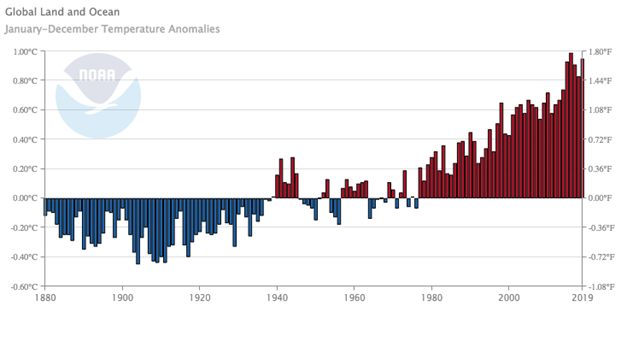
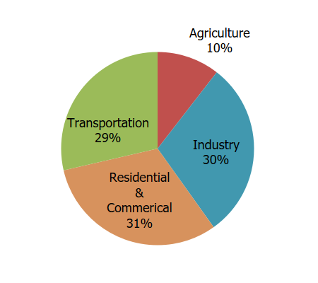
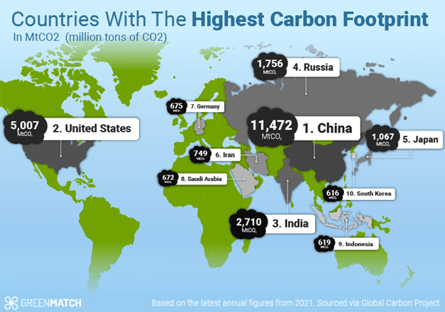
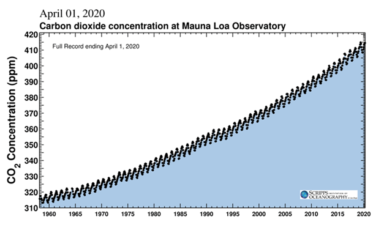
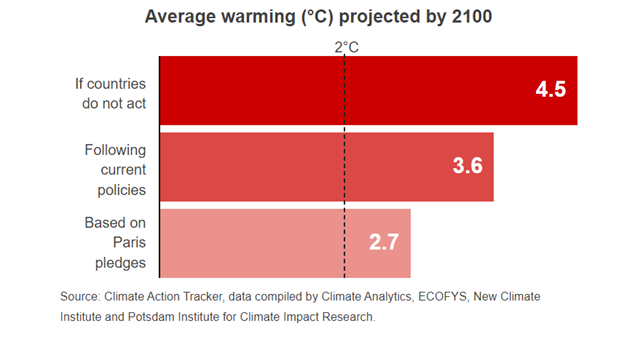
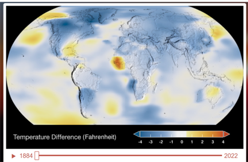
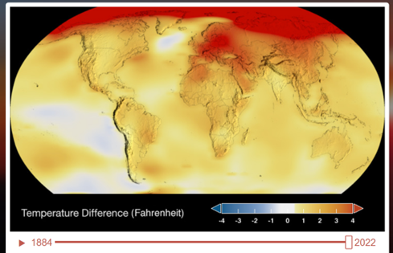

+++
title = "Podnebne Spremembe"
date = 2025-01-26

[extra]
author = "Tilen Caf"

[taxonomies]
categories = ["Podnebne spremembe"]
tags = ["Globalno segrevanje", "Toplogredni plini", "Podnebni ukrepi"]
+++

## 1. Kje je težava?

Naš planet se vse bolj segreva.

V zadnjih 100 letih se je povprečna temperatura Zemljinega površja zvišala za približno 0,85 °C (1,4 °F). Po ocenah naj bi globalna temperatura do leta 2050 narasla za približno 1,5 stopinje Celzija (2,7 °F) ter do leta 2100 za 2–4 stopinje Celzija (3,6–7,2 °F).

Nacionalna uprava za oceane in atmosfero (NOAA) ugotavlja, da se povprečne letne temperature na globalni ravni stalno povečujejo že od 60. let prejšnjega stoletja. Na sliki 1 so prikazana odstopanja od povprečne globalne temperature, pri čemer vodoravna črta na 0,00 °C predstavlja povprečje 20. stoletja. Modri stolpci označujejo leta, ko je bila temperatura nižja od tega povprečja, rdeči stolpci pa predstavljajo leta z višjo temperaturo. Devetnajst izmed dvajsetih najtoplejših let je bilo zabeleženih po letu 2001. Zelo verjetno je, da bodo prihodnja najhladnejša leta toplejša od najtoplejših let, ki smo jih doživeli v 20. stoletju.

---

## 2. Kje je vzrok

Glavni krivec so toplogredni plini, predvsem ogljikov dioksid.

Po mnenju znanstvenikov emisije, torej plini, ki jih v ozračje spušča industrija in kmetijstvo, krepijo naravni učinek tople grede. Ta proces omogoča, da Zemljina atmosfera zadrži del Sončeve energije. Največji vpliv ima človekovo delovanje, kot je kurjenje fosilnih goriv (premoga, nafte in zemeljskega plina), saj to močno povečuje količino ogljikovega dioksida (CO2) v ozračju. CO2 velja za glavni toplogredni plin, ki prispeva k globalnemu segrevanju. Poleg tega se izsekavajo gozdovi, ki bi sicer absorbirali ogljikov dioksid. 

<small>Vir: Greenmatch</small> 

Danes je koncentracija CO2 v atmosferi višja, kot je bila kadarkoli v zadnjih 800.000 letih. Rekordne vrednosti so bile zabeležene maja 2015, leto 2016 pa je bilo že peto leto zapored, ko je koncentracija CO2 narasla za vsaj dva delca na milijon.

---

## 3. Kakšni so učinki? Taljenje morskega ledu na Arktiki

Segrevanje podnebja povzroča višje temperature, pogostejše in hujše vremenske ekstreme ter dvigovanje morske gladine, kar lahko močno spremeni številne regije sveta. Od začetka 20. stoletja se je gladina morja na svetovni ravni povprečno dvignila za približno 19 cm. V zadnjih desetletjih se je ta proces še pospešil, kar predstavlja veliko tveganje za otoške države in nizko ležeče območje. Pomembno k dvigu morske gladine prispeva krčenje ledenih plošč na polarnih območjih. Čeprav arktični morski led zaradi višjih temperatur hitro izginja, ta proces le malo vpliva na dvig gladine morja. V primerjavi z zgodnjimi 80. leti prejšnjega stoletja smo izgubili območje morskega ledu, ki je skoraj 10-krat večje od površine Združenega kraljestva.

<video controls width="100%" poster="https://svs.gsfc.nasa.gov/vis/a000000/a005300/a005382/sea_ice_2024_min_1080p60.mp4">
  <source src="https://svs.gsfc.nasa.gov/vis/a000000/a005300/a005382/sea_ice_2024_min_1080p60.mp4" type="video/mp4">
  Your browser does not support the video tag.
</video>

Satelitske pasivne mikrovodne slike morskega ledu že od leta 1979 omogočajo zanesljivo spremljanje sprememb v arktičnem ledu. Vsako poletje se arktična ledena kapa zaradi taljenja zmanjša do tako imenovanega "minimuma", preden se z začetkom hladnejšega vremena ledena površina znova začne povečevati. Analiza satelitskih podatkov, ki so jo izvedli znanstveniki, kaže, da je minimum v letu 2024, dosežen verjetno 11. septembra, obsegal 4,28 milijona kvadratnih kilometrov (1,65 milijona kvadratnih milj). To predstavlja sedmi najmanjši izmerjeni obseg arktičnega morskega ledu v zgodovini meritev.

Animacija prikazuje dnevne spremembe arktičnega morskega ledu in sezonske spremembe kopenskega pokrova skozi čas – od najvišjega letnega obsega ledu, zabeleženega 14. marca 2024, do njegovega minimuma 11. septembra 2024. Na vodni površini lahko opazujemo, kako se arktični morski led spreminja iz dneva v dan, pri čemer so prikazane regije, kjer je koncentracija ledu večja od 15 %. Modro-bel odtenek ledu temelji na 3-dnevnem minimalnem teku svetlosti temperature pri 89 GHz. Rumena črta označuje povprečni minimum iz 30-letnega obdobja med letoma 1981 in 2010. Na kopnem pa se mesečni podatki o sezonskih spremembah, pridobljeni iz niza satelitskih slik, postopoma spreminjajo iz meseca v mesec.

{{ youtube(id="LwRTw_7NNJs") }}

### Globalno segrevanje od leta 1880 do leta 2022

Animirani prikaz ponazarja mesečna temperaturna odstopanja od poletja 1880 do poletja 2023, primerjana z NASA-inim povprečjem za obdobje 1951–1980.

{{ youtube(id="NMnFbIDIEGs") }}

Po poročilu Združenih narodov trenutni predlogi kažejo na dvig temperature za 2,7 °C nad predindustrijsko raven do leta 2100.
Znanstveniki so ugotovili, da bo preseganje dviga temperature za 2 °C povzročilo znatne in nevarne podnebne posledice, ki bodo posebej prizadele revnejše prebivalstvo sveta.

Barvno kodirana karta nazorno prikazuje dramatične spremembe globalnih površinskih temperatur od leta 1884. Temno modra barva jasno označuje območja z občutno nižjimi temperaturami od povprečja, medtem ko temno rdeča poudarja območja z izrazito višjimi temperaturami od povprečja.

## 4. Omejevanje škode

- **Varčevanje z energijo doma**  
  Velik del elektrike in ogrevanja prihaja iz premoga, nafte in plina. Prihranite energijo z manjšo porabo ogrevanja in hlajenja, uporabo LED žarnic in učinkovitih naprav, pranjem perila s hladno vodo ter sušenjem perila na zraku. Izboljšajte izolacijo doma ali zamenjajte kurilno napravo s toplotno črpalko in zmanjšajte ogljični odtis za do **900 kg CO2 na leto**.

- **Prehod na obnovljive vire energije**  
  Preverite pri dobavitelju energije, ali vaš dom uporablja premog, nafto ali plin. Če je mogoče, preidite na obnovljive vire, kot sta veter ali sonce. Namestitev sončnih celic lahko zmanjša vaš ogljični odtis za do **1,5 tone CO2 na leto**.

- **Peš, s kolesom ali javnim prevozom**  
  Namesto vožnje avtomobila raje hodite peš ali kolesarite, kar zmanjša emisije toplogrednih plinov in izboljša zdravje. Za daljše poti uporabite vlak ali avtobus. Življenje brez avtomobila lahko zmanjša vaš ogljični odtis za do **2 toni CO2 letno**.

- **Prehod na električni avtomobil**  
  Pri nakupu avtomobila razmislite o električnem vozilu, saj ima manjši vpliv na okolje kot bencinski ali dizelski avtomobili. Prehod na električni avto lahko zmanjša vaš ogljični odtis za do **2 toni CO2 na leto**, hibrid pa za do **700 kg CO2**.

- **Manj zavržene hrane**  
  Z metanjem hrane stran zapravljamo tudi vire in energijo. Kupujte premišljeno, porabite vse kupljeno in ostanke kompostirajte. Zmanjšanje odpadne hrane lahko zmanjša vaš ogljični odtis za do **300 kg CO2 letno**.

- **Več rastlinske prehrane**  
  Prehod na prehrano z več zelenjave in manj mesa zmanjša okoljski vpliv. Vegetarijanska prehrana lahko zmanjša vaš ogljični odtis za do **500 kg CO2 na leto**, veganska pa do **900 kg CO2**.

- **Sajenje avtohtonih rastlin**  
  V vrtu posadite domače rastline, ki podpirajo lokalni ekosistem. Zamenjajte invazivne vrste in se izogibajte uporabi pesticidov.

- **Čiščenje okolja**  
  Sodelujte pri lokalnih akcijah čiščenja narave. Odpadki onesnažujejo zemljo in vodo, zato odpadke vedno pravilno odložite.

- **Pametno upravljanje denarja**  
  Podpirajte podjetja, ki delujejo trajnostno. Preverite, ali vaše naložbe podpirajo okolju prijazne dejavnosti.

- **Spodbujajte druge k ukrepanju**  
  Pogovarjajte se s sosedi, podjetji in voditelji ter zahtevajte odločne ukrepe za varovanje podnebja.

### Viri

- [Climate Time Machine – NASA](https://climate.nasa.gov/interactives/climate-time-machine/?intent=021)  
- [BBC Interactive: Climate Change](https://www.bbc.co.uk/news/resources/idt-5aceb360-8bc3-4741-99f0-2e4f76ca02bb)  
- [NASA: Climate Change Visualizations](https://svs.gsfc.nasa.gov/5382/)  
- [YouTube: Climate Change Explained](https://www.youtube.com/watch?v=LwRTw_7NNJs)  
- [Wisconsin Department of Natural Resources: Climate Science](https://dnr.wisconsin.gov/climatechange/science#:~:text=Since%201880%2C%20average%20global%20temperatures,7.2%20degrees%20Fahrenheit)  
- [Countries with the Highest Carbon Footprint – GreenMatch](https://www.greenmatch.co.uk/blog/countries-with-the-highest-carbon-footprint)  
- [UN ActNow: Ten Actions to Fight Climate Change](https://www.un.org/en/actnow/ten-actions)  
