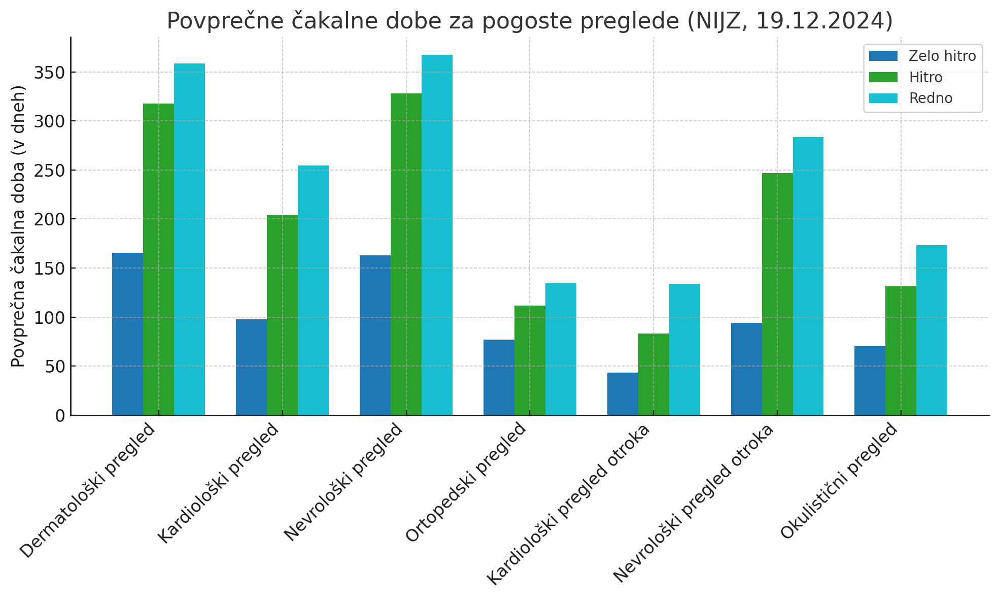

+++
title = "Študenti v belem: mladi, ki pišejo prihodnost zdravstva"
date = 2025-01-26

[extra]
author = "Maja Turinek"

[taxonomies]
categories = ["slovensko zdravstvo"]
tags = ["študenti", "medicina", "študentski projekti", "Slovenija Oživlja"]
+++

**Slovensko zdravstvo že dlje časa deluje pod velikim pritiskom zaradi dolgotrajnih čakalnih dob, pomanjkanja kadrov in vse večjih potreb starajoče se populacije. Kljub tem težavam so študenti medicine z inovativnimi projekti in praktično pomočjo ključen dejavnik izboljšanja stanja. S svojo energijo in znanjem ne razbremenjujejo le zdravstvenega osebja, temveč z raznimi projekti tudi pomembno prispevajo k ozaveščanju javnosti in reševanju življenj. Eden izmed takih je tudi projekt Slovenija oživlja, ki se osredotoča na temeljne postopke oživljanja.**

<!-- more -->

---

## Izzivi slovenskega zdravstva

Slovenski zdravstveni sistem se že vrsto let sooča z več ključnimi izzivi, ki vplivajo na dostopnost in kakovost zdravstvenih storitev. Med najbolj perečimi težavami so **dolge čakalne dobe**, ki omejujejo pravočasen dostop pacientov do potrebne oskrbe. Nacionalni inštitut za javno zdravje (NIJZ) v svojih analizah ugotavlja, da so se čakalne dobe v zadnjih desetletjih **opazno podaljšale**, kar negativno vpliva na obravnavo in izid zdravljenja. Poleg tega se slovensko zdravstvo sooča še s problemom neenakomerne dostopnosti do zdravstvenih storitev med regijami in preobremenjenostjo zdravnikov in zdravstvenega osebja. Dodatno obremenitev za sistem predstavlja tudi staranje prebivalstva. Starejši ljudje zahtevajo več zdravstvenih storitev, kar povečuje pritisk na že zdaj **omejene vire in kadre**.

\
<small>Povprečne čakalne dobe za preglede v Sloveniji</small> 

**Vlada Republike Slovenije** je pripravila več ukrepov za spopadanje s temi težavami, 
vključno s strategijami za skrajšanje čakalnih dob, prilagoditvijo zdravstvenih storitev starajoči se populaciji in zagotavljanjem finančne stabilnosti sistema. Kot prioritete so med usmeritve zdravstvene politike za leti 2024–2025 zapisali tudi več vlaganj v preventivo in zdrav življenski slog, več kadrovskih virov in prilagoditev sistema izobraževanja za zdravstvene delavce, povečanje učinkovitosti urgentnih služb in krepitev javno zasebnih partnerstev.

> »*Eden izmed najpomembnejših konceptov na področju javnega zdravja je poenostavljeno **bolje je preprečevati kot zdraviti**. Z ozaveščanjem, krepitvijo znanja o lastnem zdravju skrbimo, da so ljudje opolnomočeni za sprejemanje odločitev o zdravem načinu življenja – vse od zdrave prehrane in gibanja, oživljanja in prve pomoči pa do zdrave spolnosti in duševnega zdravja. Zdravo in opolnomočeno prebivalstvo pa posledično pomeni manjšo obremenitev za zdravstveni sistem in boljše ter učinkovitejše razporejanje sredstev.*« je situacijo komentirala Kristina Brečko, vodja projekta Slovenija Oživlja.

---

## Mladi nosilci zdravstvene prihodnosti

K boljšemu delovanju javnega zdravstvenega sistema pripomorejo tudi **študenti medicine**, saj z njim sodelujejo skozi celoten študij. S svojim znanjem in energijo pomagajo **razbremeniti zdravstveno osebje** in **izboljšati dostopnost storitev**. Njihova predanost se je lepo pokazala med epidemijo COVIDA-19, ko so študenti prostovoljno pomagali v bolnišnicah in domovih za starejše, kjer so odvzemali brise, spremljali paciente in izvajali administrativna dela. Njihovo delo je bilo ključno v kriznih trenutkih, saj so omogočili boljšo obravnavo pacientov in olajšali delo obstoječih kadrov. Poleg pomoči med epidemijo so študenti medicine aktivni tudi v okviru **praktičnega usposabljanja**, ki ga izvajajo v bolnišnicah in zdravstvenih domovih. Ta praksa jim omogoča pridobivanje dragocenih izkušenj, hkrati pa predstavlja pomemben prispevek k zdravstvenemu sistemu.

Ključen prispevek študentov pa ni le njihova pomoč v zdravstvenih institucijah, ampak tudi **mnogo projektov**, ki jih izvajajo ob študiju. Ti so usmerjeni predvsem v ozaveščanje, preventivo in izboljšanje zdravstvene pismenosti prebivalstva. Za take projekte je med študenti ogromno zanimanja tako na **fakulteti ljubljanske kot mariborske univerze**. Predvsem priljubljena so področja srčnožilnih obolenj in duševnega zdravja, torej tam, kjer lahko posameznik največ naredi za svoje zdravje. Tako na primer projekta V odsevu in Serotonin širita zavedanje o duševnem zdravju in se zavzemata za njegovo destigmatizacijo. Projekti, kot so **Dotik življenja**, **Za Življenje!**, **Projekt Imuno**, **Vakcinet** in **Misli na srce**, se osredotočajo na **preventivno ozaveščanje**, s čimer si prizadevajo zmanjšati tveganje za nastanek resnih zdravstvenih težav ter prispevati k bolj zdravemu življenju posameznikov v prihodnosti.

<iframe title="Interactive gallery" frameborder="0" width="1200px" height="675px" style="position: absolute; top: 0; left: 0; width: 100%; height: 100%;" src="https://view.genially.com/6781534a6f9bea42dd0cbd06" type="text/html" allowscriptaccess="always" allowfullscreen="true" scrolling="yes" allownetworking="all"></iframe> 
 

<small>Projekti študentov medicine</small>

Z izvajanjem teh projektov gre za neke vrste **opolnomočenje prebivalstva** s tem, da se jim predaja znanje. S takimi projekti pa veliko pridobijo tudi študenti, saj dobijo občutek za to, kaj je ljudem pomembno, kaj so njihove skrbi in pogosta vprašanja. Naučijo se tudi ustrezne komunikacije ter ustreznega predajanja informacij, kar je ključno za večino zdravniških poklicev. Sodelovanje študentov pri takšnih projektih **ustvarja komunikacijsko sposobnejše zdravnike**.

{{ youtube(id="fZVRRmyMIME") }}
<small>Intervju z Evo Nograšek, koordinatorico projekta Dotik Življenja</small>

---

## Projekt Slovenija oživlja

Projekt **Slovenija oživlja** je eden izmed najvidnejših projektov na področju temeljnih postopkov oživljanja v Sloveniji. Ključni del tega projekta so prav študenti medicine, ki vsako leto okoli **16. oktobra**, ko je **svetovni dan oživljanja**, opravijo okoli sto prikazov. S takimi akcijami želijo doseči čim več ljudi in jim predstaviti oživljanje ter poudariti pomen le-tega. Medijski partner projekta je **Val 202**, na katerem vsako leto v oddaji **Sekunde rešujejo** skozi uspešne zgodbe poudarjajo pomen znanja oživljanja. Glavni cilj projekta je namreč vse prebivalce Slovenije ozavestiti o pomenu temeljnih postopkov oživljanja.

Zadnji dve leti je projekt vodila **Kristina Brečko**, študentka 6. letnika Medicinske fakultete Univerze v Ljubljani, ki poudarja: »Ko človek doživi srčni zastoj, imajo možgani štiri minute časa, preden se začnejo dogajati nepopravljive možganske poškodbe. Če v tem času očividec začne s temeljnimi postopki oživljanja, je verjetnost preživetja približno 15 % višja kot po desetih minutah srčnega zastoja. Slovenija oživlja vsako leto doda svoj košček tej zgodbi in poskuša trenutni odstotek oživljanja s strani očividcev dvigniti na zavidljivo raven.«

### Izvedene akcije

Promocije si prizadevajo izvesti na **čim več lokacijah po Sloveniji**, s poudarkom na frekventnejših krajih. Študentje medicine jih imajo največ **v Ljubljani in Mariboru**, pokrijejo pa tudi Koper, Novo mesto, Kranjsko Goro, Kranj, Celje, Mursko Soboto, Slovenj Gradec, Velenje, Domžale in Novo Gorico. Zelo pomembno je tudi sodelovanje z zdravniki iz **Slovenskega reanimacijskega sveta**, s prostovoljci **Rdečega križa Slovenije** in reševalci iz **Sekcije reševalcev Slovenije**. V manjših krajih prav slednji opravijo največ prikazov v lokalnih zdravstvenih ali gasilskih domovih. Prostovoljci so na lokaciji nekaj ur, na svetovni dan oživljanja pa po navadi kar cel dan, razstavljene imajo lutke in defibrilatorje. Skupaj z mimoidočimi ponovijo oživljanje, odgovarjajo na vprašanja, delijo informativno gradivo ... Največji je odziv družin z otroki, pa tudi starejših parov, zlasti če so v preteklosti že doživeli podoben dogodek, so bolni, jemljejo zdravila ...

### Projekt Slovenija oživlja na terenu


{
  "images": [
    {
      "src": "slika2.jpg",
      "title": "",
      "description": "Slovenija oživlja 1"
    },
    {
      "src": "slika3.jpg",
      "title": "",
      "description": "Slovenija oživlja 2"
    },
    {
      "src": "slika4.JPEG",
      "title": "",      
      "description": "Slovenija oživlja 3"
    },
    {
      "src": "slika5.jpg",
      "title": "",      
      "description": "Slovenija oživlja 4"
    },
    {
      "src": "slika6.jpg",
      "title": "",
      "description": "Slovenija oživlja 5"
    },
    {
      "src": "slika7.JPEG",
      "title": "",
      "description": "Slovenija oživlja 6"
    },
    {
      "src": "slika8.JPEG",
      "title": "",      
      "description": "Slovenija oživlja 8"
    }
  ]
}


---

### Statistika uspešnosti

V lanskem letu je oddajo **Sekunde rešujejo** poslušalo **450.000 poslušalcev**. V povezavi s svetovnim dnem oživljanja je bilo objavljenih 192 internetnih prispevkov z dosegom preko 200.000 ljudi. Skupni doseg na družabnih omrežjih je bil več kot 40.000 uporabnikov, v živo pa naj bi s **prikazi oživljanja dosegli čez 5000 ljudi**. Pri projektu je sodelovalo malo manj kot sto študentov medicine in 25 društev/organizacij. 

Da gre Slovenija v pravo smer, kažejo tudi rezultati raziskave, ki je primerjala oživljanje s strani očividcev. V **leta 1998** objavljenem slovenskem članku (podatki so se zbirali med 1995 in 1997) **je oživljalo 20 % očividcev**, bolnišnico je zapustilo 5,2 % oseb. Brez nevroloških posledic je bilo 3,5 % oseb. V **21 let kasneje** objavljenem članku iste ekipe (zbiranje podatkov 2016–2018) **oživlja 60 % očividcev**, preživetje do odpusta iz bolnišnice je bilo 13,8 %, od tega 10,9 % oseb brez težav ali z blagimi nevrološkimi težavami. Ti podatki ne pomenijo, da se je odstotek preživetja dvignil zgolj zaradi pogostejšega oživljanja očividcev, definitivno pa korelirajo, skupaj z razvojem tehnologije, transportnih zmožnosti ipd.

> »*V projektu sem letos sodelovala že peto leto in resnično imam občutek, da so ljudje bolj zainteresirani, več znajo, več sprašujejo in poslušajo. Glede na zgoraj omenjene podatke se tudi dejanski odstotek oživljanja s strani očividcev viša in verjamem, da se bo to v prihodnosti še nadaljevalo. Javnost nas lepo sprejme, mislim, da smo Slovenci narod, ki nam je mar za naše okolje in za naše zdravje in oživljanje se v to neposredno vpleta. Še pred desetimi leti reševalni pas na avtocesti v Sloveniji ni bila poznana entiteta, danes pa je kar samoumeven. Zdi se mi, da se podobno dogaja z oživljanjem,*«  je povedala Kristina Brečko. 

Študenti medicine v Sloveniji ne prispevajo le k trenutnemu delovanju zdravstvenega sistema, temveč tudi aktivno oblikujejo njegovo prihodnost. Zaradi pomanjkanja zdravnikov v državi se načrtuje **povečanje števila vpisnih mest** na medicinskih fakultetah. Rektor Univerze v Ljubljani, **Gregor Majdič**, je napovedal, da bo z **izgradnjo novega kampusa** na Vrazovem trgu, ki naj bi bil dokončan leta 2026, omogočeno povečanje vpisa študentov medicine že v letu 2027. Ta razvoj bo študentom omogočil še več priložnosti za sodelovanje v prostovoljnih projektih in prispevanje k izboljšanju zdravstvenega sistema. To bo še okrepilo njihovo vlogo kot nosilcev pozitivnih sprememb in ključnih gradnikov prihodnosti slovenskega zdravstva.