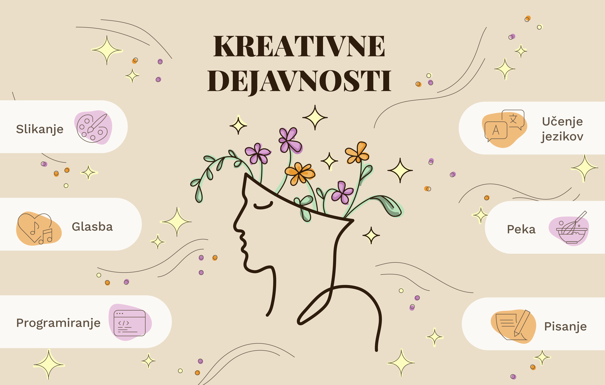
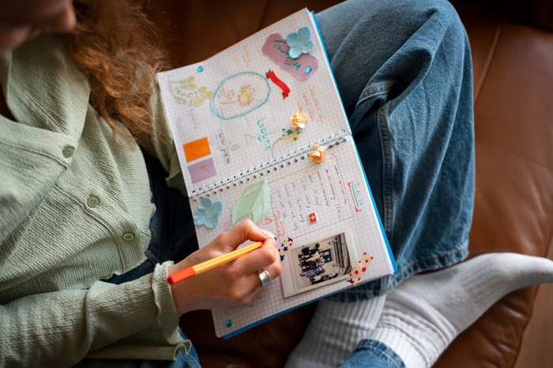

+++
title = "Ustvarjalnost kot veščina, ki je dostopna vsem"
date = 2025-01-26

[extra]
author = "Jasna Bahovec, Aida Čehić"

[taxonomies]
categories = ["Psihologija in dobro počutje"]
tags = ["Ustvarjalnost", "Duševno zdravje", "Prostočasne aktivnosti"]
+++

**Kreativnost pogosto povezujemo z umetniškimi talenti in nadarjenostjo, vendar je v resnici veščina, ki jo lahko razvijamo vsi. V Mariboru med odrasle kreativnost širi, ki redno izvaja ustvarjalne delavnice, ki redno izvaja ustvarjalne delavnice pod imenom Creative Tea Breaks.**

<!-- more -->

---

\
<small>Kreativne dejavnosti so več kot samo slikanje. 〡 Grafika: Jasna Bahovec</small> 

## Kreativnost za vse, ne samo za »nadarjene« 

Čeprav kreativnost ali ustvarjalnost pogosto dojemamo kot značilnost, ki je rezervirana za umetnike, Adelisa Huskić, mag. psih., izpostavlja, da ustvarjalnost v psihologiji razumemo kot veščino, ki jo lahko razvijamo. V študiji, ki jo je izvajal Morse s sodelavci (2021), je kreativna dejavnost opredeljena kot katera koli dejavnost, ki vključuje produkcijo novih idej ali izražanje sebe na izviren in uporaben način. Poleg tradicionalnih umetniških praks, kot so slikanje ali glasba, kot primere omenjajo tudi peko, programiranje, učenje jezikov in pisanje. Psihologinja pravi, da se ustvarjalnost nanaša tudi na razmišljanje na nekonvencionalne načine, kot so raziskovanje različnih vidikov, ustvarjanje inovativnih rešitev in reševanje težav, karposledično prispeva k večji zmožnosti za soočanje s stresom. Enako meni tudi podjetnica Alice Elizabeth Hope Sheperd Erlač, ki je ustanovila [Creative Tea Breaks](https://creativeteabreaks.com/) in na svojih družbenih omrežjih rada poudarja, da smo vsi ljudje kreativna bitja. Pravi, da se z ustvarjalnostjo, poleg umetnosti, srečujemo tudi v reševanju problemov, pripovedovanju šal, kuhanju, izbiri oblačil, načinu uporabe glasu, odločitvah, ki jih sprejemamo in reševanju problemov.  

---

## Ustvarjalne urice za odrasle 

Alice na svoje ustvarjalne urice vabi vse odrasle, ki si želijo več prisotnosti in sproščenosti v življenju. Delavnice, ki jih podjetnica izvaja v Mariboru, in na spletu, so med drugim sestavljene iz raznovrstnih praks, kot so prosto risanje ob glasbi ali brez, meditacija, manifestacija, pisanje odzivov na slike, izdelovanje vzorcev in mandal, avtoportretov, pisanje dnevnika, dihalne vaje, kolaž, barvanje in podobno. Opaža, da udeleženci velikokrat delavnice zapuščajo boljše volje, saj so uspeli izklopiti možgane in se sprostiti. Nekateri pa so po delavnicah žalostni, ker so morda spoznali stvari, ki so jih zanikali. Pravi, da z ustvarjalnostjo ne dobimo vpogled samo v mir in veselje v življenju, temveč nam omogoča tudi to, da se srečujemo z bolečino in nelagodjem.  


{
  "images": [
    {
      "src": "slika2.png",
      "title": "",
      "description": ""
    },
    {
      "src": "slika3.png",
      "title": "",
      "description": ""
    },
    {
      "src": "slika4.png",
      "title": "",
      "description": ""
    }
  ]
}

<small>Vpogled v delavnice Creative Tea Breaks v Mariboru.〡 Foto: Alice Elizabeth Hope Sheperd Erlač</small> 

---

## Recipročnost med kreativnostjo in duševnim zdravjem 

Prostočasne aktivnosti, med katere spadajo ustvarjalne akivnosti in raznorazni hobiji, kot so šport ter socialne dejavnosti, po besedah psihologinje veljajo za varovalne dejavnike, ki ščitijo pred nastankom težav v duševnem zdravju. Tovrstne aktivnosti torej krepijo duševno zdravje, boljše duševno zdravje pa vpliva na izbiro in zmožnost izvajanja prostočasnih aktivnosti. Kreativnost kot veščina pa med drugim vpliva tudi na našo sposobnost čustvene regulacije, kognitivno fleksibilnost in socialno povezanost.  

\
<small>Kreativne aktivnosti se moramo lotiti na sproščen način. 〡 Foto: Freepik</small> 

---

## Zadovoljstvo ob izvajanju prostočasnih aktivnosti

Psihologinja opominja, da so pozitivni učinki kreativnih aktivnosti odvisni od tega, ali se teh »lotimo na sproščen način, brez postavljanja visokih pričakovanj, potrebe po popolnosti, samo-obtoževanja, primerjanja z drugimi in če se jih ne lotimo zaradi zunanjih pritiskov ali če v nas vzbujajo dodatno stisko.« Sicer pa k duševnemu zdravju - poleg ustvarjalnih aktivnosti - prispevajo »katere koli prostočasne aktivnosti, v katerih uživamo in s katerimi zadovoljujemo osnovne psihološke potrebe,« je še izpostavila. 

---

## Kreativnost kot podpora, ne kot rešitev za hude duševne stiske 

Kreativne aktivnosti lahko pozitivno vplivajo na duševno zdravje, saj omogočajo izražanje čustev, krepijo samozavest in občutek kompetentnosti, so način samo-izražanja ter ponujajo priložnost učenja novih veščin. Pomembno pa se je zavedati, da te aktivnosti niso zdravilo ali nadomestilo za psihoterapijo. V primeru, da se soočamo s hudo stisko ali z večjimi travmami, se moramo zavedati, da je prezgodnje samostojno procesiranje slednjih z umetniškim ustvarjanjem lahko kontraproduktivno. V primeru hude stiske je nujno poiskati strokovno pomoč.  

Na voljo so tudi anonimni telefoni za podporo v stiski:

- **Klic v duševni stiski**: 01 520 99 00 (vsak dan, 19:00 – 07:00).  
- **Zaupna telefona Samarijan in Sopotnik**: 116 123 (vsak dan, 24 ur na dan). Klic je brezplačen.  
- **Društvo SOS telefon za ženske in otroke žrtve nasilja**: 080 11 55 (vsak dan, 24 ur na dan).  
- **TOM telefon za otroke in mladostnike**: 116 111 (vsak dan, 12:00 – 20:00). Klic je brezplačen.  

## Viri

- Morse, K. F., Fine, P. A., & Friedlander, K. J. (2021). Creativity and Leisure During COVID-19: Examining the Relationship Between Leisure Activities, Motivations, and Psychological Well-Being. *Frontiers in Psychology, 12*, 609967. [Povezava do članka](https://www.frontiersin.org/journals/psychology/articles/10.3389/fpsyg.2021.609967/full)  
